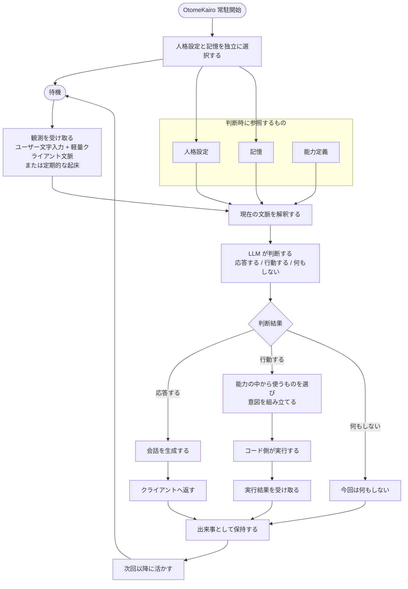

# アーキテクチャ

## 基本構成

OtomeKairo は、常駐する AI サーバとして存在し、`CocoroConsole` はその接点のひとつとして扱う。

大きな構成要素は次のとおりである。

- クライアント
  - 現時点では `CocoroConsole`
- OtomeKairo サーバ
  - 会話、判断、記憶、行動選択の中心
- LLM 層
  - LiteLLM 経由で利用する
- 人格設定
  - AI の性格や振る舞い方針を与える
- 記憶領域
  - 過去の出来事や派生した理解を保持する
- 能力定義
  - 現在何ができるかを外部化して管理する

## 中心ループ

OtomeKairo の中心は、観測して判断し、必要なら応答または行動し、その結果を次に活かす循環である。

高水準では、次の流れを前提とする。

1. 観測を受け取る
2. 現在の文脈と記憶を踏まえて解釈する
3. 応答するか、行動するか、何もしないかを判断する
4. 実行結果を受け取る
5. 出来事として保持し、次回以降に活かす

このループは、ユーザー入力時だけでなく、定期的な起床でも動きうる。

## 処理フロー

上記の中心ループを、現時点の上位設計だけに基づいて図示すると次のようになる。

## 判断責務の置き方

OtomeKairo では、会話だけでなく行動判断も LLM に寄せる方針を取る。
ただし、実行可能な範囲まで LLM に無制限に委ねるのではなく、責務を次のように分ける。

- LLM
  - 何をすべきかを判断する
  - 応答や意図を組み立てる
- コード
  - 何が実行可能かを定義する
  - 判断結果を受け取り、実行可能な形に変換する
  - 外部との接続や状態管理を担う

## 通信境界

最初のクライアントは `CocoroConsole` だが、OtomeKairo はそれ専用の API を持つ。
既存システムとの互換性よりも、OtomeKairo にとって自然な責務分割を優先する。

そのため、初期段階では次の考え方を取る。

- クライアント都合ではなく、OtomeKairo 側の概念に沿って API を考える
- `CocoroConsole` 側の調整は後から行える前提にする
- 将来クライアントが増えても、中心の責務はサーバ側に残す

## システム境界

OtomeKairo と `CocoroConsole` の関係は、UI と本体の関係として扱う。

この段階では、責務を次のように分ける。

- `CocoroConsole`
  - ユーザーが OtomeKairo と接するための UI
  - 観測入力の送信
  - 表示と操作の提供
- OtomeKairo
  - 設定の正本を持つ
  - 会話の生成を担う
  - 自発動作の判断を担う
  - 人格、記憶、能力、ランタイム状態を管理する

つまり、`CocoroConsole` は判断主体ではなく、OtomeKairo の入出力面を担う存在である。

## 状態の層

OtomeKairo では、状態をひとつの塊として扱わず、役割ごとに層を分けて考える。

### 観測

観測は、その時点で受け取った事実そのものを指す。

例:

- ユーザー文字入力
- 軽量クライアント文脈
- 定期起床が発生したという事実

観測は、生の出来事として扱う。

### 作業文脈

作業文脈は、その瞬間の判断のために一時的に組み立てる文脈である。

これは正本ではなく、その都度構成される判断用の文脈である。

### 記憶

記憶は、生の出来事から育った継続知識である。

例:

- 嗜好
- 人物理解
- 関係
- 話題の継続
- 将来的なタスク候補

### ランタイム状態

ランタイム状態は、サーバが現在どの条件で動いているかを表す。

例:

- 現在選択中の人格
- 現在選択中の記憶
- 起床間隔
- 接続状態

### 能力状態

能力状態は、OtomeKairo が現在何を行えるかを表す。

これは記憶とは別物であり、行動可能性の管理対象として扱う。

## 常駐サーバとしての性質

OtomeKairo は一度起動したら継続的に存在し続けることを前提とする。

この前提には次の意味がある。

- セッションごとに人格や状態を作り直さない
- 自発判断の機会を持てる
- クライアントが切断されても存在が消えない

## モデル利用の方針

LiteLLM を利用し、用途ごとにモデル設定を分けられる前提を採る。
ただし、どの単位で分けるのが最適かは、今後の設計論点として残す。

ここで重要なのは次の 2 点である。

- 会話品質とコストは両立させたい
- モデルの役割分離は、実装都合ではなく責務分離に従って決める

## モデル役割の論理分割

現段階では、モデルの役割を次の論理単位で考える。

- 会話生成
- 自発判断と行動判断
- 記憶解釈
- 埋め込み

この役割分割は論理上のものであり、直ちに別々のモデル実体を要求するものではない。

当面は次の考え方を取る。

- 会話生成と自発判断は、同じ高品質な日本語モデルでもよい
- 記憶解釈も、初期段階では同一モデルでよい
- 埋め込みは別役割として独立に扱う
