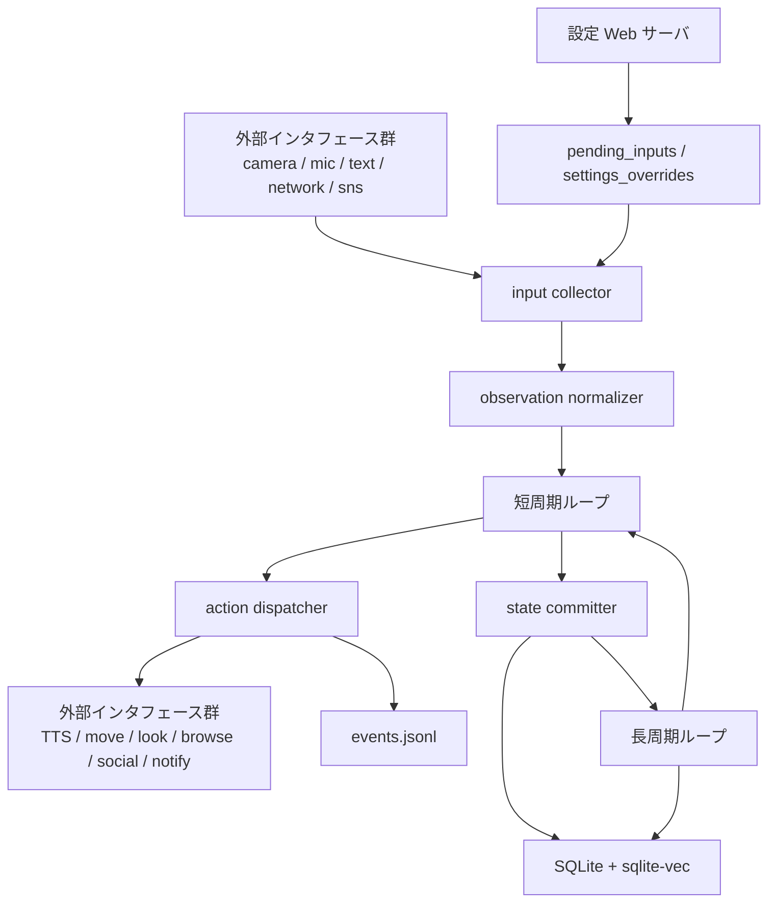
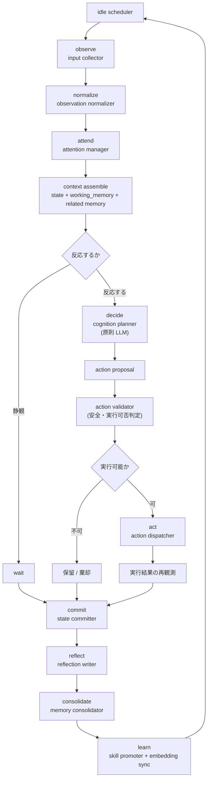

# 詳細設計ブレークダウン

<!-- Block: Purpose -->
## このドキュメントの役割

- このドキュメントは、`docs/10_target_architecture.md` を実装可能な単位まで分解した詳細設計である
- 目的は、「何をどの責務で作るか」を曖昧にしないことにある
- 構成の全体像は `docs/10_target_architecture.md` を見る
- 外部接続と技術選定は `docs/20_external_interfaces.md` を見る
- 実装前に責務、処理順序、状態境界で迷ったら、このドキュメントを正本として扱う

<!-- Block: System Split -->
## システムの分割単位

- システムは、`人格ランタイム`、`設定 Web サーバ`、`永続化基盤`、`外部インタフェース群` の 4 つに分ける
- `人格ランタイム` は、観測・判断・行動・保存を行う本体である
- `設定 Web サーバ` は、設定変更、テキスト入力、状態確認だけを受け持つ制御面である
- `永続化基盤` は、SQLite と JSONL を使って人格個体の正本状態と観測ログを保存する
- `外部インタフェース群` は、カメラ、マイク、TTS、SNS API、LINE API、ブラウザアクセスなどの外界接続を担う

<!-- Block: Process Model -->
## プロセス構成

- 1 台のホスト上で、`人格ランタイム` と `設定 Web サーバ` を分離して常駐させる
- `人格ランタイム` だけが、自己状態、世界状態、記憶の更新権限を持つ
- `設定 Web サーバ` は、人格状態を直接書き換えず、設定変更要求とテキスト入力要求を正規化して渡す
- 状態の正本は常に永続化基盤にあり、メモリ上の状態は実行中の作業コピーとして扱う
- 背後で勝手に状態を書き換える隠れた常駐処理は作らない

<!-- Block: Runtime Ownership -->
## 人格ランタイムの責務分解

- `idle scheduler`: 次の観測周期、長周期処理、保留タスクの発火判定を行う
- `input collector`: 各入力元から新しい刺激を回収する
- `observation normalizer`: 入力差異を `perception` に正規化する
- `attention manager`: 何を見るか、何を抑制するか、何を先に処理するかを決める
- `context assembler`: 現在の自己状態、身体状態、世界状態、関連記憶を読み出し、LLM に渡す `cognition_input` を組み立てる
- `cognition planner`: 原則として LLM を使い、意図と行動候補を作る
- `action validator`: 行動候補を、実行可能で安全な `action_command` へ落とす
- `action dispatcher`: 実行すべき行動を選び、外部インタフェースへ命令する
- `state committer`: 行動結果を自己状態、世界状態、記憶へ反映して保存する
- `reflection writer`: 実行結果から反省と再試行ヒントを作る
- `memory consolidator`: 短期の出来事を整理し、長期記憶へ統合する
- `skill promoter`: 反復成功した行動列を再利用可能スキルへ昇格する

<!-- Block: Runtime Cycles -->
## ランタイムの周期設計

- ランタイムは `短周期ループ` と `長周期ループ` の 2 種類で回す
- `短周期ループ` は、`observe -> attend -> decide -> act -> commit` を担当する主循環である
- `長周期ループ` は、`reflect -> consolidate -> learn` を担当する補助循環である
- 両方のループを同じ人格ランタイムが管理し、状態の更新者を 1 つに保つ
- どの周期でも、状態更新は必ず保存完了まで 1 つの処理単位として閉じる

<!-- Block: Runtime Mermaid -->
## ランタイムの動作図

- 下の Mermaid 図は、`人格ランタイム`、`設定 Web サーバ`、`永続化基盤`、`外部インタフェース群` の動きを本文どおりに図示したものである
- 上段はシステム全体の受け渡し、下段はランタイム内部の短周期と長周期の循環を示す

<!-- Block: Short Cycle -->
## 短周期ループの処理順

1. 設定変更要求とテキスト入力要求を取り込む
2. カメラ、マイク、その他入力元から新規観測を回収する
3. 観測を `perception` に正規化する
4. `attention manager` が、注意対象、抑制対象、優先順位を決める
5. 命令階層と優先度に従って、現在状態、`working_memory`、関連記憶を読み出し、`cognition_input` を組み立てる
6. `cognition_input` をもとに、反応不要、即時行動、保留継続のいずれかを決める
7. 原則として LLM を使って、`cognition_input` から意図と `action proposal` を組み立てる
8. `action validator` が、候補を安全で実行可能な `action_command` へ変換する
9. 実行可能な行動だけを実行し、必要なら実行中の観測変化を再取り込みする
10. 実行結果と観測結果をイベントとして記録する
11. 自己状態、身体状態、世界状態、`working_memory`、短期記憶を更新して保存する
12. 次の待機状態へ戻る

<!-- Block: Long Cycle -->
## 長周期ループの処理順

1. 直近イベントから意味のある出来事を抽出する
2. 実行結果と失敗要因から `reflection_notes`、`retry_hint`、`avoid_pattern` を作る
3. エピソード記憶として残す内容を選別する
4. 長期的に再利用する知識や関係性を意味記憶へ昇格させる
5. 反復成功した行動列を `skill_registry` へ昇格させる
6. 記憶強度、重要度、最終参照時刻を更新し、忘却と再強化を反映する
7. 埋め込みベクトルを更新し、`sqlite-vec` の検索索引を同期する
8. 完了済みタスクや期限切れ保留状態を整理する
9. 反映後の状態を保存し、次の短周期へ戻す

<!-- Block: Priority Model -->
## 優先度モデル

- 最優先は安全制約であり、安全に反する行動は選ばない
- 次に優先するのは、明示的な外部入力である
- その次に、緊急度の高い観測イベントを優先する
- 進行中のタスクは、緊急イベントがない限り継続して処理する
- 自発行動は、外部入力と保留タスクが落ち着いているときにだけ実行する

<!-- Block: Instruction Priority -->
## 命令階層

- `system policy` が最上位であり、人格個体の不変条件と安全条件を持つ
- `runtime policy` は、その時点の実行条件と内部制約を持つ
- `external input` は、Web 入力、テキスト入力、SNS 入力、環境からの観測を含む
- `tool output` は、Web 検索結果や外部 API 応答を含む
- 優先順位は `system policy > runtime policy > external input > tool output` とし、下位層は上位層を直接上書きできない
- 命令階層の判定は、`attention manager` と `action validator` の前に必ず通す

<!-- Block: Input Breakdown -->
## 観測入力の分解

- `Wi-Fi Web カメラ`: 画像取得と視点制御を分けて扱う。画像は観測、視点変更は行動である
- `マイク入力`: 音声断片または発話区間として観測する
- `テキスト入力`: 優先度の高い明示指示として観測する
- `インターネット応答`: 検索や取得の結果として後から返る観測として扱う
- `SNS API 応答`: 外部サービス上の反応や取得結果として観測に戻す
- どの入力元でも、人格コアに渡す前に `observation_frame` に統一する

<!-- Block: Action Breakdown -->
## 行動の分解

- `speak`: 発話内容を作り、TTS で音声出力する
- `move`: 身体位置または移動状態を変える
- `look`: カメラの視点方向を変える
- `browse`: Web へアクセスし、検索または取得を行う
- `social`: SNS API を使って取得または投稿を行う
- `notify`: LINE API を使って通知を送る
- `wait`: 明示的に静観し、次の観測を待つ
- すべての行動は `action_command` として正規化してから実行する

<!-- Block: Action Validation -->
## 行動候補と実行命令の分離

- LLM や内部判断が作るのは `action proposal` であり、まだ実行命令ではない
- `action validator` は、現在の身体状態、世界状態、能力制約、安全制約を見て、候補を `action_command` に変換する
- 実行不能な候補は、その場で棄却または保留に回す
- `action proposal` と `action_command` を同一視しない

<!-- Block: LLM Boundaries -->
## 認知処理の境界

- 認知判断の主担当は LLM であり、意図形成、候補生成、要約、言語化、反省補助の大半を担う
- LLM に渡すのは、`context assembler` が選別した `cognition_input` であり、人格の性格、現在感情、長期目標、関係性、関連記憶、現在の身体状態、世界状態、進行中タスク、命令階層の要約を含む
- `cognition_input` は、その時点で必要な断面だけを渡し、DB の全量ダンプや生ログ全量をそのまま渡さない
- LLM は、外部 API の直接実行者にはしない
- LLM は、DB の直接更新者にはしない
- 行動の安全検証、実行可否判定、状態保存の確定は、LLM ではなく決定論的な処理で行う
- LLM の入出力は、必ず構造化した `cognition_result` に落とす
- プロバイダ差異は `LiteLLM` に閉じ込め、人格コアはモデル名と役割だけを見る
- LLM が返す行動関連の出力は `action proposal` までとし、`action_command` は必ず別段で確定する

<!-- Block: Cognition Input -->
## LLM に渡す認知入力

- `cognition_input` は、LLM にその時点の人格として判断させるための入力断面である
- 必須要素は、`self_state` の性格傾向、現在感情、長期目標、関係性の認識である
- 必須要素は、`body_state`、`world_state`、`drive_state`、`task_state` の現在断面である
- 必須要素は、`working_memory` と、その時点で関連するエピソード記憶、意味記憶、感情記憶、対人記憶、反省メモである
- 必須要素は、現在の観測イベント、注意対象、抑制対象、命令階層の評価結果である
- `skill_registry` は、今回の状況に適合するスキルだけを候補として含める
- 性格や記憶を欠いた入力で行動判断させることは、この設計では不完全な認知として扱う

<!-- Block: Control Plane -->
## 設定 Web サーバの責務分解

- `settings api`: 設定の取得、変更、反映要求を受け付ける
- `text input api`: 手動テキスト入力を受け付ける
- `status api`: 現在状態の参照情報を返す
- Web サーバは、人格コアの判断を代行しない
- Web サーバは、要求を検証して正規化し、ランタイムへ渡すまでを担当する
- Web サーバは、`system policy` と `runtime policy` を直接上書きしない

<!-- Block: Handoff Model -->
## Web サーバからランタイムへの受け渡し

- Web サーバは、要求を `pending_inputs` と `settings_overrides` の論理領域へ保存する
- ランタイムは、短周期ループの先頭でその要求を取り込む
- 設定変更は、ランタイムが安全な境界でのみ反映する
- テキスト入力は、新しい観測イベントとして扱う
- Web サーバからランタイムへの直接メソッド呼び出しは前提にしない
- 外部入力は、命令階層上で `external input` として扱い、上位ポリシーを直接上書きしない

<!-- Block: State Breakdown -->
## 状態モデルの分解

- `self_state`: 性格傾向、感情、関係性、長期目標を持つ
- `attention_state`: 現在の注意対象、無視対象、再観測優先順位を持つ
- `body_state`: 姿勢、移動状態、出力可否、観測可能な感覚器の状態を持つ
- `world_state`: 現在地、周辺対象、進行中タスク、外界の最近の状況、`affordances`、`constraints` を持つ
- `drive_state`: 空腹や疲労のような生理ではなく、行動を促す内部欲求の強度を持つ
- `task_state`: 継続中の作業、待機中の保留、再開条件を持つ
- `skill_registry`: 再利用可能な行動列、発火条件、成功条件を持つ
- `memory_state`: `working_memory`、エピソード記憶、意味記憶、感情記憶、対人記憶、反省メモを持つ

<!-- Block: Storage Breakdown -->
## 永続化の論理分解

- `self_state`: 現在の人格状態の正本を 1 件保持する
- `attention_state`: 現在の注意状態の正本を 1 件保持する
- `body_state`: 現在の身体状態の正本を 1 件保持する
- `world_state`: 現在の世界認識の正本を 1 件保持する
- `pending_inputs`: Web サーバや外部から入った未処理入力を保持する
- `task_queue`: 継続タスクと再開条件を保持する
- `working_memory`: 短周期でのみ使う作業文脈を保持する
- `episodic_memory`: 出来事単位の記憶を時系列で保持する
- `semantic_memory`: 安定した知識を保持する
- `affective_memory`: 出来事に紐づく感情痕跡を保持する
- `relationship_memory`: 相手や対象への認識を保持する
- `skill_registry`: 再利用可能なスキルを保持する
- `reflection_notes`: 失敗要因、再試行ヒント、回避パターンを保持する
- `memory_embeddings`: `sqlite-vec` で検索する埋め込み索引を保持する
- `action_history`: 実行した行動と結果を保持する
- `settings_overrides`: Web から変更された設定の差分を保持する
- `events.jsonl`: 観測と行動の追跡ログを追記専用で保持する

<!-- Block: Memory Policy -->
## 記憶の更新方針

- 短周期では、`working_memory` を組み立て、直近の出来事をエピソード候補として残す
- 長周期では、繰り返し参照される内容だけを意味記憶へ昇格させる
- 感情痕跡は `affective_memory` として保持し、持続感情は `self_state` 側で持つ
- 反省は `reflection_notes` として独立に保持する
- 再利用価値が高い行動列は `skill_registry` に昇格させる
- 記憶の更新と埋め込み更新は、同じ処理単位で完了させる
- 記憶本文とベクトル索引は別管理でも、論理的には同じ記憶項目として扱う
- 忘却は削除ではなく、重要度低下、参照頻度低下、記憶強度減衰として扱う

<!-- Block: Package Mapping -->
## パッケージと設計単位の対応

- `runtime/`: 周期制御とループ管理
- `web/`: HTTP 制御面
- `usecase/`: 1 処理単位の調停
- `domain/`: 状態と概念モデル
- `gateway/`: 外部依存の抽象境界
- `infra/`: 外部接続の具体実装
- `policy/`: 優先度、命令階層、安全の明示ルール
- `schema/`: 受け渡しの構造定義

<!-- Block: Initial Slices -->
## 実装の最初の切り分け

- 第1段階は、`設定 Web サーバ`、`短周期ループ`、`状態保存` の 3 点を成立させる
- 第2段階は、`attention`、`instruction priority`、`LiteLLM` による認知処理を接続する
- 第3段階は、`sqlite-vec` による記憶検索と `reflection` を接続する
- 第4段階は、`skill_registry` と `working_memory` を接続する
- 第5段階は、`Wi-Fi Web カメラ`、`マイク`、`TTS` を接続する
- 第6段階は、`SNS API`、`LINE API`、`移動制御` を接続する
- 各段階で、人格ランタイムの責務境界は崩さない

<!-- Block: Definition of Done -->
## 詳細設計として確定したこと

- 状態更新者は `人格ランタイム` だけである
- Web サーバは制御面であり、人格判断は行わない
- LLM は認知判断の主担当だが、直接 I/O を実行しない
- 中心ループは `observe -> attend -> decide -> act -> reflect -> consolidate` である
- `action proposal` と `action_command` は分離する
- 命令階層は `system policy > runtime policy > external input > tool output` である
- `SQLite + sqlite-vec + JSONL` が永続化の基本構成である
- 実装はこの分解単位に沿って進める
