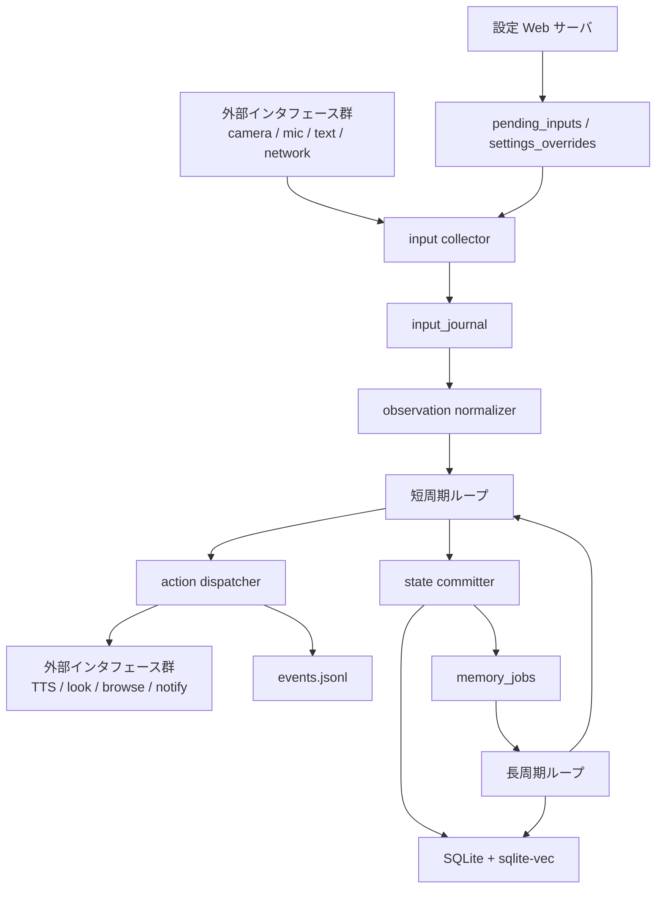
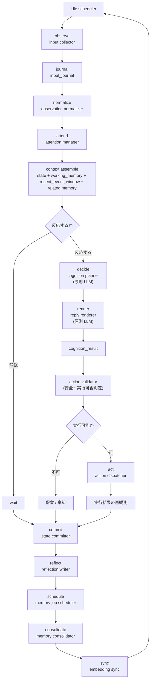

# システム設計

<!-- Block: Purpose -->
## このドキュメントの役割

- このドキュメントは、`docs/10_目標アーキテクチャ.md` を実装可能な単位まで分解した詳細設計である
- このドキュメントは、target の責務分解を正本にしつつ、current の `browser_chat` 実装も別節で同期する
- 目的は、「何をどの責務で作るか」を曖昧にしないことにある
- 構成の全体像は `docs/10_目標アーキテクチャ.md` を見る
- 外部接続と技術選定は `docs/20_外部インタフェース.md` を見る
- 実装直前の入出力仕様、状態遷移、保存順序は `docs/31_ランタイム処理仕様.md` を見る
- 記憶サブシステムの詳細は `docs/32_記憶設計.md` を見る
- `memory_jobs` の payload 仕様は `docs/33_記憶ジョブ仕様.md` を見る
- SQLite のテーブル定義は `docs/34_SQLite論理スキーマ.md` を見る
- HTTP path と `SSE` の仕様は `docs/35_WebAPI仕様.md` を見る
- `payload_json` や Web API 本文の JSON 形は `docs/36_JSONデータ仕様.md` を見る
- 初回 seed と排他起動は `docs/37_起動初期化仕様.md` を見る
- 入力重複、`cancel`、`SSE` 保持運用は `docs/38_入力ストリーム運用仕様.md` を見る
- 設定キーと型制約は `docs/39_設定キー運用仕様.md` を見る
- 人格に基づく選択規則は `docs/41_人格選択仕様.md` を見る
- 実装前に責務、処理順序、状態境界で迷ったら、このドキュメントを正本として扱う

<!-- Block: Read Guide -->
## target と current の読み分け

- 後続の責務分解、図、段階設計は target を主語にしている
- `current 実装のシステム像` は、今の `develop` 上で動いている `browser_chat` 実装だけを要約する
- target と current が衝突する場合、実装把握では current を、設計判断では target を優先する

<!-- Block: Current Overview -->
## current 実装のシステム像

- current の主要プロセスは `設定 Web サーバ` と `人格ランタイム` の 2 つで、正本状態は SQLite に置く
- Web サーバの公開面は `status api`、`settings api`、`settings editor api`、`chat input api`、`microphone api`、`chat stream api`、`camera api`、`/` の静的 UI である
- ランタイムの主ループは `settings_change_sets`、`settings_overrides`、`pending_inputs`、`waiting_external` の `browse` task、`memory_jobs` を順に消費する
- current の入力種別は `chat_message`、`microphone_message`、`camera_observation`、`network_result`、`idle_tick`、`cancel` に限る
- current の行動確定は `speak`、`browse`、`notify`、`look`、`wait` に限る
- current の外部接続は TTS、DuckDuckGo 検索、ONVIF カメラ静止画取得と視点操作、ブラウザ録音を `AmiVoice` へ流して `microphone_message` を作る `STT` 経路である
- current の composition root は `src/otomekairo/boot/compose_sqlite.py`、`src/otomekairo/boot/compose_runtime.py`、`src/otomekairo/boot/compose_web.py` にあり、`SqliteBackend` と SQLite adapter 群の組み立ては `boot/` で完結する
- current の `state committer` は汎用抽象ではなく、`src/otomekairo/infra/sqlite/cycle_commit_impl.py` と `src/otomekairo/infra/sqlite/settings_impl.py` が短周期確定を担当し、`src/otomekairo/infra/sqlite/runtime_live_state_impl.py`、`src/otomekairo/infra/sqlite/event_writer_impl.py`、`src/otomekairo/infra/sqlite/memory_job_impl.py` が transaction 内 helper を分担し、`src/otomekairo/infra/sqlite/backend.py` は bootstrap facade として `bootstrap_connection_impl.py`、`bootstrap_meta_impl.py`、`bootstrap_settings_editor_impl.py`、`bootstrap_singleton_seed_impl.py` を束ねる。singleton seed は `bootstrap_core_singleton_seed_impl.py` と `bootstrap_live_state_seed_impl.py` に分かれている
- current の `browser_chat` では、`attention_state` と `task_state` だけでなく、`body_state`、`world_state`、`drive_state` も同じ短周期 transaction 内で live 更新する

<!-- Block: Current Coupling Points -->
## current の主要結合点

- `src/otomekairo/runtime/main_loop.py` は `RuntimeStores` bundle と `gateway/*` port だけに依存し、`infra/` の具象実装を直接 import しない
- `src/otomekairo/web/app.py` と `src/otomekairo/web/dependencies.py` は `AppServices` bundle と `gateway/*` port だけを扱い、`SqliteBackend` を直接生成しない
- `src/otomekairo/usecase/run_write_memory_job.py` は `gateway/unit_of_work.py` の execution contract に依存し、具象 store 型を前提にしない
- `src/otomekairo/usecase/cognition_prompt_messages.py` が planner / retrieval selector / reply renderer の prompt message 構築を共有し、`src/otomekairo/infra/litellm_cognition_client.py` は LiteLLM 呼び出しと response validation だけを持つ
- `src/otomekairo/boot/run_all.py` と deterministic eval runner は `src/otomekairo/boot/compose_sqlite.py` を経由して port / adapter bundle を組み立て、`SqliteBackend` を直接生成しない
- `src/otomekairo/infra/sqlite/runtime_query_impl.py`、`cycle_commit_impl.py`、`settings_impl.py`、`runtime_live_state_impl.py`、`event_writer_impl.py`、`ui_event_impl.py`、`runtime_lease_impl.py`、`memory_job_impl.py` が責務別の SQLite 実装を持ち、`*_store.py` はその薄い adapter として gateway port を満たす。`runtime_query_impl.py` は `runtime_status_query_impl.py`、`runtime_cognition_query_impl.py`、`runtime_settings_editor_query_impl.py` の集約であり、`runtime_cognition_query_impl.py` も `runtime_cognition_base_query_impl.py` と `runtime_memory_snapshot_query_impl.py` の coordinator に分けている。`write_memory_execution_store.py` は `write_memory_load_impl.py`、`write_memory_state_impl.py`、`write_memory_preference_impl.py`、`write_memory_context_impl.py` へ委譲する長周期 `write_memory` 専用 adapter として分かれている
- `src/otomekairo/infra/sqlite/unit_of_work.py`、`src/otomekairo/infra/sqlite/write_memory_execution_store.py`、`src/otomekairo/infra/sqlite/memory_job_store.py` が `write_memory` と `embedding_sync` の completion transaction を担当し、`src/otomekairo/infra/sqlite/backend.py` の公開面から長周期 orchestration を追い出している
- `src/otomekairo/infra/sqlite/backend.py` の残存責務は `initialize()` と `_connect()` に限られ、bootstrap 実処理は `bootstrap_*` helper module 群へ、`write_memory` の execution state load / apply helper は `src/otomekairo/infra/sqlite/write_memory_execution_store.py` とその下位 helper module 群へ移っている
- deterministic eval 用 usecase は `SqliteBackend` へ直接依存せず、boot 側で組み立てた store bundle と callable を受け取る

<!-- Block: System Overview Group -->
## システム全体像

<!-- Block: System Split -->
### システムの分割単位

- システムは、`人格ランタイム`、`設定 Web サーバ`、`永続化基盤`、`外部インタフェース群` の 4 つに分ける
- `人格ランタイム` は、観測・判断・行動・保存を行う本体である
- `設定 Web サーバ` は、設定変更、テキスト入力、状態確認だけを受け持つ制御面である
- `永続化基盤` は、SQLite と JSONL を使って人格個体の正本状態と観測ログを保存する
- `外部インタフェース群` は、カメラ、マイク、TTS、ブラウザアクセスなどの外界接続を担う

<!-- Block: Process Model -->
### プロセス構成

- 1 台のホスト上で、`人格ランタイム` と `設定 Web サーバ` を分離して常駐させる
- `人格ランタイム` だけが、自己状態、世界状態、記憶の更新権限を持つ
- `設定 Web サーバ` は、人格状態を直接書き換えず、設定変更要求とテキスト入力要求を正規化して渡す
- 状態の正本は常に永続化基盤にあり、メモリ上の状態は実行中の作業コピーとして扱う
- 背後で勝手に状態を書き換える隠れた常駐処理は作らない

<!-- Block: Crosscutting Rules Group -->
## 横断ルール

<!-- Block: Fixed Responsibility Conditions -->
### 具体設計として固定する責務条件

- `attention manager` は、記憶の補助ではなく、`memory` と同格の必須責務として毎短周期で評価する
- `input collector` は、受理した観測を `observation_id` 単位で `input_journal` に不変追記してから後段へ渡し、判断前に入力痕跡を失わない
- `action dispatcher` の実行後は、成否に関係なく必ず `reobserve` を行い、その結果を保存前に取り込む
- `reflection writer` は感想文を残すのではなく、少なくとも `reflection_note`、`retry_hint`、`avoid_pattern` の 3 種を構造化して残す
- `context assembler` は、`working_memory` を最優先で詰めつつ、`recent_event_window` を別断面として保持し、その残り予算で関連するエピソード、意味、感情、関係、反省を種別ごとの上限付きで組み立てる
- `cognition planner` は、高位の意図、優先順位、次の 1 手の行動候補、必要なら後続の `step_hints` までを作る責務に限定し、低位のデバイス制御手順は作らない
- `reply renderer` は、`cognition planner` が決めた意図と行動候補に従って、ユーザーへ見せる `speech_draft` だけを作る
- `action validator` は、安全、身体能力、空間制約、`affordances`、現在タスク、命令階層を同時に検査し、`execute`、`hold`、`reject` のいずれかへ確定する
- `state committer` は、短周期の正本更新を完了するまで、次の短周期や長周期へ進ませない
- `state committer` は、`drive_state`、`settings_overrides`、`pending_inputs` を短周期の同一保存単位で確定する
- `events.jsonl` は `commit_record` から再構成できる派生ログとし、正本更新と同じ差分を二重適用しない
- `memory job scheduler` は、`write_memory` と `embedding_sync` を永続ジョブとして claim し、処理をメモリ内だけで終わらせない
- `memory consolidator` は、イベントの抽出、意味記憶の昇格、重要度更新、`embedding_sync` followup の確定までを長周期処理として完了させる
- `memory consolidator` は、誤想起が確定した項目を削除せず、`searchable` の切替で主要想起から隔離する
- `attention manager` と `action validator` は、同じ命令階層評価結果を共有し、下位入力が上位制約を飛び越えないようにする
- `gateway` は、センサー、行動器、ネットワークの唯一の統合点とし、人格コアから個別実装を直接呼ばない
- 外部接続の失敗は、単なる `failed` で終わらせず、原因種別付きのイベントとして保存し、次回判断と学習の材料にする

<!-- Block: Runtime Design Group -->
## 人格ランタイムの処理設計

<!-- Block: Runtime Ownership -->
### 人格ランタイムの責務分解

- `idle scheduler`: 次の観測周期、長周期処理、保留タスクの発火判定を行う
- `input collector`: 各入力元から新しい刺激を回収する
- `observation normalizer`: 入力差異を `perception` に正規化する
- `attention manager`: 何を見るか、何を抑制するか、何を先に処理するかを決める
- `retrieval planner`: 入力種別に応じて query、time、thread、entity の想起ヒントを作る
- `candidate collectors`: `recent_event_window`、長期記憶、reply chain、thread、state link、entity、explicit time の候補を並列収集する
- `retrieval selector`: collector 群の候補を `LLM` で選別し、`selection_trace` とともに確定する
- `context assembler`: 現在の自己状態、身体状態、世界状態、関連記憶を読み出し、LLM に渡す `cognition_input` を組み立てる
- `cognition planner`: 原則として LLM を使い、意図と行動候補を作る
- `reply renderer`: 原則として LLM を使い、認知計画と人格断面に沿う `speech_draft` を作る
- `action validator`: 行動候補を、実行可能で安全な `action_command` へ落とす
- `action dispatcher`: 実行すべき行動を選び、外部インタフェースへ命令する
- `state committer`: 行動結果を自己状態、世界状態、記憶へ反映して保存する
- `reflection writer`: 実行結果から反省と再試行ヒントを作る
- `memory job scheduler`: 長周期で扱う `memory_jobs` を claim し、処理順を固定する
- `memory consolidator`: 短期の出来事を整理し、長期記憶へ統合する
- current 実装では、`write_memory` の手順制御は `usecase/run_write_memory_job.py` が担当し、transaction 境界は `gateway/unit_of_work.py`、`infra/sqlite/unit_of_work.py`、`infra/sqlite/write_memory_execution_store.py` に明示し、`write_memory_execution_store.py` は orchestration と followup enqueue だけを持ち、`load / state / preference / context` の SQL 適用は下位 helper module へ分けている。さらに `state` は `write_memory_state_update_impl.py` と `write_memory_self_state_sync_impl.py`、`write_memory_state_update_impl.py` は `write_memory_state_insert_impl.py` と `write_memory_state_existing_update_impl.py`、`context` は `write_memory_event_affect_impl.py` と `write_memory_context_relation_impl.py` に責務分割している

<!-- Block: Chat Memory Subsystem -->
### 会話記憶サブシステム

- current の `browser_chat` では、`retrieval planner -> candidate collectors -> retrieval selector -> context assembler` を短周期の前段で必ず通す
- `candidate collectors` は、`recent events`、`associative memory`、`episodic memory`、`reply chain`、`context threads`、`state link expand`、`entity expand`、`explicit_time` を役割ごとに分離する
- `retrieval selector` は、`events.summary_text` や `memory_states.payload.summary_text` のような要約済み候補だけを `LLM` へ渡し、`selected`、`reserve`、`slot skipped` を固定 shape で返す
- `context assembler` は、`memory_bundle` を直接 prompt へ流さず、`recent_dialog`、`selected_memory_pack`、`stable_preferences`、`long_mood_state`、`reply_render_input`、`action_selection_context` へ再投影する
- `reply renderer` は full `cognition_input` を見ず、`reply_render_input` と `reply_render_plan` だけを入力にする
- `reply_render_input` と `action_selection_context` には共通の `stable_preferences` を入れ、`likes/dislikes/revoked` の件数と shape を揃える

<!-- Block: Runtime Cycles -->
### ランタイムの周期設計

- ランタイムは `短周期ループ` と `長周期ループ` の 2 種類で回す
- `短周期ループ` は、`observe -> attend -> decide -> act -> commit` を担当する主循環である
- `長周期ループ` は、`reflect -> schedule -> consolidate -> sync` を担当する補助循環である
- 両方のループを同じ人格ランタイムが管理し、状態の更新者を 1 つに保つ
- どの周期でも、状態更新は必ず保存完了まで 1 つの処理単位として閉じる

<!-- Block: Runtime Mermaid -->
### ランタイムの動作図

- 下の Mermaid 図は、`人格ランタイム`、`設定 Web サーバ`、`永続化基盤`、`外部インタフェース群` の動きを本文どおりに図示したものである
- 上段はシステム全体の受け渡し、下段はランタイム内部の短周期と長周期の循環を示す

<!-- Block: Short Cycle -->
### 短周期ループの処理順

1. 設定変更要求とテキスト入力要求を取り込む
2. カメラ、マイク、その他入力元から新規観測を回収する
3. 受理した観測を `input_journal` に `observation_id` 単位で受理ログとして不変追記する
4. 観測を `perception` に正規化する
5. `attention manager` が、注意対象、抑制対象、優先順位を決める
6. 命令階層と優先度に従って、`retrieval planner`、collector 群、`retrieval selector` を走らせ、現在状態、`working_memory`、`recent_event_window`、選別済み関連記憶から `cognition_input` を組み立てる
7. `cognition_input` をもとに、反応不要、即時行動、保留継続のいずれかを決める
8. 原則として LLM を使って、`cognition_input` から意図と `action proposal` を含む `cognition_plan` を組み立てる
9. 必要な対話応答がある場合は、`reply renderer` が `cognition_plan` に沿う `speech_draft` を組み立て、`cognition_result` を合成する
10. `action validator` が、候補を安全で実行可能な `action_command` へ変換する
11. 実行可能な行動だけを実行し、実行後の観測変化を必ず再取り込みする
12. 実行結果と観測結果をイベントとして記録する
13. 自己状態、身体状態、世界状態、`working_memory`、`recent_event_window`、短期記憶を更新して保存する
14. 長周期用の `memory_jobs` を短周期の保存単位として投入し、次の待機状態へ戻る

<!-- Block: Long Cycle -->
### 長周期ループの処理順

1. `memory_jobs` から、その長周期で処理すべきジョブを claim する
2. 実行結果と失敗要因から `reflection_notes`、`retry_hint`、`avoid_pattern` を作る
3. 直近イベントから `MemoryWritePlan` を作り、適用前に検証する
4. エピソード記憶として残す内容を選別し、長期的に再利用する知識や関係性を意味記憶へ昇格させる
5. 記憶強度、重要度、最終参照時刻を更新し、忘却と再強化を反映する
6. 埋め込みベクトルを更新し、`sqlite-vec` の検索索引を同期する
7. ジョブ状態と反映後の状態を保存し、次の短周期へ戻す

<!-- Block: Priority Model -->
### 優先度モデル

- 最優先は安全制約であり、安全に反する行動は選ばない
- 次に優先するのは、`system policy` と `runtime policy` による実行条件である
- 明示的な外部入力は高く扱うが、命令と確定したものだけを最上位候補として扱う
- その次に、緊急度の高い観測イベントと進行中タスクの継続性を優先する
- 同順位の候補では、`relationship salience`、`personality fit`、経験由来の好悪と回避傾向を使って並べ替える
- 自発行動は、外部入力と保留タスクが落ち着いているときにだけ実行する

<!-- Block: Self Initiated Actions -->
### 自発行動の制約

- 自発行動は、`task_progress`、`unexplored_check`、`self_maintenance`、`skill_rehearsal` のいずれかに分類できるものだけを許す
- 自発行動は、開始時点で `goal_hint` と停止条件を持ち、無目的な徘徊や無期限の探索を許さない
- `unexplored_check` は、未観測領域、未確認対象、長時間更新のない重要対象の確認に限定する
- `self_maintenance` は、身体状態、観測品質、外部待ち状態の健全性回復に限定する
- `skill_rehearsal` は、緊急入力や高優先タスクがないときだけ許す
- 自発行動の候補順位は、性格傾向、気にかける対象、経験で学んだ日課、経験で学んだ回避傾向を反映して変える

<!-- Block: Instruction Priority -->
### 命令階層

- `system policy` が最上位であり、人格個体の不変条件と安全条件を持つ
- `runtime policy` は、その時点の実行条件と内部制約を持つ
- `external input` は、Web 入力、テキスト入力、環境からの観測を含む
- `tool output` は、Web 検索結果や外部 API 応答を含む
- 優先順位は `system policy > runtime policy > external input > tool output` とし、下位層は上位層を直接上書きできない
- 命令階層の判定は、`attention manager` と `action validator` の前に必ず通す

<!-- Block: Input Breakdown -->
### 観測入力の分解

- `Wi-Fi Web カメラ`: 画像取得と視点制御を分けて扱う。画像は観測、視点変更は行動である
- `マイク入力`: 音声断片または発話区間として観測する
- `テキスト入力`: 命令、相談、雑談、感情表明を分けて観測し、命令と確定したものだけを高優先の明示指示として扱う
- `インターネット応答`: 検索や取得の結果として後から返る観測として扱う
- どの入力元でも、人格コアに渡す前に `observation_frame` に統一する

<!-- Block: Action Breakdown -->
### 行動の分解

- `speak`: 発話内容を作り、設定された TTS プロバイダで音声出力する
- `look`: `camera_connections[].is_enabled=true` の候補から 1 台を選び、カメラの視点方向を変える
- `browse`: Web へアクセスし、検索または取得を行う
- `notify`: ユーザーへの通知を送る
- `wait`: 明示的に静観し、次の観測を待つ
- すべての行動は `action_command` として正規化してから実行する

<!-- Block: Action Validation -->
### 行動候補と実行命令の分離

- LLM や内部判断が作るのは `action proposal` であり、まだ実行命令ではない
- `action validator` は、現在の身体状態、世界状態、能力制約、空間制約、アフォーダンス、安全制約、人格整合性、関係性整合性、経験由来の好悪を見て、候補を `action_command` に変換する
- 実行不能な候補は、その場で棄却または保留に回す
- `action proposal` と `action_command` を同一視しない

<!-- Block: Stepwise Planning -->
### 長い計画の分解

- 1 回の短周期で確定する主命令は 1 つだけとし、複数手順をまとめて確定しない
- `cognition planner` は、後続の `step_hints` を返してよいが、未実行ステップをそのまま確定命令として扱わない
- 後続ステップが必要な場合は、`task_state` に残課題として保持し、次周期で再評価する
- 外界が変化した場合、前周期の後続手順は自動継続せず、必ず再判断する

<!-- Block: LLM Boundaries -->
### 認知処理の境界

- 認知判断の主担当は LLM であり、意図形成、候補生成、要約、言語化、反省補助の大半を担う
- LLM が扱うのは、正規化済みのマルチモーダル観測要約と構造化した判断材料であり、生センサー入力や低位制御信号ではない
- LLM に渡すのは、`context assembler` が選別した `cognition_input` であり、人格の性格、現在感情、長期目標、関係性、関連記憶、現在の身体状態、世界状態、進行中タスク、命令階層の要約を含む
- `cognition_input` は、その時点で必要な断面だけを渡し、DB の全量ダンプや生ログ全量をそのまま渡さない
- DB の `*_at` 系時刻は UTC unix milliseconds のまま保持し、`context assembler` は LLM に渡す時だけ人間可読な日時表現と相対時間表現を付与する
- LLM は、外部 API の直接実行者にはしない
- LLM は、DB の直接更新者にはしない
- 行動の安全検証、実行可否判定、状態保存の確定は、LLM ではなく決定論的な処理で行う
- current 実装では、LLM の出力を `cognition_plan` と `speech_draft` に分けてよいが、後段へ渡すのは常に構造化した `cognition_result` に統一する
- プロバイダ差異は `LiteLLM` に閉じ込め、人格コアはモデル名と役割だけを見る
- LLM が返す行動関連の出力は `action proposal` までとし、`action_command` は必ず別段で確定する

<!-- Block: Cognition Input -->
### LLM に渡す認知入力

- `cognition_input` は、LLM にその時点の人格として判断させるための入力断面である
- 必須要素は、`self_state` の性格傾向、現在感情、長期目標、関係性の認識である
- 必須要素は、`self_state` に蓄積された好みの行動様式、学習済みの好悪、反復した回避傾向である
- 必須要素は、`body_state`、`world_state`、`drive_state`、`task_state` の現在断面である
- 必須要素は、`working_memory`、`recent_event_window`、その時点で関連するエピソード記憶、意味記憶、感情記憶、対人記憶、反省メモである
- 必須要素は、現在の観測イベント、注意対象、抑制対象、命令階層の評価結果である
- 必須要素は、現在時刻と各出来事の人間可読な日時表現、および「何分前か」のような相対時間表現である
- `skill_candidates` は、自発行動候補のうち今回の状況に適合するものだけを候補として含める
- 性格や記憶を欠いた入力で行動判断させることは、この設計では不完全な認知として扱う

<!-- Block: Control State Group -->
## 制御面と状態設計

<!-- Block: Control Plane -->
### 設定 Web サーバの責務分解

- `settings api`: 設定の取得、変更、反映要求を受け付ける
- `chat input api`: ブラウザからのテキストチャット入力を受け付ける
- `chat stream api`: `ui_outbound_events` を `SSE` でブラウザへ配信する
- `status api`: 現在状態の参照情報を返す
- Web サーバは、人格コアの判断を代行しない
- Web サーバは、要求を検証して正規化し、ランタイムへ渡すまでを担当する
- Web サーバは、`system policy` と `runtime policy` を直接上書きしない

<!-- Block: Handoff Model -->
### Web サーバからランタイムへの受け渡し

- Web サーバは、`chat input api` と `settings api` で受けた要求を `pending_inputs` と `settings_overrides` の論理領域へ保存する
- ランタイムは、短周期ループの先頭でその要求を取り込む
- 設定変更は、ランタイムが安全な境界でのみ反映する
- テキスト入力は、新しい観測イベントとして扱う
- Web サーバからランタイムへの直接メソッド呼び出しは前提にしない
- 外部入力は、命令階層上で `external input` として扱い、上位ポリシーを直接上書きしない

<!-- Block: Outbound Handoff -->
### ランタイムから Web サーバへの受け渡し

- ランタイムは、ブラウザへ見せる応答トークン、応答完了、自発メッセージ、状態通知を、短周期の完了を待たず `ui_outbound_events` に追記してよい
- `chat stream api` は、`ui_outbound_events` を読み出し専用で監視し、`SSE` としてブラウザへ流す
- `chat stream api` は、`Last-Event-ID` または同等のカーソルで再開位置を決め、未送出分だけを再送できるようにする
- Web サーバは、`ui_outbound_events` を更新せず、読み出しと配信だけを担当する
- ランタイムから Web サーバへの直接メソッド呼び出しは前提にしない

<!-- Block: State Breakdown -->
### 状態モデルの分解

- `self_state`: 性格傾向、感情、関係性、長期目標を持つ
- `attention_state`: 現在の注意対象、無視対象、再観測優先順位を持つ
- `body_state`: 姿勢、移動状態、出力可否、観測可能な感覚器の状態を持つ
- `world_state`: 現在地、周辺対象、進行中タスク、外界の最近の状況、`affordances`、`constraints`、`attention_targets` を持つ
- `drive_state`: 空腹や疲労のような生理ではなく、行動を促す内部欲求の強度を持つ
- `task_state`: 継続中の作業、待機中の保留、再開条件を持つ
- `memory_state`: `working_memory`、`recent_event_window`、エピソード記憶、意味記憶、感情記憶、対人記憶、反省メモを持つ

<!-- Block: Storage Breakdown -->
### 永続化の論理分解

- `self_state`: 現在の人格状態の正本を 1 件保持する
- `attention_state`: 現在の注意状態の正本を 1 件保持する
- `body_state`: 現在の身体状態の正本を 1 件保持する
- `world_state`: 現在の世界認識の正本を 1 件保持する
- `drive_state`: 現在の内部欲求状態の正本を 1 件保持する
- `pending_inputs`: Web サーバや外部から入った未処理入力を保持する
- `ui_outbound_events`: ブラウザ向けの応答トークン、応答完了、自発メッセージ、状態通知を、コア状態の保存単位とは別の append-only ストリームログとして保持する
- `input_journal`: 受理した観測と外部入力の不変ログを保持する
- `task_state`: 継続タスク、保留タスク、再開条件の正本を保持する
- `working_memory`: 短周期でのみ使う作業文脈を保持する
- `recent_event_window`: 直近の生イベント列を短期判断用に保持する
- `episodic_memory`: 出来事単位の記憶を時系列で保持する
- `semantic_memory`: 安定した知識を保持する
- `affective_memory`: 出来事に紐づく感情痕跡を保持する
- `relationship_memory`: 相手や対象への認識を保持する
- `reflection_notes`: 失敗要因、再試行ヒント、回避パターンを保持する
- `memory_jobs`: 長周期で処理する記憶更新と埋め込み同期ジョブを保持する
- `memory_embeddings`: `sqlite-vec` で検索する埋め込み索引を保持する
- `action_history`: 実行した行動と結果を保持する
- `settings_overrides`: Web から変更された設定の差分を保持する
- `commit_records`: 各短周期の確定差分と `events.jsonl` 同期状態を保持し、派生ログ再構成の正本にする
- `events.jsonl`: 観測と行動の追跡ログを追記専用で保持する

<!-- Block: Memory Policy -->
### 記憶の更新方針

- 短周期では、`working_memory` を組み立て、直近の出来事をエピソード候補として残す
- 短周期では、`input_journal` に残った受理済み観測から `recent_event_window` を構成し、`working_memory` と混ぜない
- 長周期では、繰り返し参照される内容だけを意味記憶へ昇格させる
- 感情痕跡は `affective_memory` として保持し、持続感情は `self_state` 側で持つ
- 反省は `reflection_notes` として独立に保持する
- 記憶の更新と埋め込み更新は、同じ処理単位で完了させる
- 想起に使う本文は、出来事や記憶の既存要約を優先し、同じ意味の派生本文を別保存しない
- 記憶本文とベクトル索引は別管理でも、論理的には同じ記憶項目として扱う
- 忘却は削除ではなく、重要度低下、参照頻度低下、記憶強度減衰として扱う

<!-- Block: Implementation Group -->
## 実装導線

<!-- Block: Package Mapping -->
### パッケージと設計単位の対応

- `runtime/`: 周期制御とループ管理
- `web/`: HTTP 制御面
- `usecase/`: 1 処理単位の調停
- `domain/`: 状態と概念モデル
- `gateway/`: `runtime query`、`cycle commit`、`memory jobs`、`settings editor`、`ui events`、`runtime lease` のような用途別 port
- `infra/`: port ごとの外部接続の具体実装
- `policy/`: 優先度、命令階層、安全の明示ルール
- `schema/`: 受け渡しの構造定義

<!-- Block: Decoupling Slices -->
### 疎結合化で先に切り出す単位

- `runtime coordinator`: `runtime/main_loop.py` の責務を「順序制御だけ」に絞る単位
- `runtime query port`: 短周期開始時に必要な状態断面を読む単位
- `cycle commit port`: `pending_inputs`、状態更新、イベント確定、followup enqueue を短周期保存単位として確定する単位
- `memory job port`: `claim`、`complete`、`fail`、followup enqueue を扱う単位
- `settings editor port`: 設定 UI の保存対象を読む単位
- `ui event port`: `ui_outbound_events` の読み書きを分離する単位
- `runtime lease port`: bootstrap、排他起動、runtime lease を扱う単位
- `unit_of_work`: `write_memory` のような複数テーブル更新を 1 transaction で閉じる単位
- `composition root`: runtime と web へ port 群を束ねて渡す単位

<!-- Block: Migration Order -->
### 疎結合化で実施した順

1. `docs/10` と `docs/30` を正本として、port 名、責務、composition root の位置を先に固定した
2. `gateway/` に `runtime query`、`cycle commit`、`memory jobs`、`settings editor`、`ui events`、`runtime lease`、`unit_of_work` の抽象を追加した
3. `runtime/` と `web/` を dependency bundle 経由へ切り替え、具象 method 名への依存を外した
4. `write_memory` を `unit_of_work` 境界へ載せ替え、usecase から SQLite helper 前提を消した
5. `src/otomekairo/infra/sqlite/backend.py` の内部実装を、`bootstrap_*` helper module へ分割し、公開面を `initialize()` と `_connect()` に縮退した
6. 長周期 helper は `write_memory_execution_store.py` とその下位 helper module 群へ集約し、`write_memory_state_update_impl.py` / `write_memory_self_state_sync_impl.py` / `write_memory_event_affect_impl.py` / `write_memory_context_relation_impl.py` まで分けた。`write_memory_state_update_impl.py` も `write_memory_state_insert_impl.py` と `write_memory_state_existing_update_impl.py` へ分割した

<!-- Block: Initial Slices -->
### 実装の最初の切り分け

- 第1段階は、`runtime query port`、`cycle commit port`、`settings editor port`、`runtime lease port` を切り出し、runtime と web から具象 store 依存を外す
- 第2段階は、`memory job port` と `unit_of_work` を切り出し、`write_memory` の transaction 境界を明示化する
- 第3段階は、`ui event port` と `embedding_store` を独立させ、制御面と検索索引の責務を混ぜない
- 第4段階は、`attention`、`instruction priority`、`LiteLLM` による認知処理を、port 境界の上で接続する
- 第5段階は、`Wi-Fi Web カメラ`、`マイク`、`TTS` を port 単位で接続する
- 各段階で、人格ランタイムの責務境界は崩さず、巨大 adapter の再導入を許さない

<!-- Block: Definition of Done -->
### 詳細設計として確定したこと

- 状態更新者は `人格ランタイム` だけである
- Web サーバは制御面であり、人格判断は行わない
- LLM は認知判断の主担当だが、直接 I/O を実行しない
- 中心ループは `observe -> attend -> decide -> act -> reflect -> consolidate` である
- `action proposal` と `action_command` は分離する
- 命令階層は `system policy > runtime policy > external input > tool output` である
- `SQLite + sqlite-vec + JSONL` が永続化の基本構成である
- 記憶保持は `input_journal -> events -> memory_states` の段階で扱う
- `runtime/`、`web/`、`usecase/` は `infra/` の具象 adapter を直接 import しない
- transaction 境界は `unit_of_work` と `cycle commit port` に明示し、巨大 store の公開 method 群へ寄せない
- 実装はこの分解単位に沿って進める
