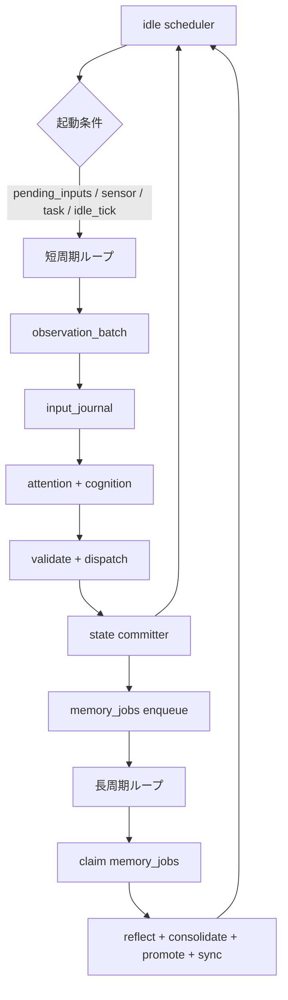
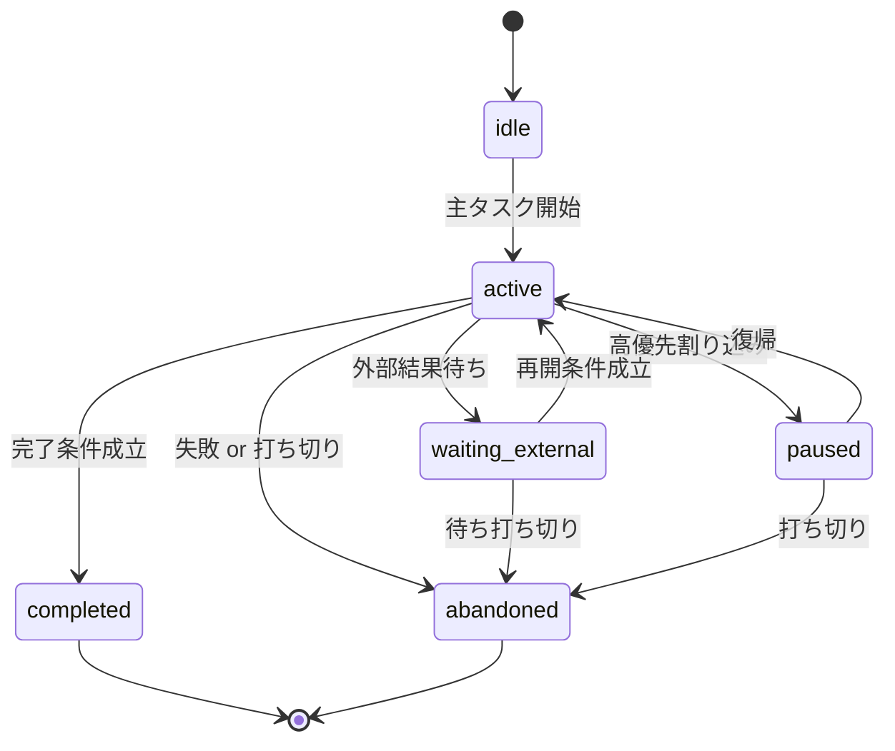

# ランタイム処理仕様

<!-- Block: Purpose -->
## このドキュメントの役割

- このドキュメントは、`docs/30_システム設計.md` を、ランタイム実装直前の処理仕様まで具体化した正本である
- このドキュメントは、target のランタイム像を正本にしつつ、current の `browser_chat` ループを別節で同期する
- 目的は、ランタイムの処理単位、受け渡しデータ、状態更新境界を曖昧にしないことにある
- 責務分割の全体像は `docs/10_目標アーキテクチャ.md` を見る
- 実装単位の責務分解は `docs/30_システム設計.md` を見る
- 記憶サブシステムの詳細は `docs/32_記憶設計.md` を見る
- `memory_jobs` の payload 仕様は `docs/33_記憶ジョブ仕様.md` を見る
- SQLite のテーブル定義は `docs/34_SQLite論理スキーマ.md` を見る
- HTTP path と `SSE` の仕様は `docs/35_WebAPI仕様.md` を見る
- 構造化された JSON 本文と `payload_json` の形は `docs/36_JSONデータ仕様.md` を見る
- 起動前の seed と排他起動は `docs/37_起動初期化仕様.md` を見る
- 入力重複、`cancel`、`SSE` 保持運用は `docs/38_入力ストリーム運用仕様.md` を見る
- 経験からの人格変化は `docs/40_人格変化仕様.md` を見る
- 人格に基づく選択規則は `docs/41_人格選択仕様.md` を見る
- 関数の入出力や状態遷移で迷ったら、このドキュメントを正本として扱う

<!-- Block: Read Guide -->
## target と current の読み分け

- 後続の節で「〜する」と書く本文は、原則として target の最終仕様を指す
- `current browser_chat ランタイム` は、現在の `src/otomekairo/runtime/main_loop.py` が実際に処理している順序だけを示す
- 後続で `current 実装` または `初期実装の browser_chat` と書く補足は、今の `browser_chat` 実装を固定説明したものである
- target と current が衝突する場合、今の実装理解では current を優先する

<!-- Block: Scope -->
## このドキュメントで固定する範囲

- 固定するのは、`人格ランタイム` の実行モデル、`設定 Web サーバ` との受け渡し、`LLM` への認知入力、`action_command` の確定、状態保存の単位である
- 固定するのは、論理的な状態断面と更新順序であり、物理的な SQL テーブル名やカラム名そのものではない
- 固定するのは、ランタイム内部の仕様であり、LLM プロバイダ固有の prompt 文面や SDK 呼び出しではない
- 記憶の物理保存の輪郭は `docs/32_記憶設計.md` で固定し、SQLite のテーブル定義は `docs/34_SQLite論理スキーマ.md` を正本とする
- `memory_jobs.payload_ref` と `job_kind` ごとの payload 詳細は `docs/33_記憶ジョブ仕様.md` を正本とする

<!-- Block: Out Of Scope -->
## このドキュメントに書かないこと

- HTTP path、method、`SSE` 接続方式は `docs/35_WebAPI仕様.md` を正本とする
- JSON のキー、型、必須項目は `docs/36_JSONデータ仕様.md` を正本とする
- 物理テーブル名、カラム名、index は `docs/34_SQLite論理スキーマ.md` を正本とする
- `client_message_id` 重複、`cancel`、`SSE` 保持期間の運用細則は `docs/38_入力ストリーム運用仕様.md` を正本とする
- LLM SDK の呼び出し細部や prompt の逐語的な文面は、このドキュメントでは固定しない

<!-- Block: Current Runtime -->
## current browser_chat ランタイム

- current の `run_once()` は、`settings_change_sets`、`settings_overrides`、`pending_inputs`、`waiting_external` の `browse` task、`memory_jobs` の順で 1 件ずつ処理し、通常 work がないまま `runtime.idle_tick_ms` 経過した場合は内部入力 `idle_tick` を enqueue して同じ短周期経路へ流す
- current の待機は、次の `idle_tick` 時刻まで一括停止せず、短い poll 間隔で `settings_change_sets`、`settings_overrides`、`pending_inputs`、`waiting_external` task、`memory_jobs` の有無を再確認し、Web 入力や設定変更が来たら次の `idle_tick` を待たずに短周期へ戻る
- `pending_inputs` の current 入力種別は `chat_message`、`microphone_message`、`camera_observation`、`network_result`、`idle_tick`、`cancel` に限る
- `chat_message`、`microphone_message`、`camera_observation`、`network_result`、`idle_tick` は、`input_journal` 追記、`build_cognition_input`、`cognition_plan` 生成、必要なら `reply_render`、`validate_action`、`dispatch_action_command`、`finalize_pending_input_cycle` の順で処理する
- `cancel` は、現在進行中の `browser_chat` 応答だけを対象に解決し、対象がなければ `discarded` に確定する
- current の認知入力は `current_observation`、`selection_profile`、`attention_snapshot`、決定論的に組んだ `memory_bundle`、`task_snapshot`、`camera_candidates` を含む
- current の `action_proposal` 受理対象は `speak`、`browse`、`notify`、`look`、`wait` に限る
- current の `action_command.command_type` は `speak_ui_message`、`dispatch_notice`、`enqueue_browse_task`、`control_camera_look` に限る
- `browse` を確定した場合は、まず `waiting_external` task を作り、後続ループで外部検索して `network_result` を返す
- `look` を確定した場合は、`control_camera_look` 実行後に同一短周期内で静止画を取得し、`source=post_action_followup`、`trigger_reason=post_action_followup` の `camera_observation` を follow-up 入力として enqueue してよい
- current の `idle_tick` は、`source=idle_tick`、`trigger_reason=idle_tick`、正の `idle_duration_ms` を持つ内部入力として `pending_inputs` に積み、通常の pending input と同じ finalize 単位で処理する
- current の `ui_outbound_events` は `status`、`token`、`message`、`message_end`、`notice`、`error` を使い、`status api` とは別の制御面ストリームとして扱う
- `microphone` の常時観測回収、`SNS` 入出力、`move`、`social` は current では未実装である

<!-- Block: Runtime Model Group -->
## 実行モデルと前提状態

<!-- Block: Runtime Invariants -->
### ランタイムの不変条件

- 同時に状態を書き換える実体は、常に 1 つの `人格ランタイム` だけである
- 1 回の短周期ループは、1 つの作業コピーに対して閉じた更新として完了する
- 1 回の長周期ループは、直前までに確定したイベントだけを材料にする
- `LLM` は認知判断の主担当だが、I/O 実行者にも DB 更新者にもならない
- `action proposal` と `action_command` は常に分離し、同一視しない
- 性格、感情、記憶を欠いた判断は、不完全な認知として扱う
- 受理した観測は、判断前に `input_journal` へ不変追記し、短周期の途中失敗でも失われない
- 長周期で扱う記憶育成は、`memory_jobs` に永続化された仕事だけを処理対象にする
- 暗黙の補完やフォールバックは行わず、失敗は明示的な失敗として扱う

<!-- Block: Runtime Execution Model -->
### 実行モデル

- ランタイムは、常に 1 本の主スレッド相当の処理単位で `短周期ループ` と `長周期ループ` を交互に管理する
- 同じ時刻に、2 つの短周期ループが並列で同じ状態を更新することはない
- `短周期ループ` は、外部刺激への反応と即時行動を担当する
- `長周期ループ` は、反省、記憶整理、スキル昇格、埋め込み同期を担当する
- 各ループには、`cycle_id`、`cycle_kind`、`trigger_reason`、`started_at` を必ず付与する
- `trigger_reason` は、少なくとも `external_input`、`external_result`、`sensor_change`、`task_resume`、`idle_tick`、`self_initiated`、`post_action_followup` を区別する
- `trigger_reason` はサイクル起動理由の分類であり、詳細な外部入力源は `observation_batch.source` に持つ

- 下の Mermaid 図は、短周期と長周期がどの保存境界でつながるかを本文どおりに図示したものである

<!-- Block: Short Cycle Triggers -->
### 短周期ループの起動条件

- `pending_inputs` に未処理入力があるときは、短周期ループを起動する
- センサー取得で新しい観測が得られたときは、短周期ループを起動する
- `task_state` に再開条件を満たした保留タスクがあるときは、短周期ループを起動する
- 一定時間のアイドリング経過で、再観測や自発行動の判定時刻に達したときは、短周期ループを起動する
- 直前行動に `requires_reobserve` が立っているときは、その追跡のために短周期ループを起動する

<!-- Block: Self Initiated Triggers -->
### 自発行動の起動条件

- `self_initiated` は、緊急度の高い外部入力、保留中の高優先タスク、外部待ちの戻りがないときだけ候補にする
- 自発行動の目的種別は、`task_progress`、`unexplored_check`、`self_maintenance`、`skill_rehearsal` の 4 つに固定する
- `self_initiated` を選ぶ場合でも、開始前に `goal_hint` と停止条件が作れない候補は採用しない
- 無目的な探索、無期限の巡回、根拠のないスキル試行は採用しない
- 自発行動の候補順位は、性格傾向、関係性の重み、経験で学んだ日課、経験で学んだ回避傾向を反映して変える
- 自発行動候補の比較値は、`self_initiated_score_breakdown` として内部計算してよく、JSON 形は `docs/36_JSONデータ仕様.md` を正本とする
- current の `browser_chat` では、`idle_tick` でも同じ `skill_candidates` と `action_proposals` を使って `browse`、`look`、`wait` などの短い自発行動を選んでよい

<!-- Block: Long Cycle Triggers -->
### 長周期ループの起動条件

- 直近の短周期で新しいイベントが確定したときは、長周期ループの候補にする
- `reflection` 対象の失敗イベントが発生したときは、次の安全な境界で長周期ループを起動する
- 記憶更新の保留件数が閾値を超えたときは、長周期ループを起動する
- 一定時間ごとの整理時刻に達したときは、長周期ループを起動する
- 長周期ループは、`runtime.long_cycle_min_interval_ms` より短い間隔では起動しない
- 長周期ループは、短周期ループの保存完了前には起動しない

<!-- Block: Runtime Working Set -->
### 1 サイクルで扱う作業単位

- 1 回の短周期ループでは、`observation_batch`、`input_journal_batch`、`attention_set`、`selection_profile`、必要なら `attention_score_breakdown`、`self_initiated_score_breakdown`、`action_candidate_score`、`cognition_input`、`cognition_plan`、必要なら `speech_draft`、`cognition_result`、`action_command`、`commit_record` を作る
- 1 回の長周期ループでは、`claimed_memory_jobs`、`reflection_bundle`、`memory_updates`、`persona_updates`、`skill_updates`、`embedding_updates` を作る
- これらの作業単位は、永続状態そのものではなく、そのサイクル内だけで使う中間成果物である
- 永続状態へ反映されるのは、`state committer` が確定した差分だけである

<!-- Block: State Slices -->
### 状態断面の詳細

- `self_state` は、経験でゆっくり変化する性格傾向、現在感情、長期目標、関係性、人格としての不変条件を持つ
- `attention_state` は、主注意対象、抑制対象、再確認待ち、直近の注意遷移理由を持つ
- `body_state` は、姿勢、移動状態、感覚器利用可否、出力ロック、現在負荷を持つ
- `world_state` は、現在地、周辺対象、状況要約、`affordances`、`constraints`、`attention_targets`、外部待ち状態を持つ
- `drive_state` は、内部欲求の強度と優先度への影響を持つ
- `task_state` は、進行中タスク、保留タスク、再開条件、中断可否、期限を持つ
- `memory_state` は、`working_memory`、`recent_event_window`、エピソード、意味、感情、対人、反省を持つ
- `skill_registry` は、再利用可能な行動列と、その発火条件、成功条件を持つ

<!-- Block: Task State Machine -->
### `task_state` の状態遷移

- `task_state` の行状態は、`active`、`waiting_external`、`paused`、`completed`、`abandoned` の 5 つである
- 現在の主タスクがない状態は、`task_state` に `active`、`waiting_external`、`paused` の未完了行がないことで表す
- `active` は、短周期で継続して処理すべき主タスクがある状態である
- `waiting_external` は、外部結果待ちで次の観測を待っている状態である
- current 実装の `browse` では、`waiting_external` のタスクを後続の短周期で claim し、外部検索アダプタの結果で `completed` または `abandoned` に進めてよい
- current 実装の `browse` 成功時は、外部検索結果を内部入力 `network_result` として `pending_inputs` に enqueue し、次の短周期で再認知してよい
- `paused` は、緊急度の高い別件で一時中断している状態である
- `completed` は、目標を満たして終了した状態である
- `abandoned` は、安全制約、失敗、優先度低下で打ち切った状態である
- 遷移は、常に短周期または長周期の保存時にだけ確定する

- 下の Mermaid 図は、`task_state` の主状態遷移を本文どおりに図示したものである

<!-- Block: Short Cycle Group -->
## 短周期の処理仕様

<!-- Block: Observation Batch -->
### `observation_batch` の仕様

- `observation_batch` は、その短周期で処理対象になる観測イベントの集合である
- `observation_batch` は、受理済みの観測を `input_journal` へ記録した後に、正規化して組み立てる
- 各項目は、`observation_id`、`source`、`kind`、`captured_at`、`priority_hint`、`normalized_summary`、`payload_ref` を持つ
- `observation_id` は、その観測を `input_journal` と結び付ける一意キーであり、再処理時の重複追記を防ぐ
- `source` は、少なくとも `web_input`、`camera`、`microphone`、`network_result`、`sns_result`、`line_result`、`idle_tick`、`post_action_followup` を区別する
- 初期実装の `browser_chat` では、`chat_message -> web_input`、`microphone_message -> microphone`、`camera_observation(source=camera) -> camera`、`camera_observation(source=post_action_followup) -> post_action_followup`、`network_result -> network_result`、`idle_tick -> idle_tick` に正規化する
- `kind` は、少なくとも `instruction`、`dialogue_turn`、`scene_change`、`audio_segment`、`search_result`、`social_reaction`、`internal_trigger` を区別する
- 初期実装の `browser_chat` では、`chat_message -> dialogue_turn`、`microphone_message -> dialogue_turn`、`camera_observation -> scene_change`、`network_result -> search_result`、`idle_tick -> internal_trigger`、`cancel -> instruction` に正規化する
- `web_input` 由来のテキストは、命令と確定したものだけを `instruction` とし、雑談や相談は `dialogue_turn` として扱う
- 生データ本体は `payload_ref` の先に閉じ込め、人格コア側では正規化後の要約を主に扱う
- 同一短周期で扱う観測は、時系列順に並べたうえで `priority_hint` を保持する
- 内部起点の観測でも、`source` は観測そのものの出所を表し、`trigger_reason` は短周期の起動理由を表す

<!-- Block: Input Journal Contract -->
### `input_journal` の仕様

- `input_journal` は、受理した観測や外部入力を、判断前に残すための不変ログである
- `input_journal` の追記は `input collector` が担当し、`attention_set` の評価前に完了させる
- 各記録は、少なくとも `journal_id`、`observation_id`、`cycle_id`、`source`、`kind`、`captured_at`、`receipt_summary`、`payload_ref`、`created_at` を持つ
- `receipt_summary` は、正規化済みの意味要約ではなく、受理時点で分かる短い受領要約である
- `input_journal` は append-only とし、同じ `observation_id` を二重追記しない
- `input_journal` はスケジューリング用キューではなく、「何を受理したか」の正本であり、後段の `events` が置き換えない
- 後続で `events` を確定するときは、どの `input_journal` を材料にしたかを追跡可能にする

<!-- Block: Attention Set -->
### `attention_set` の仕様

- `attention_set` は、その短周期で何を主対象にし、何を抑制するかを確定した結果である
- `attention_set` は、`primary_focus`、`secondary_focuses`、`suppressed_items`、`revisit_queue` を持つ
- 注意配分は、`safety`、`explicitness`、`urgency`、`novelty`、`task_continuity`、`relationship_salience`、`personality_fit`、`experience_bias` の 8 軸で評価する
- 明示指示は、同じ安全条件の範囲では高く評価する
- 進行中タスクに関係する観測は、無関係な新奇性だけで上書きしない
- 抑制した観測も捨てず、`revisit_queue` に残して次周期の候補にする
- 観測候補の比較値は、`attention_score_breakdown` として内部計算してよく、JSON 形は `docs/36_JSONデータ仕様.md` を正本とする

<!-- Block: Selection Profile -->
### `selection_profile` の仕様

- `selection_profile` は、その短周期で人格に基づく選択を行うための一時オブジェクトである
- `selection_profile` は、`attention_set` の確定後、`cognition_input` の組み立て前に作る
- `selection_profile` は、`self_state`、`current_emotion`、`relationship_overview`、`preference_memory`、`drive_state` から再構成する
- `selection_profile` は、少なくとも `trait_values`、`interaction_style`、`relationship_priorities`、`learned_preferences`、`learned_aversions`、`habit_biases`、`emotion_bias`、`drive_bias` を持つ
- `selection_profile` の JSON 形は、`docs/36_JSONデータ仕様.md` を正本とする
- `selection_profile` を候補へ適用した人格軸の比較結果は、`persona_consistency_score` として内部計算してよい
- `attention manager` は、`selection_profile` を使った候補比較を `attention_score_breakdown` として内部計算してよい
- `self_initiated` の候補比較は、`selection_profile` を使って `self_initiated_score_breakdown` として内部計算してよい
- `action validator` の最終比較は、`selection_profile` を使って `action_candidate_score` として内部計算してよい
- `attention manager`、`self_initiated` の比較、`context assembler`、`action validator` は、同じ `selection_profile` を共有して使う
- `selection_profile` は永続化せず、その短周期の中間成果物としてだけ扱う

<!-- Block: Cognition Input Contract -->
### `cognition_input` の仕様

- `cognition_input` は、その時点の人格として判断させるために `LLM` へ渡す入力断面である
- `cognition_input` は、`cycle_meta`、`time_context`、`self_snapshot`、`behavior_settings`、`selection_profile`、`body_snapshot`、`world_snapshot`、`drive_snapshot`、`task_snapshot`、`attention_snapshot`、`memory_bundle`、`retrieval_context`、`policy_snapshot`、`camera_candidates`、`skill_candidates`、`current_observation`、`context_budget` を持つ
- `cognition_input` は人格判断の意味内容だけを持ち、`llm.model`、`llm.api_key`、`llm.base_url`、`llm.temperature`、`llm.max_output_tokens` は別の `completion_settings` として `effective_settings` から組み立てる
- `completion_settings` は `LLM` クライアント専用の実行設定であり、`cognition_input` や永続化対象の `action history` へ混ぜない
- `time_context` には、少なくとも `current_time_utc_text`、`current_time_local_text`、`timezone_name`、`relative_reference_text` を含める
- `self_snapshot` には、性格傾向、現在感情、長期目標、関係性、人格としての不変条件、好みの行動様式、学習済みの好悪と回避傾向を含める
- 直近の人格更新があるときは、`self_snapshot.last_persona_update` に更新 trait の要約を含めてよい
- `behavior_settings` には、呼び方、振る舞い本文、追加指示、応答ペース、自発性、検索傾向、通知傾向、話し方、詳細さを含める
- `selection_profile` には、その短周期での人格選択に使う短期補正済みの選択断面を含める
- current 実装の `context assembler` は、`selection_profile` から compact な人格要約を組み、`trait_values`、`interaction_style`、`learned_preferences`、`learned_aversions`、`habit_biases`、`emotion_bias`、`drive_bias` を毎周期の prompt self layer と `context_budget.self` の見積りで共有してよい
- `body_snapshot` には、移動可否、出力可否、利用可能センサー、直近負荷、現在の姿勢を含める
- `world_snapshot` には、現在地、周辺対象、`affordances`、`constraints`、`attention_targets`、現在の状況要約を含める
- `drive_snapshot` には、内部欲求の強度と、その短周期での優先度影響を含める
- `task_snapshot` には、進行中タスク、保留条件、再開条件、中断可否を含める
- current 実装では、`task_snapshot.active_tasks` と `task_snapshot.waiting_external_tasks` に、それぞれ優先度上位 `3` 件までの `task_state` を入れてよい
- `attention_snapshot` には、主注意対象、抑制対象、再確認候補を含める
- current の `attention_snapshot` は、`current_observation`、優先度最高の `active_task`、最優先の `relationship_priority` を比較し、`primary_focus`、`secondary_focuses`、`revisit_queue` を再構成してよい
- `memory_bundle` には、`working_memory`、関連エピソード、関連意味記憶、関連感情記憶、関連対人記憶、関連する `preference_memory`、関連反省メモを含める
- `memory_bundle` には、選別済みの `working_memory` とは別に、直近の生イベント列である `recent_event_window` を含める
- `retrieval_context.plan` には、その短周期で使った `RetrievalPlan` を、`retrieval_context.selected` には選別件数と最小の `selection_trace` を含める
- `policy_snapshot` には、`system policy`、`runtime policy`、今回の入力をどう扱うかの決定論的な `input_evaluation` を含める
- current 実装の `input_evaluation` は、少なくとも `input_role`、`attention_priority`、`factuality`、`should_reply_in_channel`、`can_override_persona`、`must_preserve_invariants` を持つ
- current 実装では、`chat_message` / `microphone_message` を `dialogue` または `instruction`、`network_result` を `task_result`、`camera_observation` を `observation` または `followup_observation`、`idle_tick` を `self_maintenance` として扱ってよい
- `skill_candidates` には、今回の状況に適合しうるスキルだけを含める
- current の `skill_candidates` は、`self_initiated_score_breakdown` の上位候補から `fit_score >= 0.30` の項目だけを採り、`suggested_action_types` を添えてよい
- `current_observation` には、その短周期を起動した観測本文と付随情報を含める
- `context_budget` には、今回の `LLM` 呼び出しで使える全体量上限、`self`、`behavior`、`situation`、`memory`、`output contract` への割当上限、各層の見積使用量、削除した記憶断面の参照を含める
- current 実装では、`memory` 層の上限は `runtime.context_budget_tokens` と `memory.max_inject_tokens` の両方で拘束する
- current 実装では、`self`、`behavior`、`situation` の固定層が自分の割当上限を超えた場合、その短周期を失敗として扱う
- `context assembler` は、DB に保存された UTC unix milliseconds をそのまま主表示に使わず、`YYYY-MM-DD HH:MM:SS TZ` のような人間可読な日時表現と、「5 分前」のような相対時間表現へ変換して `cognition_input` に入れる
- `context assembler` は、`current_observation`、`recent_event_window`、`memory_bundle` に含める各時刻についても、LLM が解釈しやすい派生時刻フィールドを付与する
- `context assembler` は DB の全量を渡さず、この短周期で必要な断面だけを選別して `cognition_input` にする
- `context assembler` は、`context_budget` を超えた断面をそのまま詰め込まず、優先度の低い項目から落として構成する
- current 実装では、`memory_bundle` のうち `recent_event_window`、`reflection_items`、`episodic_items`、`semantic_items`、`affective_items`、`relationship_items`、`working_memory_items` の順で末尾から落とし、人格核に近い断面を後まで残す
- current 実装では、`memory_bundle` を削った結果に合わせて `retrieval_context.selected` も最終使用集合へ詰め直す
- `context assembler` は、`RetrievalPlan -> collector 群 -> 決定論的 selector -> memory_bundle` の結果を、そのまま `retrieval_runs` へ保存できる shape にまとめる

<!-- Block: Completion Settings -->
### `completion_settings` の仕様

- `completion_settings` は、`LLM` クライアントが実際の completion 呼び出しに使う runtime-only の設定断面である
- current 実装の `completion_settings` は、少なくとも `model`、`api_key`、`base_url`、`temperature`、`max_output_tokens` を持つ
- `completion_settings` は、`effective_settings` から短周期ごとに再構成し、`cognition_input` の JSON shape へ混ぜない
- `completion_settings` の秘密情報は prompt 材料として使わない

<!-- Block: Prompt Layering -->
### LLM へ渡す層の分け方

- `LLM` へ渡す内容は、`system layer`、`self layer`、`behavior layer`、`situation layer`、`memory layer`、`output contract layer` の 6 層に分けて組み立てる
- `system layer` は、安全制約と人格個体の不変条件を持つ
- `self layer` は、性格、現在感情、長期目標、関係性を持つ
- `behavior layer` は、呼び方、振る舞い本文、追加指示、応答傾向を持つ
- `situation layer` は、今回の観測、身体状態、世界状態、タスク状態を持つ
- current 実装では、`situation layer` に `time_context.current_time_local_text`、`body_snapshot` の姿勢と負荷、`task_snapshot` の active/waiting 要約、`drive_snapshot.priority_effects` を含める
- `memory layer` は、今回参照が必要な記憶だけを持つ
- `output contract layer` は、返答形式と禁止事項を持つ
- current 実装では、`output contract layer` の予算だけは `context_budget` へ予約し、その内容自体は `cognition_input` へ持ち込まない
- どの層も省略可能な任意要素として扱わず、必須断面として常に構成する

<!-- Block: Cognition Plan Contract -->
### `cognition_plan` の仕様

- `cognition_plan` は、認知層の第 1 段で返す構造化された判断計画である
- current 実装では、`cognition_plan` は `intention_summary`、`decision_reason`、`action_proposals`、`step_hints`、`reply_policy`、`memory_focus`、`reflection_seed` を持つ
- `cognition_plan` は、対話本文そのものを持たず、意図と行動候補だけを固定する
- `reply_policy` は、その計画で `speech_draft` を作るべきかを表し、current 実装では `mode=render|none` と `reason` を持つ
- 構造化形式に合わない `cognition_plan` は、その短周期では失敗として扱い、`reply_render` へ進めない

<!-- Block: Speech Draft Contract -->
### `speech_draft` の仕様

- `speech_draft` は、認知計画に沿ってユーザーへ見せる応答本文だけを表す構造化オブジェクトである
- current 実装では、`speech_draft` は `text`、`language`、`delivery_mode` を持つ
- current 実装では、`language` は `ja`、`delivery_mode` は `stream` に固定する
- 構造化形式に合わない `speech_draft` は、その短周期では失敗として扱い、`validate_action` へ進めない

<!-- Block: Cognition Result Contract -->
### `cognition_result` の仕様

- `cognition_result` は、認知層が返す構造化された認知結果である
- current 実装では、`cognition_result` は `cognition_plan` と `speech_draft` を合成して作る
- `cognition_result` は、`intention_summary`、`decision_reason`、`action_proposals`、`step_hints`、`memory_focus`、`reflection_seed` を必須に持ち、必要な対話本文があるときだけ `speech_draft` を持つ
- `intention_summary` は、この短周期で人格が何をしようとしているかを 1 つに定める
- `decision_reason` は、行動の根拠となる要約であり、後から検証できる形で残す
- `action_proposals` は、優先順に並んだ候補列であり、まだ実行命令ではない
- `step_hints` は、複数手順が必要な場合の後続候補列であり、未確定の補助計画として扱う
- `memory_focus` は、この判断で特に参照した記憶の要約を持つ
- `reflection_seed` は、後続の `reflection writer` が使う要点を持つ
- 構造化形式に合わない `cognition_result` は、その短周期では失敗として扱い、実行段へ進めない

<!-- Block: Decision Gate -->
### 短周期の判断ゲート

- `attention_set` と `cognition_input` を作った時点で、その短周期は `ignore`、`react`、`defer` の 3 つに分ける
- `ignore` は、保存だけ行って即時行動をしない状態である
- `react` は、`LLM` による認知判断から行動候補を作る状態である
- `defer` は、保留タスクとして残し、即時行動を見送る状態である
- `ignore` と `defer` も、判断結果として明示的に確定し、暗黙に捨てない

<!-- Block: Action Proposal Contract -->
### `action_proposal` の仕様

- `action_proposal` は、`LLM` が提案する未確定の行動候補である
- 各候補は、`proposal_id`、`action_type`、`target_hint`、`parameter_hint`、`goal_hint`、`step_hints`、`completion_hint`、`priority`、`reason` を持つ
- `action_type` は、少なくとも `speak`、`move`、`look`、`browse`、`social`、`notify`、`wait` を区別する
- 候補は複数返してよいが、優先度の高い順に並んでいなければならない
- 候補の段階では、実行パラメータはまだ確定値ではなく、検証前のヒントとして扱う
- `step_hints` は、必要な場合だけ持つ手続き的な補助手順であり、実行命令ではない
- `completion_hint` は、何をもってその候補が完了したとみなすかの観測条件を持つ
- current の `browser_chat` では、`action_proposal` の受理対象を `speak`、`browse`、`notify`、`look`、`wait` に絞ってよい

<!-- Block: Planning Constraints -->
### 長い計画の拘束条件

- 1 回の短周期で `action_command` に落とすのは、常に次の 1 手だけである
- `step_hints` が複数あっても、未実行の後続手順をまとめて確定命令にしない
- 後続手順は `task_state` に保持してよいが、次周期の観測と優先度評価を通したうえで再判断する
- 前周期で妥当だった後続手順でも、外界変化や失敗があれば自動継続せず破棄または再編する

<!-- Block: Action Command Contract -->
### `action_command` の仕様

- `action_command` は、`action validator` が確定する唯一の実行命令である
- 1 回の短周期で確定する主命令は、原則として 1 つだけである
- `action_command` は、`command_id`、`command_type`、`target`、`parameters`、`preconditions`、`stop_conditions`、`timeout_ms`、`requires_reobserve`、`expected_effects`、`proposal_ref` を持つ
- `proposal_ref` は、どの `action_proposal` から確定したかを追跡するために必須である
- current の `browser_chat` では、`command_type` を `speak_ui_message`、`dispatch_notice`、`enqueue_browse_task`、`control_camera_look` に絞ってよい
- `preconditions` を満たさない候補は確定しない
- `stop_conditions` は、行動をいつ止めるかを明示し、無制限な継続を許さない
- `requires_reobserve` は、行動直後の標準再観測に加えて、追加の追跡観測が必要かを明示する
- どの `action_command` も、必ず 1 つの明確な `actuator_port` に属する

<!-- Block: Action Validation Rules -->
### `action validator` の確定ルール

- `action validator` は、候補を優先順に検査し、実行不能な候補を落としたうえで、実行可能候補の中から最も人格整合なものを `action_command` にする
- 検査対象は、`system policy`、`runtime policy`、身体制約、世界制約、空間制約、`affordances`、現在タスク、命令階層、人格整合性、関係性整合性、経験由来の好悪である
- 候補ごとの人格側の比較値は、`persona_consistency_score` として内部計算してよく、JSON 形は `docs/36_JSONデータ仕様.md` を正本とする
- 実行可能候補の全体比較値は、`action_candidate_score` として内部計算してよく、JSON 形は `docs/36_JSONデータ仕様.md` を正本とする
- current の `browser_chat` では、`notify` の最上位候補を選んだ場合、ユーザー通知 (`notice` イベント) として実行してよい
- current の `browser_chat` では、`browse` の最上位候補を選んだ場合、`task_state(waiting_external)` へ検索タスクを enqueue してよく、`reply_policy.mode=render` なら伴走メッセージを同時に出してよい
- current の `browser_chat` では、`look` の最上位候補を選んだ場合、カメラ視点操作として実行してよい
- current の `browser_chat` では、`look` は `camera_connection_id` を必須にし、`preset_name` / `preset_id` を使う場合は選んだ `camera_candidates[].presets[]` に存在するものだけを受理してよい
- current の `browser_chat` では、`look` を `action_command.requires_reobserve=true` で確定し、成功時は `followup_input_kind=camera_observation`、`followup_input_source=post_action_followup`、`followup_trigger_reason=post_action_followup` を `observed_effects` に残してよい
- current の `browser_chat` では、`wait` の最上位候補だけを `hold` として確定してよく、`reply_policy.mode=render` なら伴走メッセージを同時に出してよい
- current の `browser_chat` では、`action validator` は `task_snapshot.waiting_external_tasks` に同じ `query` の `browse` がある候補を hard gate で棄却してよい
- current の `browser_chat` では、`action validator` は `memory_bundle` の `summary` / `fact` / `relation` / `preference` / `event_affect` / `reflection_note` と、直近の `self_snapshot.last_persona_update` を使って候補差を付けてよい
- 安全に反する候補は、その時点で棄却する
- 身体能力を超える候補は、その時点で棄却する
- 現在のタスク連続性を壊す候補は、緊急性がなければ保留に回す
- 外部入力があっても、`system policy` と `runtime policy` を上書きする候補は確定しない
- 複数の候補が同程度に実行可能な場合は、`proposal.priority` だけでなく、性格傾向、関係性、学習済みの好みと回避傾向で最終順位を決める
- 実行可能な候補が 1 つもない場合は、候補を棄却または保留として確定し、代替命令を捏造しない

<!-- Block: Action Execution Contract -->
### `action dispatcher` と実行結果の仕様

- `action dispatcher` は、`action_command` を対応する `actuator_port` に渡して実行する
- 実行結果は、`result_id`、`command_id`、`started_at`、`finished_at`、`status`、`failure_mode`、`observed_effects`、`raw_result_ref`、`adapter_trace_ref` を持つ
- `status` は、少なくとも `succeeded`、`failed`、`stopped` を区別する
- `failure_mode` は、失敗時の原因種別であり、少なくとも `precondition_failed`、`device_rejected`、`network_timeout`、`sensor_mismatch`、`unexpected_side_effect` を区別する
- 実行後の再観測結果は、必ず `observed_effects` として束ねる
- `requires_reobserve` が立っている場合は、行動直後の標準再観測に加えて追跡観測を行う
- 実行器は、宣言されていない副作用を持ってはならない
- 実行失敗も成功と同じく、後続の保存と反省の入力にする
- `adapter_trace_ref` は、外部アダプタ側の詳細記録への参照であり、統合由来の失敗解析に使う
- current の `enqueue_browse_task` は、伴走メッセージを持つ場合に `message` を、持たない場合に `notice(browse_queued)` を出してよい
- current の `hold_chat_response` は、伴走メッセージを持つ場合に `message` と `status` を出してよい

<!-- Block: Commit Contract -->
### `state committer` の保存仕様

- `state committer` は、その短周期で確定した差分だけを永続状態へ反映する
- current の `browser_chat` では、`attention_state`、`body_state`、`world_state`、`drive_state`、`task_state`、`action_history`、`pending_inputs`、`settings_overrides`、`events`、`memory_jobs`、`retrieval_runs`、`commit_records` を短周期で更新する
- current の `browser_chat` では、`body_state` は少なくとも `posture`、`sensor_availability`、`load` を、`world_state` は少なくとも `situation_summary`、`affordances`、`constraints`、`attention_targets`、`external_waits` を、`drive_state` は少なくとも `drive_levels` と `priority_effects` を更新する
- current の `browser_chat` では、`dispatch_action_command` や task 再開が follow-up 入力を作った場合、その `pending_inputs` 追加と `followup_input_ids` の `commit_record` 反映を同じ短周期 transaction で確定する
- 1 回の短周期の保存単位は、`self_state`、必要なら `runtime_settings`、`attention_state`、`body_state`、`world_state`、`drive_state`、`task_state`、`working_memory`、`recent_event_window`、`action_history`、`pending_inputs`、`settings_overrides`、`settings_change_sets`、新規に enqueue する `memory_jobs`、必要なら `retrieval_runs` の処理結果である
- `state committer` は、まず SQLite 側の正本更新と `commit_record` を確定し、その後に `events.jsonl` を派生同期する
- `commit_record` には、少なくとも `commit_id`、`cycle_id`、`committed_at`、`log_sync_status` を持たせる
- `input_journal` は、短周期の状態保存とは別に事前追記されるが、その短周期で確定した `events` は必ず `input_journal` の参照を持てるようにする
- `events.jsonl` は正本ではないため、内容は必ず SQLite で確定した `commit_record` から再構成する
- `events.jsonl` の追記は、`commit_id` を使って idempotent に行い、同じ `commit_record` を二重記録しない
- `events.jsonl` の追記に失敗した場合は、`log_sync_status` を `needs_replay` に更新し、同じ状態差分を再適用せずに派生ログ同期だけを再実行する
- 短周期の正本完了条件は、SQLite 側の状態差分と `commit_record` の確定であり、`events.jsonl` 同期状態は `log_sync_status` で別追跡する

<!-- Block: Commit Order -->
### 短周期の保存順序

- まず、観測原本の受理時点で `input_journal` を `observation_id` 単位に追記し、取りこぼしを防ぐ
- 次に、入力の取り込み結果として `pending_inputs`、`settings_overrides`、`settings_change_sets` の状態を更新し、`runtime` scope の設定反映や設定UI保存の適用がある場合は `runtime_settings` も更新する
- 次に、`self_state`、`attention_state`、`body_state`、`world_state`、`drive_state`、`task_state`、`working_memory`、`recent_event_window` の差分を反映する
- current の `browser_chat` では、この段階で `attention_state`、`body_state`、`world_state`、`drive_state`、`task_state` を同じ transaction 内で確定する
- current の `browser_chat` では、`dispatch_action_command` や task 再開が follow-up 入力を返した場合、この段階で `pending_inputs(status=queued)` を同じ transaction 内へ追加する
- 次に、`action_history` を保存し、同じ短周期 transaction 内で `retrieval_runs.plan_json`、`candidates_json`、`selected_json`、`resolved_event_ids_json` を保存する
- 次に、その短周期で確定した `events` を根拠に、必要な `memory_jobs` を enqueue する
- 次に、今回の `commit_record` を `log_sync_status="pending"` で確定して SQLite の更新を完了する
- 次に、確定済み `commit_record` から `events.jsonl` を `commit_id` 単位で追記する
- 最後に、`events.jsonl` 同期結果に応じて `log_sync_status` を `synced` または `needs_replay` に更新する
- この順序は固定し、同一サイクル内で入れ替えない

<!-- Block: Long Cycle Group -->
## 長周期の処理仕様

<!-- Block: Memory Job Scheduler -->
### `memory job scheduler` の仕様

- `memory job scheduler` は、`memory_jobs` から `queued` のジョブを claim し、その長周期で扱う仕事を確定する
- `memory_jobs` の主状態は、`queued`、`claimed`、`completed`、`dead_letter` の 4 つである
- 各ジョブは、少なくとも `job_id`、`job_kind`、`payload_ref`、`created_at`、`status`、`tries` を持つ
- `payload_ref` の解決規則と `job_kind` ごとの payload 本体は `docs/33_記憶ジョブ仕様.md` に従う
- 1 回の長周期では、claim したジョブだけを処理し、未claim のジョブを暗黙に巻き込まない
- `memory_jobs` は、少なくとも `write_memory`、`refresh_preview`、`embedding_sync`、`tidy_memory`、`quarantine_memory` を区別する
- 短周期で新しい `events` が確定したときは、同じ短周期の保存単位で最低でも `write_memory` を enqueue する
- `refresh_preview` は、対象イベント本文または要約が変わったときだけ enqueue する
- 失敗したジョブは `tries` を増やして再実行対象に残し、上限到達時だけ `dead_letter` にする
- 失敗したジョブは、再キューや `dead_letter` 化に加えて `logger.exception(...)` で stderr にも出し、端末上で異常を追跡できる状態を保つ

<!-- Block: Reflect Contract -->
### `reflection writer` の仕様

- `reflection writer` は、直近の `commit_record` と `cognition_result` と実行結果を材料に `reflection_bundle` を作る
- `reflection_bundle` は、`what_happened`、`what_failed`、`what_worked`、`retry_hint`、`avoid_pattern` を持つ
- `reflection` は感想文ではなく、次回判断に使える差分知識として残す
- 直近の短周期で `ignore` や `defer` を選んだ場合も、その判断妥当性を記録対象にできる

<!-- Block: Consolidation Contract -->
### `memory consolidator` の仕様

- `memory consolidator` は、`claimed_memory_jobs` と `reflection_bundle` と直近イベントから、対象ジョブに応じた更新内容を選別する
- `job_kind="write_memory"` の選別結果は、`episodic_updates`、`semantic_updates`、`affective_updates`、`relationship_updates`、`quarantine_updates` に分ける
- `job_kind="write_memory"` の選別結果には、必要なら `persona_updates` を含めてよい
- `persona_updates` は、`self_state.personality` の可変 trait にだけ適用し、`invariants` を更新してはならない
- `persona_updates` は、`base_personality_updated_at` を持つ適用可能な差分オブジェクトとし、JSON 形は `docs/36_JSONデータ仕様.md`、更新上限は `docs/40_人格変化仕様.md` に従う
- `base_personality_updated_at` の比較対象は、`self_state.updated_at` ではなく `self_state.personality_updated_at` に固定する
- ここでの `persona_updates` は `write_memory` の内部出力であり、`memory_job_payloads.payload_json` に含めて保存するものではない
- `job_kind="refresh_preview"` の場合は、`event_preview_cache` の更新だけを行い、他の更新群を同時に確定しない
- 一度の出来事でも、事実、感情、関係性は別レイヤとして分けて保持する
- `working_memory` にしか価値がない内容は、長期記憶へ昇格させない
- `recent_event_window` は、次の短周期に必要な近接文脈だけを残し、長期記憶へそのまま昇格させない
- 短期的な出来事のうち、再参照価値が低いものはエピソード候補のまま減衰させる
- `quarantine_updates` は、誤想起として確定した項目を削除せず、`searchable` の切替で主要想起から外す

<!-- Block: Learning Contract -->
### `skill promoter` と学習の仕様

- `skill promoter` は、反復成功し、かつ人格傾向に一貫している行動列だけを `skill_registry` の候補にする
- current 実装では、`skill_registry` への昇格処理はまだ持たず、`skill promoter` は `cognition_input.skill_candidates` を作る人格適合フィルタとして実装してよい
- `skill` には、`skill_id`、`trigger_pattern`、`preconditions`、`action_pattern`、`success_signature` を持たせる
- `preconditions` と `action_pattern` には、少なくとも人格に合う発火条件と、避けるべき行動様式を含める
- 単発成功だけでは `skill` に昇格させない
- `embedding_updates` は、記憶本文の更新と同じ長周期で同期する
- `refresh_preview` や `quarantine_memory` が完了したときも、対応する `memory_jobs` の状態を同じ長周期で `completed` に確定する
- 記憶の忘却は削除ではなく、重要度、参照頻度、記憶強度の減衰として扱う

<!-- Block: Boundary Conditions Group -->
## 境界条件

<!-- Block: Web Handoff Contract -->
### Web サーバとの受け渡し仕様

- `settings overrides api` は scalar な設定変更要求だけを `settings_overrides` へ書き込む
- `settings editor api` は設定UIの全体保存を受け取り、`settings_editor_state`、5 種のプリセットテーブル、`camera_connections` を更新し、`settings_change_sets` を enqueue する
- ランタイムは `settings_change_sets` を適用するときに `settings_editor_state` や `camera_connections` を書き戻さず、Web が保存した正本を read-only で参照する
- `chat input api` は人格状態を直接変更せず、`pending_inputs` に要求を書き込む
- `microphone api` は raw audio body を同期 `STT` し、転写結果を `microphone_message` として `pending_inputs` に書き込む
- `camera api` の `observe` は、撮影した静止画を `source=camera` / `trigger_reason=self_initiated` の `camera_observation` として `pending_inputs` に書き込む
- ランタイムは、通常 work がないまま `runtime.idle_tick_ms` 経過した場合だけ、内部入力 `idle_tick` を `pending_inputs` に書き込んでよい
- ランタイムは、`idle_tick` の待機中でも短い poll 間隔で queue を再確認し、`settings_change_sets`、`settings_overrides`、`pending_inputs`、`waiting_external` task が到着した場合は、次の `idle_tick` を待たずにその短周期を開始しなければならない
- `chat stream api` は、人格状態を変更せず、`ui_outbound_events` を `SSE` で読み出して配信する
- `pending_inputs` の各項目は、`input_id`、`source`、`channel`、`client_message_id`、`payload`、`created_at`、`priority`、`status` を持つ
- `settings_overrides` の各項目は、`override_id`、`key`、`requested_value_json`、`apply_scope`、`created_at`、`status` を持つ
- `settings_change_sets` の各項目は、`change_set_id`、`editor_revision`、`payload_json`、`created_at`、`status` を持つ
- `ui_outbound_events` の各項目は、`ui_event_id`、`source_cycle_id`、`channel`、`event_type`、`payload`、`created_at` を持つ
- `pending_inputs.status` は、少なくとも `queued`、`claimed`、`consumed`、`discarded` を区別する
- `settings_overrides.status` は、少なくとも `queued`、`claimed`、`applied`、`rejected` を区別する
- `settings_change_sets.status` は、少なくとも `queued`、`claimed`、`applied`、`rejected` を区別する
- `pending_inputs.channel` は、少なくとも `browser_chat` を区別する
- `client_message_id` があるチャット入力は、`(channel, client_message_id)` の重複を受け付けない
- `chat_message` は、非空の `text` に加えて `camera_still_image` 添付を持ってよく、添付がある場合は `text` を省略してよい
- `microphone_message` は、非空の `text`、`stt_provider`、`stt_language` を必須とし、`message_kind=dialogue_turn` の転写済み音声入力として扱う
- `camera_observation` は、`camera_still_image` 添付を 1 件以上必須とし、各添付に `camera_connection_id` と `camera_display_name` を含め、`text` を持たない観測入力として扱う
- `network_result` は、`query`、`summary_text`、`source_task_id` を必須とし、`trigger_reason=external_result` を持つ内部結果入力として扱う
- `idle_tick` は、`trigger_reason=idle_tick` と正の `idle_duration_ms` を必須とし、`text` や添付を持たない内部トリガ入力として扱う
- `ui_outbound_events.event_type` は、少なくとも `token`、`message`、`message_end`、`status`、`notice`、`error` を区別する
- `ui_outbound_events` は append-only を基本とし、ランタイムだけが追記し、Web サーバは配信済み状態を書き戻さない
- `ui_outbound_events` は、短周期のコア状態保存単位とは別の制御面ストリームログとして扱う
- ランタイムは、短周期の先頭で `queued` を `claimed` にし、そのサイクルの責任範囲として取り込む
- ランタイムは、入力を処理した同じ短周期の保存で、`pending_inputs` の `claimed` を必ず `consumed` または `discarded` に確定する
- ランタイムは、`settings_overrides` を評価した同じ短周期の保存で、`claimed` を必ず `applied` または `rejected` に確定する
- ランタイムは、`settings_change_sets` を評価した同じ短周期の保存で、`claimed` を必ず `applied` または `rejected` に確定する
- ランタイムは、`settings_change_sets` を `applied` にするとき、現在アクティブな `character`、`behavior`、`conversation`、`memory`、`motion` と `system_values` から `runtime_settings` を materialize する
- ランタイムは、`apply_scope="runtime"` の `settings_overrides` だけを同じ短周期で `runtime_settings` に反映する
- ランタイムは、`apply_scope="next_boot"` の `settings_overrides` を同じ短周期では `runtime_settings` に反映せず、次回起動時に materialize する
- ランタイムは、ブラウザへ見せる応答トークン、応答完了、自発メッセージ、状態通知があれば、短周期の完了を待たず `ui_outbound_events` に生成順で追記してよい
- ランタイムは、`speak` 応答ごとに対象 `message_id` の終端として `message_end` を 1 回だけ出し、`finish_reason` で `completed` と `cancelled` を区別する
- `cancel` は、現在進行中の `browser_chat` 応答だけを対象にし、見つからない場合は `discarded` に確定する
- `chat stream api` は、`Last-Event-ID` または同等のカーソルで未送出分だけを配信し、配信済み状態を DB へ書き戻さない
- Web サーバは、`self_state`、`world_state`、`memory_state` の正本を直接更新しない

<!-- Block: Error Policy -->
### エラー時の扱い

- `LLM` の構造化出力が壊れている場合は、その短周期を失敗として記録し、実行段へ進めない
- `action validator` が候補をすべて棄却した場合は、その事実を明示的に保存し、暗黙の代替行動は行わない
- 外部 I/O の失敗は、`action_history` とイベントに残し、次の `reflection` 対象にする
- SQLite 側の正本保存失敗は明示的なランタイムエラーとして扱い、黙って先へ進めない
- `events.jsonl` の同期失敗は、`log_sync_status="needs_replay"` として明示し、状態差分の再適用ではなく派生ログ同期の再実行対象にする
- 短周期の途中で入力処理が失敗した場合は、`pending_inputs` を `discarded` に確定し、`event_type=error` の `ui_outbound_events` を 1 件残してから短周期を閉じる
- 短周期やタスク再開の途中で例外が起きた場合も、状態確定とは別に `logger.exception(...)` で stderr にスタックトレースを出す
- エラーを握りつぶす処理は作らない

<!-- Block: Concurrency Policy -->
### 並行性の制約

- 同じ人格個体に対して、同時に複数の `人格ランタイム` を起動しない
- `設定 Web サーバ` は、入力要求、設定要求、`SSE` 接続を並行に受け付けてよい
- ランタイムは、`claimed` にした入力だけをその短周期の責任範囲として扱う
- ランタイムの状態更新は常に 1 本だが、`idle_tick` の待機は Web 入力や設定変更の受付をブロックしてはならない
- 同じ状態断面に対して、Web サーバとランタイムが同時に直接書き込む設計は採用しない
- 並列実行で性能を稼ぐより、状態一貫性を優先する

<!-- Block: Fixed Decisions -->
## このドキュメントで確定したこと

- `docs/30_システム設計.md` の各責務は、ここで定義した入出力仕様で実装する
- `cognition_input` は、人格、状態、記憶、命令階層を必須断面として持つ
- current 実装の認知層は `cognition_plan` と `speech_draft` を分けて返してよいが、`action_command` は返さない
- `action validator` は、候補を 1 つの実行命令へ確定するか、棄却または保留を明示する
- 受理した観測は、短周期の判断前に `input_journal` へ残す
- 1 回の短周期は、SQLite 側の正本更新を 1 つの保存単位として閉じる
- 長周期の記憶育成は、`memory_jobs` の永続状態を持って進める
- `events.jsonl` は観測ログであり、`commit_record` から再構成できる派生ログとして扱う
- エラーや不整合は明示的に失敗として扱い、暗黙の補完はしない
