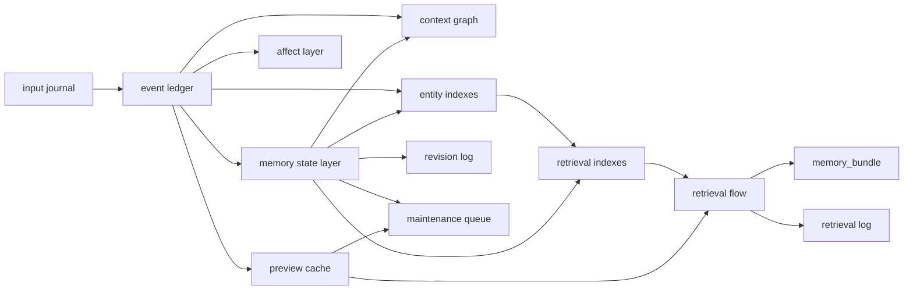
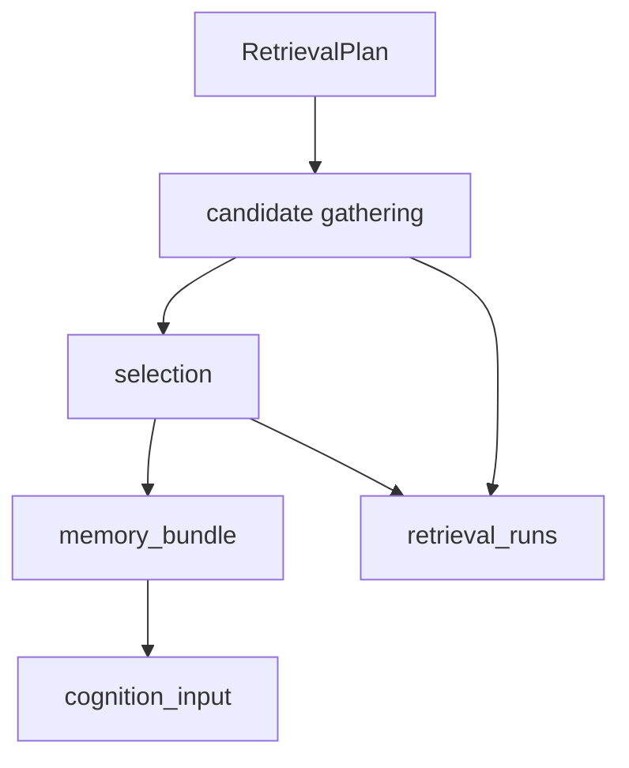
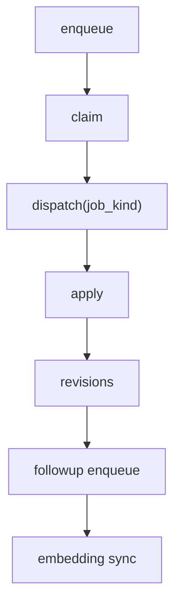

# 記憶設計

<!-- Block: Purpose -->
## このドキュメントの役割

- このドキュメントは、`docs/30_システム設計.md` と `docs/31_ランタイム処理仕様.md` にある記憶周りだけを、独立した正本として固定する
- 目的は、記憶の「思い出す」と「育てる」を分けたうえで、処理単位、更新原則、保存形を曖昧にしないことにある
- 構成全体は `docs/10_目標アーキテクチャ.md` を見る
- ランタイム全体の処理仕様は `docs/31_ランタイム処理仕様.md` を見る
- `memory_jobs` の payload 仕様は `docs/33_記憶ジョブ仕様.md` を見る
- SQLite のテーブル定義は `docs/34_SQLite論理スキーマ.md` を見る
- 経験からの人格変化は `docs/40_人格変化仕様.md` を見る
- 記憶の設計判断で迷ったら、このドキュメントを正本として扱う

<!-- Block: Scope -->
## このドキュメントで固定する範囲

- 固定するのは、記憶の論理層、想起、更新、忘却、反省、検索索引、監査履歴の扱いである
- 固定するのは、SQLite 上の物理保存の輪郭であり、最終的な SQL 文や migration 手順そのものではない
- 固定するのは、人格コアの記憶であり、設定ファイルや一時ログの一般論ではない
- 一時的な比較検討や参考情報は `docs/note/` に残し、このドキュメントには採用した内容だけを書く

<!-- Block: Current Scope -->
## current 実装で記憶へ入る入力

- current の記憶処理が直接受ける入力は `chat_message`、`camera_observation`、`network_result`、`idle_tick` に限る
- `camera_observation` やチャット添付画像は、生画像を記憶本文へ複製せず、`camera_still_image` の参照と説明文だけを持つ
- current の `browse` 完了周期では、圧縮要約の `summary` に加えて、外部確認済みの短い `fact` を別 `memory_state` として保存する
- `idle_tick` は current でも `internal_trigger` の観測として `events` と `memory_jobs` の根拠になってよい
- `microphone`、`SNS`、`line_result` 起点の記憶流入は target 語彙としては残すが、current では未接続である

<!-- Block: Memory Model Group -->
## 記憶モデル

<!-- Block: Design Principles -->
### 記憶設計の原則

- 記憶は、`追記される出来事` と `更新で育つ状態` を分ける
- 受理した観測は、正規化前の受理ログとして `input_journal` へ残し、出来事記憶と混同しない
- 事実として観測された出来事は、矛盾があっても出来事ログから消さない
- 長期記憶は、出来事から抽出して育てるが、必ず根拠イベントを持つ
- 記憶の想起は、DB の単純検索だけで終わらせず、`RetrievalPlan -> 候補収集 -> 選別 -> memory_bundle` の 4 段で行う
- 記憶の更新は、短周期の保存完了後に行い、同期の即時反応と分離する
- 忘却は削除ではなく、重要度、参照頻度、記憶強度の減衰で表現する
- `working_memory` は長期記憶ではなく、その時点の作業断面として扱う
- 短期文脈は、選別済みの `working_memory` と、直近の生イベント列である `recent_event_window` を分けて扱う
- 長周期の記憶育成は、短周期保存で enqueue された `memory_jobs` に永続化した仕事だけを順に処理する
- 性格、感情、関係性、反省は、記憶の外側に逃がさず、想起の対象として一体で扱う

<!-- Block: Fixed Memory Rules -->
### 具体設計として固定する記憶原則

- `events` は出来事の不変記録、`memory_states` は育つ知識として分離し、両者を同一更新として扱わない
- `input_journal` は受理した観測の不変記録であり、`events` が確定しても置き換えない
- すべての長期記憶更新は、必ず `evidence_event_ids` を持ち、根拠イベントなしで昇格しない
- 反省は自由文ではなく、少なくとも `reflection_note`、`retry_hint`、`avoid_pattern`、必要なら `judgment_patch` を持つ再利用用の記憶として保存する
- 想起では `working_memory` を最優先で確保しつつ、`recent_event_window` を別枠で保持し、その残りでエピソード、意味、感情、関係、反省を種別ごとの件数上限付きで `memory_bundle` に積む
- `memory_bundle` は、種別ごとの上限と全体の `context budget` を超えてはならず、超過分は優先度順に落とす
- current 実装では、`summary` / `fact` の候補収集に `sqlite-vec` の類似検索を使い、直近順だけに固定しない
- current 実装では、完全な `RetrievalPlan` の前に、`current_observation` と `summary` / `fact` / 直近 `events` の決定論的な一致判定で候補を先に絞ってよい
- `action` と `action_result` は分離して記録するが、同一 `cycle_id` と相互参照で必ず結び付け、失敗も成功と同じ粒度で残す
- 忘却は削除でなく、`importance`、`memory_strength`、`last_accessed_at`、`searchable` の変化で表現し、想起時に再強化する
- `long_mood_state` は増殖させず単一の持続状態として更新し、瞬間感情は `event_affect` で別管理する
- 想起用の圧縮プレビューは `event_preview_cache` に派生保存し、元の出来事本文の代替にしない
- 誤想起は、元の記録を削除せず、`searchable` の切替で主要想起から隔離する
- `skill` 昇格に使う根拠は、複数イベントにまたがる成功列と、それに対応する反省メモの組でなければならない

<!-- Block: Memory Topology -->
### 記憶の全体構造

- 記憶は、`input journal`、`event ledger`、`memory state layer`、`affect layer`、`context graph`、`entity indexes`、`retrieval indexes`、`preview cache`、`revision log`、`retrieval log`、`maintenance queue` の 11 層で構成する
- `input journal` は、受理した観測や外部入力を、判断前に残す不変の層である
- `event ledger` は、観測と行動を意味単位へまとめた出来事を追記する不変の層である
- `memory state layer` は、事実、関係、タスク、要約、持続感情、反省などを更新で育てる層である
- `affect layer` は、イベントごとの瞬間感情を持つ層である
- `context graph` は、出来事どうし、状態どうしのつながりを育てる層である
- `entity indexes` は、出来事と状態に付いたエンティティを正規化して、多段想起の種にする層である
- `retrieval indexes` は、ベクトル検索や文字検索のための索引であり、記憶本文ではない
- `preview cache` は、想起時の LLM 選別に使う圧縮プレビューを持つ派生層である
- `revision log` は、更新された記憶の監査履歴である
- `retrieval log` は、どう思い出したかを観測するための実行ログである
- `maintenance queue` は、長周期で処理する記憶更新、プレビュー更新、整理ジョブを保持する層である

- 下の Mermaid 図は、記憶の 11 層がどこから育ち、どこで想起に使われるかを本文どおりに図示したものである

<!-- Block: Entity Indexes -->
### エンティティ索引の設計

- `entity_expand` を成立させるため、イベント本文や状態本文に付いたエンティティは正規化索引として別に持つ
- `event_entities` は、`memory event` に紐づくエンティティ索引である
- `state_entities` は、`memory_states` に紐づくエンティティ索引である
- 各エンティティ索引は、`entity_type_norm`、`entity_name_raw`、`entity_name_norm`、`confidence`、`created_at` を持つ
- `entity_name_raw` は表示や監査用の元表記である
- `entity_name_norm` は検索用の正規化キーである
- current 実装では、`entity_name_norm` は小文字化し、空白差を吸収した値として扱ってよい
- イベントや状態の注釈更新時に、対応するエンティティ索引は作り直してよい
- current 実装では、`event_entities` は `MemoryWritePlan.event_annotations[].entities[]` から置換してよい
- current 実装では、`event_annotations.about_time` は `event_about_time` に正規化して保存してよい
- current 実装では、`state_about_time` は `memory_states.body_text` と `payload_json.summary_text` から再構成してよい
- current 実装では、`state_entities` は `memory_states.payload_json` の `query`、`source_task_id`、`fact_kind`、`summary_text` から再構成してよい
- エンティティ索引は、本文の代わりではなく、多段想起の入り口として使う

<!-- Block: Logical Domains -->
### 論理記憶ドメイン

- `working_memory`
  - 短周期ループの間だけ使う作業文脈である
  - 長期保存の正本ではなく、次の判断に必要な断面だけを持つ
  - 必要なら直近スナップショットとして保存するが、長期記憶と同一視しない

- `recent_event_window`
  - 直近の受理済みイベント列を、そのまま近接文脈として持つ
  - `working_memory` のように要点へ圧縮せず、短期の流れを保つために使う
  - 長期記憶へそのまま昇格させず、必要なら `events` と `memory_states` へ再構成して残す

- `episodic_memory`
  - 観測、行動、結果を時系列で残す出来事記憶である
  - 不変の出来事ログとして扱い、後から再解釈しても元の出来事自体は消さない

- `semantic_memory`
  - 繰り返し参照される知識、育った事実、要約、タスク状態を持つ
  - 更新対象であり、改訂履歴を必ず残す

- `affective_memory`
  - イベントに紐づく瞬間感情と、背景として持続する長期感情を扱う
  - 瞬間感情と持続感情は別レイヤで持ち、同じ器に混ぜない

- `relationship_memory`
  - 対象との関係、好悪、付き合い方、関係の変化を持つ
  - 好みや苦手のような誤断定しやすい情報は、専用の確定度付き記録として扱う

- `reflection_memory`
  - 失敗要因、再試行ヒント、回避パターン、判断の妥当性を持つ
  - 感想ではなく、次回判断で使う差分知識として扱う

- `skill_adjacent_memory`
  - `skill_registry` 自体は記憶本体ではないが、スキル昇格の根拠は記憶側で保持する
  - 反復成功の根拠となるイベント列と反省メモを参照できるようにする

<!-- Block: Input Journal -->
### `input_journal` の設計

- `input_journal` は、受理した観測や外部入力を、判断前に落とす不変ログである
- 基本単位は、`observation_id` ごとに 1 件である
- `input_journal` は append-only とし、同じ `observation_id` を二重追記しない
- `input_journal` は、元の入力痕跡を残すための層であり、後段の `events` が意味単位へ再構成しても削除しない
- `input_journal` に保存するのは、生の巨大バイナリではなく、受理時点の短い要約と参照先である
- `input_journal` は、監査用だけでなく、短周期失敗後の再処理起点としても使える形で保持する

<!-- Block: Event Ledger -->
### `event ledger` の設計

- `event ledger` は、短周期の保存完了ごとに 1 件以上の `memory event` を追記する
- 基本単位は会話の 1 ターンではなく、`1 回の意味のある観測・行動まとまり` とする
- 1 件の `memory event` は、観測、判断、実行、結果のうち、そのサイクルで確定した事実を持つ
- `memory event` は、必要に応じて複数の `input_journal` を束ねて 1 件にしてよい
- `memory event` は削除しない
- 同じ事象に対して後から違う解釈が生じても、元の `memory event` はそのまま残す
- 生の画像や音声を正本記憶として保持せず、必要な説明テキスト、要約、参照先だけを残す
- 明示的な制御面入力でも、人格が自発判断の材料として取り込んだなら `memory event` として残す

<!-- Block: Event Record Contract -->
### `memory event` の仕様

- 各 `memory event` は、少なくとも `event_id`、`cycle_id`、`created_at`、`source`、`kind`、`searchable` を持つ
- 各 `memory event` は、必要に応じて `observation_summary`、`action_summary`、`result_summary`、`payload_ref`、`input_journal_refs` を持つ
- target の `source` 語彙は、少なくとも `web_input`、`camera`、`microphone`、`network_result`、`sns_result`、`line_result`、`idle_tick`、`post_action_followup`、`runtime` を区別する
- current 実装で実際に出る `source` は、主に `web_input`、`camera`、`network_result`、`idle_tick`、`post_action_followup`、`runtime` である
- `kind` は、少なくとも `observation`、`action`、`action_result`、`internal_decision`、`external_response` を区別する
- `searchable` は、想起対象に含めるかを示す明示フラグである
- `event_id` の時系列は保存順序と一致させ、時系列検索の基準にする
- `updated_at` は、注釈追加や派生更新があったときだけ更新し、出来事そのものの発生時刻は `created_at` に固定する
- 内部起点でも `source` は観測や処理の実出所を保持し、自発観測の起動理由 `self_initiated` は `cycle.trigger_reason` 側で追う

<!-- Block: Event Annotations -->
### 出来事注釈

- `memory event` には、出来事そのものとは別に `event_annotations` を付与できる
- `event_annotations` は、少なくとも `about_time`、`entities`、`thread hints`、`modality summary` を持つ
- `about_time` は、記録時刻ではなく「内容がいつの話か」を表すために使う
- `about_time` は、`about_start_ts`、`about_end_ts`、`about_year_start`、`about_year_end`、`life_stage`、`about_time_confidence` を持つ
- current 実装では、`about_time` は event summary 内の明示年と一部の `life_stage` cue から推定してよい
- `entities` は、人、場所、組織、道具、話題などの抽出結果を持つ
- `thread hints` は、直前の流れや関連する文脈スレッドの仮置き情報を持つ
- 出来事注釈は、イベントの追記後に追加・補正してよいが、元の出来事本文を書き換えたものとしては扱わない

<!-- Block: Memory State Layer -->
### `memory state layer` の設計

- `memory state layer` は、イベントから抽出された「育つ読み物」を持つ
- 物理保存は 1 つの `memory_states` 系テーブルにまとめてもよいが、論理的には記憶種別を分けて扱う
- 各状態は、`memory_state_id`、`memory_kind`、`body_text`、`payload_json`、`confidence`、`searchable` を持つ
- 各状態は、`valid_from_ts`、`valid_to_ts`、`last_confirmed_at` を持ち、時間的な並存を許す
- 更新で内容が変わる状態は、変更前後を `revisions` に必ず残す
- 同じ種類の情報でも、時期が違うなら上書きせず並存させる
- 記憶更新は、`self_state.personality` を直接その場で書き換えず、まず人格変化の証拠として蓄積してから別段で評価する

<!-- Block: Memory Kinds -->
### `memory_kind` の固定集合

- `fact`
  - 比較的安定した事実、属性、設定を持つ
  - 変わりうる事実は、期間を分けて並存させる

- `relation`
  - 対象との関係、関連づけ、関係の変化を持つ
  - 複数関係の同時並存を許す

- `task`
  - 継続中、保留中、完了、放棄のような作業状態を持つ
  - `task_state` と同期する長期視点の記憶層である

- `summary`
  - 人物、話題、期間、活動の圧縮要約を持つ
  - ローリング要約ではなく、必要なら複数並存させる

- `long_mood_state`
  - 背景として持続する感情状態を持つ
  - 原則として 1 件のアクティブ状態だけを育てる

- `reflection_note`
  - 反省、再試行ヒント、回避パターンを持つ
  - 実行や判断に再利用できる形で保存する
  - 初期実装では、`events` と `action_history` と `reflection_seed` から `what_happened`、`what_worked`、`what_failed`、`retry_hint`、`avoid_pattern` を構造化して `payload_json` に持つ

- `preference`
  - 好悪のような誤断定しやすい傾向を、確定度付きで持つ
  - 通常の `fact` に埋め込まず、専用ルールで扱う

<!-- Block: Preference Memory -->
### `preference` の専用設計

- `preference` は、好みや苦手の誤断定を減らすための専用記録である
- 会話アプリ由来の `user_preferences` という考え方は、そのままでは使わず、人格コアでは `preference_memory` として扱う
- `preference_memory` は、`owner_scope`、`target_entity_ref`、`domain`、`polarity`、`status`、`confidence` を持つ
- `owner_scope` は、少なくとも `self` と `other_entity` を区別する
- `domain` の初期固定値は、`action_type` と `observation_kind` とする
- `target_entity_ref` は、少なくとも `target_kind`、`target_key` を持ち、初期実装では `domain` と同じ語彙で対象を指す
- `polarity` は、`like`、`dislike` の 2 つに固定する
- `status` は、`candidate`、`confirmed`、`revoked` の 3 つに固定する
- 断定の根拠にしてよいのは `confirmed` だけである
- `candidate` は確認材料にはしてよいが、人格判断の確定根拠にはしない
- 矛盾する `confirmed` が出た場合は、新しい確定を正として反対極性を `revoked` にする

<!-- Block: Affect Layer -->
### 感情記憶の設計

- 感情は、`瞬間感情` と `持続感情` の 2 層で扱う
- 瞬間感情はイベントに紐づく `event_affect` として持つ
- 持続感情は `long_mood_state` として `memory state layer` 側で持つ
- 感情は、数値だけでもラベルだけでも足りないため、`VAD + labels + text` の 3 つを持つ
- 感情記述は人格本人の主観で統一する

<!-- Block: Event Affect Contract -->
### `event_affect` の仕様

- `event_affect` は、`event_id` に紐づく瞬間感情である
- 各記録は、`event_affect_id`、`event_id`、`moment_affect_text`、`moment_affect_labels`、`vad`、`confidence`、`created_at` を持つ
- `vad` は、`v`、`a`、`d` の 3 軸を持ち、各値は `-1.0..+1.0` に固定する
- `moment_affect_labels` は短いラベル配列とし、0 件でもよい
- 1 イベントにつき 1 件を基本とし、同一イベントに重複生成しない
- `event_affect` は長期感情の更新材料にも使う

<!-- Block: Long Mood Model -->
### `long_mood_state` の更新モデル

- `long_mood_state` は、背景として持続する感情状態である
- `long_mood_state` は、`baseline` と `shock` の 2 層で解釈する
- `baseline` は、緩やかに更新する基調であり、毎サイクルで反転しない
- `shock` は、直近の強い出来事の余韻であり、時間とともに減衰する
- `baseline` の更新は、直前の `baseline` を現在の `event_affect.vad` へ少しだけ近づける `lerp` として扱い、更新率は小さく固定する
- `shock` の初期値は、`event_affect.vad - baseline` の差分を基準に作り、強い差分ほど大きくする
- `shock` の減衰は、経過時間に応じた指数減衰とし、半減期ベースで滑らかに下げる
- 最終的な現在感情は、`baseline` と `shock` を合成して `self_state.current_emotion` に反映する
- 合成後の VAD は各軸 `-1.0..+1.0` に clamp し、1 サイクルで急反転しないよう上限変化量を持つ
- `long_mood_state` 自体は増殖させず、1 件を更新して育てる

<!-- Block: Context Graph -->
### 文脈グラフの設計

- 記憶は本文検索だけでは足りないため、出来事どうし、状態どうしの関係を別に持つ
- `event_links` は、イベント間の向き付き関係である
- `event_threads` は、イベントがどの文脈スレッドに属するかを表す
- `state_links` は、状態間の関連、補足、矛盾、派生を表す
- これらは派生情報だが、再現性と検索安定性のために保存して育てる

<!-- Block: Context Graph Labels -->
### 文脈グラフの関係ラベル

- `event_links.label` の初期固定値は、`reply_to`、`same_topic`、`caused_by`、`continuation` とする
- `state_links.label` の初期固定値は、`relates_to`、`derived_from`、`supports`、`contradicts` とする
- `reply_to` は、同期では直前イベントへの軽量な仮置きだけを許す
- `same_topic`、`caused_by`、`continuation` の補正や追加は、長周期の更新で行う
- 初期実装では、`event_threads.thread_key` を `cycle:<cycle_id>` で作り、同じ短周期のイベント群を 1 スレッドへ束ねてよい
- current 実装では、継続会話と判定した `chat_message` / `microphone_message` 系の周期に `dialogue:*` の thread key を追加し、後続周期でも再利用してよい
- 初期実装では、外部確認済み `fact` と `summary` の関係を `state_links.label="supports"` で張ってよい
- 対称関係として扱うラベルは、必要なら逆向きリンクも保存する

<!-- Block: Retrieval Group -->
## 想起設計

<!-- Block: Retrieval Overview -->
### 記憶検索（思い出す）の全体像

- 記憶検索は、`RetrievalPlan -> candidate gathering -> selection -> memory_bundle` の 4 段で行う
- いきなり DB 結果を `memory_bundle` にしない
- 先に非 LLM で検索方針を固定し、その後に広く候補を集め、最後に選別してノイズを落とす
- 候補段階では取りこぼし防止を優先し、最終選別でノイズを落とす
- 想起は短周期の `context assembler` の中で行う

- 下の Mermaid 図は、想起の 4 段を本文どおりに図示したものである

<!-- Block: Retrieval Plan -->
### `RetrievalPlan` の仕様

- `RetrievalPlan` は、今回どう思い出すかを固定する短い構造化計画である
- `RetrievalPlan` は、少なくとも `mode`、`queries`、`time_hint`、`diversify`、`limits` を持つ
- `RetrievalPlan` の生成は非 LLM で行い、毎サイクルの事前待ちを増やさない
- `queries` は、現在の主注意対象、観測要約、進行中タスク要約から構成する
- `time_hint` は、明示的な時期指定や `about_time` の手がかりを持つ
- current 実装では、`time_hint` に `explicit_years` と `life_stage_hints` を含めてよい
- `diversify` は、ライフステージや年バケットなどの偏りを抑える指定を持つ
- `limits` は、候補数上限と選別数上限を持つ

<!-- Block: Retrieval Modes -->
### `RetrievalPlan.mode` の固定値

- `associative_recent`
  - 最近性を強く効かせる連想想起である
  - 直近の出来事、直近の状態、最近の文脈スレッドを優先する

- `task_targeted`
  - 進行中タスクや現在の目的に寄せた目的想起である
  - 最近性を弱め、関連タスク、関連状態、関連スキル候補を優先する

- `explicit_about_time`
  - 明示された年、時期、ライフステージの手がかりに寄せた想起である
  - `about_time` と `life_stage` の補助を強く使う

- `reflection_recall`
  - 失敗や類似事例の再発防止に寄せた想起である
  - `reflection_note` と関連エピソードを優先する

<!-- Block: Candidate Gathering -->
### 候補収集の経路

- 候補収集は、可能なものを並行に走らせてよいが、最終的な統合は 1 つの順序で行う
- 初期の候補収集経路は、`recent_events`、`recent_states`、`vector_recent`、`vector_global`、`trigram_events`、`reply_chain`、`context_threads`、`context_links`、`about_time`、`event_affects`、`state_link_expand`、`entity_expand` とする
- `vector_recent` は、最近性を持つ出来事を意味検索で拾う
- `vector_global` は、期間指定がない昔話や遠い関連を拾う探索枠である
- `trigram_events` は、固有名詞や表記一致の補助である
- `reply_chain` と `context_threads` と `context_links` は、文脈の流れを復元する
- `about_time` は、時期指定があるときだけ強く使う
- `event_affects` は、「そのときどう感じたか」を拾う専用経路である
- `state_link_expand` と `entity_expand` は、多段想起のための補助経路である
- current 実装の collector 群は、`recent_event_window`、`associative_memory`、`episodic_memory`、`reply_chain`、`context_threads`、`state_link_expand`、`entity_expand` を基本にし、入力種別と mode に応じて `relationship_focus`、`task_focus`、`reflection_focus`、`explicit_time` を追加する

<!-- Block: Candidate Rules -->
### 候補収集のルール

- 収集経路ごとの遅延で全体を止めないよう、各経路には独立した時間予算を持たせる
- 時間予算を超えた経路は、そのサイクルでは不採用とし、他の経路の結果で続行する
- すべての候補が空でも、その事実を含めて `LLM` の選別へ進める
- 同一 ID の重複候補は必ず排除する
- 近い意味の重複は候補段階では許容し、最終選別で落とす
- 候補数は上限を持ち、増えやすい経路が独占しないように経路別クォータを適用する
- `event_affect` と探索枠は、入れすぎると主経路を圧迫するため、明示的に上限を持つ
- `recent_event_window` は候補経路の 1 つではなく、常に別枠で少量固定し、他の hit 枠を圧迫しない
- 初期実装では、active memory preset の `retrieval_profile.semantic_top_k` を意味検索候補数に、`retrieval_profile.recent_window_limit` を `recent_event_window` の件数上限に使う
- 初期実装では、`retrieval_profile.fact_bias`、`summary_bias`、`event_bias` を決定論的 score へ加えて、`summary`、`fact`、`episodic_event` / `recent_event_window` の選別差を付ける

<!-- Block: Memory Bundle -->
### `memory_bundle` の仕様

- `memory_bundle` は、今回の認知判断に渡す最終的な想起結果である
- `memory_bundle` は、`recent_event_window`、`working_memory_items`、`episodic_items`、`semantic_items`、`affective_items`、`relationship_items`、`reflection_items` を持つ
- `recent_event_window` は、直近の `input_journal` / `events` から取った近接文脈の列である
- `working_memory_items` は、直近の合意、進行中の流れ、即時判断に必要な短期情報だけを持つ
- `episodic_items` は、出来事ログから選ばれた過去事例を `memory_kind=episodic_event` として正規化して持つ
- `semantic_items` は、育った知識、要約、タスク状態の関連項目を持つ
- `affective_items` は、`long_mood_state` と `event_affect` を合わせた関連感情を持つ
- `relationship_items` は、`relation` と `preference_memory` の関連項目を持つ
- `relationship_items` は、今回の判断で誰を重く扱うかを決める材料でもある
- `reflection_items` は、`reflection_note` に入った類似失敗、再試行ヒント、回避パターンを持つ
- 各 hit 群は件数上限を持ち、`memory_bundle` 全体は LLM の文脈窓予算を超えないように制御する
- current 実装では、collector 群で集めた候補を `item_ref` 単位で merge したうえで、上位候補だけを追加の `LLM` selector へ渡し、その順序を slot 上限へ適用して `memory_bundle` を確定してよい

<!-- Block: Final Selection -->
### 最終選別

- target では、候補の最終選別に `LLM` を使う構成を採る
- current 実装では、`src/otomekairo/usecase/retrieval_plan.py` が `RetrievalPlan` を作り、`src/otomekairo/usecase/retrieval_collectors.py` が collector 群で候補を集め、`src/otomekairo/usecase/retrieval_selector.py` が merge 済み候補と slot 上限適用を担当し、`src/otomekairo/usecase/run_retrieval_selection.py` と `LiteLLM cognition client` が `LLM` selector 呼び出しを担当し、`src/otomekairo/usecase/retrieval_flow.py` が全体を束ねる
- current 実装の `LLM` selector には、候補本文全量ではなく `candidate_pack.slot_limits` と圧縮済み `candidate_entries` だけを渡してよい
- current 実装では、`candidate_entries.text` に `event_preview_cache.preview_text` がある event の preview を優先して使い、無い event だけ event summary を使ってよい
- current 実装では、`retrieval_runs.candidates_json.selector_input_collector_counts` に、selector 入力へ残った merged candidate の collector 別件数を残してよい
- current 実装の選別 trace は `retrieval_runs.selected_json.selection_trace` に保存し、collector ごとの採用傾向と `LLM` selector の判断要約は `collector_counts` と `selector_summary` に残してよい
- target/current を問わず、選別結果が空なら空の `memory_bundle` を明示的に返し、暗黙に他の記憶を補わない

<!-- Block: Update Group -->
## 更新設計

<!-- Block: Memory Update Overview -->
### 記憶更新（育てる）の全体像

- 記憶更新は、短周期の保存完了後に、`memory_jobs` を起点にした長周期ループで行う
- 記憶更新は、`enqueue -> claim -> dispatch(job_kind) -> apply -> revisions -> followup enqueue -> embedding sync` の順で行う
- 生成と適用を分け、生成した計画をそのまま盲目的に適用しない
- すべての更新は、根拠イベントと理由を持たなければならない
- 出来事ログの追記と、長期記憶の更新は別処理として扱う
- 経験からの人格変化は、記憶更新の副産物として証拠を集め、`docs/40_人格変化仕様.md` に従って別段で確定する

- 下の Mermaid 図は、長周期での記憶更新の基本順序を本文どおりに図示したものである

<!-- Block: Memory Write Plan -->
### `MemoryWritePlan` の仕様

- `MemoryWritePlan` は、直近イベントから何をどう育てるかを定める構造化計画である
- `MemoryWritePlan` は、少なくとも `event_annotations`、`state_updates`、`preference_updates`、`event_affect`、`context_updates`、`revision_reasons` を持つ
- `event_annotations` は、`about_time`、`entities`、`thread hints` の補正を持つ
- `state_updates` は、`memory_kind` ごとの `upsert`、`close`、`mark_done` の更新命令を持つ
- `preference_updates` は、`candidate`、`confirmed`、`revoked` の変更を持つ
- `event_affect` は、そのイベントに紐づく瞬間感情の更新を持つ
- `context_updates` は、`event_links`、`event_threads`、`state_links` の追加・補正を持つ
- `revision_reasons` は、監査用に残す短い変更理由を持つ
- 現在の実装では、`state_updates.upsert`、`close`、`mark_done`、`revise_confidence` に加えて `preference_updates`、`event_affect`、`context_updates` も同一 transaction で適用する
- 現在の実装では、`browse` 完了を含む周期から `summary` と外部確認済み `fact` を作り、`event_affect`、順序由来の `event_links`、短周期束ねと会話継続を併用した `event_threads`、`fact -> summary` の `state_links` まで保存する
- 現在の実装では、`event_affect` の集約と直前 `self_state.current_emotion` / 既存 `long_mood_state` を使って、`state_updates.upsert(memory_kind=\"long_mood_state\")` を毎周期 1 件だけ生成してよい
- 現在の実装では、`preference_updates` は既存 `preference_memory` を参照して `candidate -> confirmed` の昇格と、反対極性の `revoked` を決定論的に生成してよい

<!-- Block: Update Operations -->
### 記憶更新の操作種別

- `upsert`
  - 新規作成または既存更新を行う
  - 同一対象を育てるときに使う

- `close`
  - 状態を削除せず、`valid_to_ts` を確定して過去化する
  - 現在の実装では、主要想起から外すため `searchable=0` まで同時に適用する
  - 古い状態を閉じるときに使う

- `mark_done`
  - タスク系の状態を完了として確定する
  - 現在の実装では、`payload.status=done`、`payload.done_at`、`payload.done_reason` を書き込み、`valid_to_ts` と `searchable=0` も同時に適用する
  - 完了理由と根拠イベントを持つ

- `revise_confidence`
  - 本文は変えず、確信度や重要度だけを見直す
  - 検索優先度や将来の足切りに使う

<!-- Block: Update Rules -->
### 記憶更新の原則

- イベント由来の更新では、`evidence_event_ids` を空にしない
- 矛盾がある場合は、まず並存か期間分割を選び、即座の上書きを避ける
- `last_confirmed_at` は、最近性の基準として必ず更新する
- `long_mood_state` は、既存の 1 件を育てる方向を優先し、増殖させない
- 単発の出来事だけで `self_state.personality` の trait を直接確定しない
- `preference_memory` の `confirmed` は、明示的根拠があるときだけ許す
- `reflection_note` は、失敗時だけでなく `ignore` や `defer` の妥当性にも使ってよい
- 初期実装では、`hold_chat_response` や `reject_chat_response` でも `retry_hint` / `avoid_pattern` を持つ `reflection_note` を作り、次回判断の禁止パターンとして再利用してよい
- 根拠が弱い情報は `candidate` や低 `confidence` として残し、断定状態へ飛ばさない
- current 実装では、`browse` の `network_result` を伴う周期からは、圧縮要約の `summary` だけでなく、外部確認済みの短い `fact` を別 `memory_state` として作ってよい
- `write_memory` は、payload の `event_snapshot_refs` と現在の `events.updated_at` を照合し、stale なら適用前に失敗させる

<!-- Block: Misretrieval Quarantine -->
### 誤想起の隔離

- 誤想起が確定したときは、対象の `events`、`memory_states`、`event_affects` を削除しない
- 現在の実装で `quarantine_memory` が直接扱う `entity_type` は、`event` と `memory_state` のみである
- 誤想起の隔離は、主に `searchable=0` と、必要ならベクトル索引からの除外で表現する
- 隔離した事実そのものは監査や再検証に使えるよう残す
- 誤想起の隔離判断も、`revisions` または専用のジョブ履歴で追跡可能にする
- 同じ対象が `targets` に重複していても、隔離対象は 1 回に正規化して扱う
- すでに `searchable=0` の対象だけだった場合、その `quarantine_memory` は no-op 完了してよい
- 隔離は長周期の `quarantine_memory` ジョブで適用し、同期の想起経路を遅くしない

<!-- Block: Dedup And Coexistence -->
### 重複、矛盾、並存の扱い

- `events` は追記ログなので、重複しても削除しない
- `memory_states` は、完全一致の重複だけを整理対象にする
- 完全一致の判定は、少なくとも `memory_kind`、`body_text`、`payload_json` の一致で行う
- 近い意味の統合は難度が高いため、初期設計では同期処理に入れない
- 矛盾する状態は、まず別状態として並存させる
- 片方を失効させるときは、`close` と `revisions` で痕跡を残す
- `long_mood_state` だけは単一アクティブを維持し、並存させない

<!-- Block: Forgetting -->
### 忘却と再強化

- 忘却は、削除ではなく `importance`、`memory_strength`、`last_accessed_at` の変化で表現する
- `importance` は、その記憶が将来判断に効く重みである
- `memory_strength` は、保持の強さであり、時間経過で減衰する
- `last_accessed_at` は、最近想起されたかを示す
- 想起された記憶は、`memory_strength` を再強化する
- 長期間参照されず重要度も低い記憶は、検索順位を下げる
- 低重要度記憶は削除せず、`searchable=0` として主要想起から外す判断を許す

<!-- Block: Tidy Memory -->
### 定期整理

- 記憶検索は広めに候補を集めるため、長期運用では `memory_states` が増えやすい
- そのため、同期の判断経路ではなく、長周期の `tidy_memory` ジョブで定期的に派生物と完了済み job を整理する
- 現在の実装の `tidy_memory` は、`completed_jobs_gc`、`stale_preview_gc`、`stale_vector_gc` の 3 scope に限定し、`memory_states` 本体の `close` はまだ行わない
- `target_refs` を持つ scope では、同じ `(entity_type, entity_id)` が重複していても 1 回に正規化して扱う
- 対象が存在しない、または削除対象が 0 件だった場合、その `tidy_memory` は no-op 完了してよい
- 意味的に近い記憶の統合は、品質難度が高いため、この段階では自動化しない
- 現在の実装では、`tidy_memory` の意図と範囲は job payload / job 履歴で追跡し、`revisions` は増やさない

<!-- Block: Temporal Model -->
### 時間モデル

- 記憶には、`recorded time` と `about time` と `valid time` の 3 系統が必要である
- `recorded time` は、DB に記録された時刻であり、`created_at` を使う
- `about time` は、内容がいつの話かであり、`about_start_ts`、`about_end_ts`、`about_year_start`、`about_year_end`、`life_stage` を使う
- `valid time` は、その状態がいつ有効かであり、`valid_from_ts`、`valid_to_ts` を使う
- 最近性の評価には、状態側では `last_confirmed_at`、イベント側では `created_at` を使う
- `life_stage` は、年をまたいだ時期分散の補助として使う
- `about_time` は推定であるため、必ず `about_time_confidence` を持つ

<!-- Block: Persistence Audit Group -->
## 保存と監査

<!-- Block: Physical Mapping -->
### 物理保存の基本マッピング

- 記憶の物理保存は、`data/core.sqlite3` の中で次のテーブル群に写像する
- 初期に固定する主テーブルは、`input_journal`、`events`、`memory_states`、`preference_memory`、`event_affects`、`event_links`、`event_threads`、`event_about_time`、`state_about_time`、`state_links`、`event_entities`、`state_entities`、`revisions`、`retrieval_runs`、`event_preview_cache`、`memory_jobs`、`vec_items`、`events_fts` とする
- `working_memory` と `recent_event_window` は、長期記憶テーブルではなく、ランタイム状態のスナップショットとして別管理してよい
- `long_mood_state` は、`memory_states` の `memory_kind="long_mood_state"` として保持する
- `reflection_note` は、`memory_states` の `memory_kind="reflection_note"` として保持する
- 初期実装の `reflection_note.payload_json` は、`reflection_seed_ref`、必要なら `reflection_seed`、`event_summaries`、`action_outcomes`、`what_happened`、`what_worked`、`what_failed`、`retry_hint`、`avoid_pattern` を持ってよい
- `preference_memory` は、誤断定回避のため、`memory_states` から分けて専用テーブルとしてよい
- `vec_items` は本文を持たず、埋め込み索引だけを持つ
- `events_fts` は、`events` の文字 n-gram 検索用の派生索引である
- `events` テーブルの `memory event` と、`data/events.jsonl` のランタイム観測ログは別物である
- `data/events.jsonl` は観測と追跡用の外部ログ、`events` テーブルは人格記憶のエピソード正本として扱う

<!-- Block: Index Strategy -->
### 索引戦略

- ベクトル索引は、少なくとも `events`、`memory_states`、`event_affects` を対象にする
- 文字 n-gram 索引は、まず `events` を対象にする
- `events` は、意味検索、文字検索、文脈グラフの 3 方向から辿れるようにする
- `memory_states` は、意味検索と構造検索を主にし、初期段階では文字 n-gram の主要対象にしない
- `event_affects` は、感情の類似検索のためにベクトル索引へ入れる
- `event_entities` と `state_entities` は、`entity_expand` の構造探索に使う
- `event_about_time` と `state_about_time` は、`explicit_time` の構造探索に使う
- 文脈グラフは別テーブルで保持し、索引そのものの代わりに構造探索で使う
- 何でも主要経路へ入れず、`RetrievalPlan` と経路クォータで混入量を制御する

<!-- Block: Revision Log -->
### `revisions` の設計

- `revisions` は、更新された記憶の監査履歴である
- `revisions` は、`revision_id`、`entity_type`、`entity_id`、`before_json`、`after_json`、`reason`、`evidence_event_ids`、`created_at` を持つ
- `revisions` の対象は、少なくとも `memory_states`、`preference_memory`、`event_links`、`event_threads`、`state_links`、`event_affects`、`self_state.personality` とする
- `events` は追記ログなので `revisions` の主要対象にしない
- 変更理由は短文でよいが、後から追って理解できる必要がある
- `revisions` は通常の想起の主要経路にしない

<!-- Block: Retrieval Runs -->
### `retrieval_runs` の設計

- `retrieval_runs` は、どのように思い出したかを観測するためのログである
- `retrieval_runs` は、`run_id`、`cycle_id`、`created_at`、`plan_json`、`candidates_json`、`selected_json`、`resolved_event_ids_json` を持つ
- `cycle_id` は、想起が走った短周期への主参照であり、`retrieval_runs` の正本の結び先とする
- `resolved_event_ids_json` は、その短周期で後から確定した `events` への補助参照であり、保存時に後から埋めてよい
- `plan_json` には `RetrievalPlan` を保存する
- `candidates_json` には、候補本文ではなく、件数、経路別内訳、圧縮後の統計だけを保存する
- `selected_json` には、少なくとも `selected_counts`、`selected_refs`、`selection_trace` を含めた最終的な `memory_bundle` の要点と選別理由を保存する
- current 実装では、`selected_json.selector_summary.selector_mode=\"llm_ranked\"`、`selection_reason`、`selector_input_candidate_count`、`selector_candidate_limit`、`llm_selected_ref_count`、`slot_skipped_count` を追加し、`LLM` へ渡した候補量と上限と返した順序と slot 上限適用結果を監査できるようにしてよい
- current 実装では、`retrieval_runs` から `retrieval_eval` を組み立て、`empty run`、`explicit_time`、`thread`、`preference carryover`、`redundant injection` の傾向を観測してよい
- current 実装では、`retrieval_runs` から `retrieval_triage` を組み立て、flag 付き review packet と `annotation_template` を出し、人手確認後に `quarantine_memory` へ接続してよい
- `retrieval_runs` は、説明とデバッグのために使い、主要想起の材料にはしない

<!-- Block: Preview Cache -->
### `event_preview_cache` の設計

- `event_preview_cache` は、想起時の LLM 選別に使う派生プレビューを保持する
- `event_preview_cache` は、`preview_id`、`event_id`、`preview_text`、`source_event_updated_at`、`created_at`、`updated_at` を持つ
- `preview_text` は、出来事本文の圧縮版であり、元の `events` 本文の代替として扱わない
- current 実装では、`preview_text` に event summary に加えて `source`、`kind`、`event_entities`、`event_threads`、`event_about_time`、`event_affect` の要約を含めてよい
- `source_event_updated_at` は、元イベントとの差分検出に使い、本文が変わったらプレビューを作り直す
- `event_preview_cache` の更新主体は `refresh_preview` ジョブだけとし、`write_memory` は直接更新しない
- `refresh_preview` ジョブは、このテーブルだけを更新できる

<!-- Block: Maintenance Queue -->
### `memory_jobs` の設計

- `memory_jobs` は、長周期で処理する記憶更新用の永続ジョブキューである
- `memory_jobs` は、`job_id`、`job_kind`、`payload_ref`、`status`、`tries`、`created_at`、`updated_at` を持つ
- `status` は、少なくとも `queued`、`claimed`、`completed`、`dead_letter` を区別する
- `job_kind` は、少なくとも `write_memory`、`refresh_preview`、`embedding_sync`、`tidy_memory`、`quarantine_memory` を区別する
- `payload_ref` の解決規則と `job_kind` ごとの payload 本体は `docs/33_記憶ジョブ仕様.md` を正本とする
- 新しい `events` が確定したときは、最低でも `write_memory` を短周期保存単位で enqueue する
- `refresh_preview` は、対象イベント本文または要約が変わったときだけ enqueue する
- `memory_jobs` は、ランタイムが再起動しても未完了仕事を失わないために持つ

<!-- Block: Runtime Integration Group -->
## ランタイム接続

<!-- Block: Runtime Integration -->
### ランタイムとの接続点

- 短周期では、`input collector` が `input_journal` を追記し、その後に `context assembler` が `RetrievalPlan` を作り、候補収集と選別を行って `memory_bundle` を作る
- 短周期の保存では、`events`、`working_memory`、`recent_event_window`、新規に enqueue する `memory_jobs`、必要なら `retrieval_runs` の更新までを行う
- `retrieval_runs` は、想起時点で `cycle_id` で保存し、同じ短周期の `events` 確定後に `resolved_event_ids_json` を補助参照として埋めてよい
- 短周期の保存中に、長周期で扱う `memory_jobs` を enqueue する
- 長周期では、`memory job scheduler` が `memory_jobs` を claim し、`reflection writer` が `reflection_bundle` を作り、それをもとに `MemoryWritePlan` を作る
- 長周期の適用で、`write_memory` は `memory_states`、`preference_memory`、`event_affects`、`event_links`、`event_threads`、`event_about_time`、`state_about_time`、`state_links`、`event_entities`、`revisions`、`vec_items` を更新し、`refresh_preview` だけが `event_preview_cache` を更新する
- current 実装では、人手で review した `retrieval_triage` report を別 CLI から import し、`quarantine_memory` を enqueue して主要想起から隔離してよい
- `skill promoter` は、記憶側に保存されたイベント列、反省、成功パターンを材料にする
- 記憶更新と `memory_jobs` の完了確定が終わるまでは、その長周期は未完了である

<!-- Block: Closing Group -->
## 補足と確定事項

<!-- Block: Non Goals -->
### この段階でやらないこと

- 生の画像や音声を記憶の正本として長期保存すること
- LLM に記憶更新を直接書き込ませること
- 近い意味の記憶を同期処理で自動統合すること
- すべての記憶を毎回全文想起すること
- 監査ログを主要想起の中心にすること

<!-- Block: Fixed Decisions -->
### このドキュメントで確定したこと

- 記憶は、`追記される出来事` と `更新で育つ状態` を分ける
- `input_journal` を、`events` より前段の不変ログとして持つ
- 想起は、`RetrievalPlan -> 候補収集 -> 選別 -> memory_bundle` で行う
- 更新は、`memory_jobs` を起点に `dispatch(job_kind) -> 適用 -> revisions -> followup enqueue -> embedding sync` で行う
- `event_affect` と `long_mood_state` の 2 層で感情を扱う
- 好悪のような誤断定しやすい情報は、`preference_memory` として専用管理する
- 忘却は削除ではなく、重みと検索優先度の減衰で扱う
- 完全一致重複の整理は許すが、意味的統合はこの段階では自動化しない
- 誤想起は削除せず、`searchable` の切替で隔離する
- `revisions`、`retrieval_runs`、`memory_jobs` を持ち、記憶更新と想起の両方を観測可能にする
