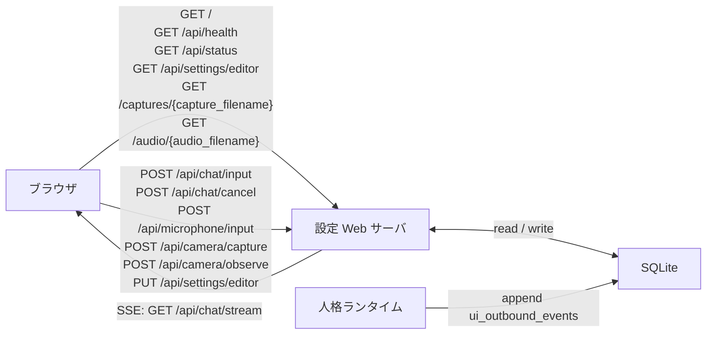

# WebAPI仕様

<!-- Block: Purpose -->
## このドキュメントの役割

- このドキュメントは、`FastAPI + Uvicorn` で提供する Web API を、エンドポイント単位で固定する正本である
- このドキュメントは、target の API 面と current の `browser_chat` 公開面を混ぜずに読むための正本である
- 目的は、ブラウザチャット、最小ブラウザ UI、`SSE` 配信、設定変更、状態参照を、実装前に曖昧なく決めることにある
- Web サーバの責務分割は `docs/30_システム設計.md` を見る
- ランタイムとの受け渡し仕様は `docs/31_ランタイム処理仕様.md` を見る
- SQLite の保存先は `docs/34_SQLite論理スキーマ.md` を見る
- 入出力 JSON 本文と `SSE data` の形は `docs/36_JSONデータ仕様.md` を見る
- 起動前の seed 前提は `docs/37_起動初期化仕様.md` を見る
- 入力重複、`cancel`、`SSE` 保持運用は `docs/38_入力ストリーム運用仕様.md` を見る
- 設定キー、型制約、`apply_scope` は `docs/39_設定キー運用仕様.md` を見る
- 設定UIの目標となる編集モデルと専用 API は `docs/42_設定UI仕様.md` を見る
- API の path、HTTP method、各エンドポイントの役割、`SSE` の接続方式で迷ったら、このドキュメントを正本として扱う

<!-- Block: Scope -->
## このドキュメントで固定する範囲

- 固定するのは、current 実装で提供する HTTP API、最小ブラウザ UI の入口、`SSE` の仕様である
- 固定するのは、ブラウザ UI から使う制御面 API であり、内部 Python 関数の呼び出しではない
- 固定するのは、エンドポイントの意味、受付条件、主要な成功応答、主要な失敗応答である
- 固定しないのは、認証方式の最終仕様、CORS の最終ポリシー、OpenAPI の自動生成細部である

<!-- Block: Out Of Scope -->
## このドキュメントに書かないこと

- JSON のキー、型、必須項目は `docs/36_JSONデータ仕様.md` を正本とする
- ランタイム内部の処理順、認知入力、保存順は `docs/31_ランタイム処理仕様.md` を正本とする
- `client_message_id` 重複、`cancel`、`SSE` 保持期間の運用細則は `docs/38_入力ストリーム運用仕様.md` を正本とする
- SQLite のテーブルやカラムの物理定義は `docs/34_SQLite論理スキーマ.md` を正本とする
- scalar 設定キーの一覧と型制約は `docs/39_設定キー運用仕様.md` を正本とする

<!-- Block: Read Guide -->
## target と current の読み分け

- 後続のエンドポイント定義は target の正本として保ちつつ、`current browser_chat 公開面` と `current` 明記の補足で現実装を読む
- `browser_chat` や最小 UI に紐づく `初期実装` の補足は、現在の `browser_chat` 実装を固定説明したものである
- target と current が衝突する場合、今どの API が実際に動くかの判断では current を優先する

<!-- Block: Current Surface -->
## current `browser_chat` 公開面

- current の組み込みブラウザ UI が実際に使う path の正確な集合は、後続の各エンドポイント節にある current 補足を正本とし、この節では大きな差分だけを要約する
- `POST /api/camera/observe` は公開 API として実装済みだが、current の組み込み UI からは呼ばれない
- `idle_tick` は公開 API を持たず、ランタイムが `pending_inputs` へ内部 enqueue する
- current の `GET /api/status`、`GET /api/chat/stream`、`notice` の current 差分は各エンドポイント節でだけ扱う

<!-- Block: Common Rules -->
## 共通ルール

<!-- Block: Transport -->
### 伝送の基本方針

- ブラウザからサーバへの要求は、`GET`、`POST`、`PUT` に分ける
- 状態変更や入力受付は、`POST` または `PUT` を使う
- 継続的なサーバ発の通知は、`SSE` を使う
- `SSE` はサーバ -> ブラウザの一方向とし、ブラウザ -> サーバの逆方向は別の `POST` で扱う
- WebSocket は初期段階では採用しない

<!-- Block: Json Rules -->
### JSON の基本方針

- JSON のキーは `snake_case` に統一する
- ただし、`GET /api/settings` の `effective_settings` だけは、`docs/39_設定キー運用仕様.md` と同じドット区切り設定キーをそのままキー名に使ってよい
- 時刻は、原則として UTC unix milliseconds を `integer` で返す
- ID は、文字列または単調増加整数をそのまま返し、UI 側で意味づけしない
- 任意項目を省略するときは `null` ではなく未出現を許す

<!-- Block: Error Envelope -->
### エラー応答の基本形

- `2xx` 以外の応答本文は、少なくとも `error_code`、`message`、`request_id` を持つ JSON とする
- `request_id` は、その HTTP リクエスト単位で Web サーバが生成する追跡 ID である
- エラー時も HTML を返さず、必ず JSON を返す
- `404 Not Found`、`405 Method Not Allowed`、リクエスト検証失敗も、この error envelope に統一する

```json
{
  "error_code": "invalid_request",
  "message": "channel must be browser_chat",
  "request_id": "req_..."
}
```

<!-- Block: Channel Rules -->
### 初期チャネルの固定

- 初期のブラウザチャット用チャネルは `browser_chat` に固定する
- `pending_inputs.channel` は、初期段階では `browser_chat` だけを使う
- `ui_outbound_events.channel` も、初期段階では `browser_chat` を標準値にする
- 複数 UI チャネルの分離は後段で追加してよいが、初期段階では前提にしない

<!-- Block: Endpoint Group -->
## エンドポイント一覧

<!-- Block: Endpoint Summary -->
### この仕様で扱う API

- `GET /`
- `GET /api/health`
- `GET /api/status`
- `GET /api/settings`
- `GET /api/settings/editor`
- `POST /api/settings/overrides`
- `PUT /api/settings/editor`
- `POST /api/chat/input`
- `POST /api/chat/cancel`
- `POST /api/microphone/input`
- `POST /api/camera/capture`
- `POST /api/camera/observe`
- `GET /api/chat/stream`
- `GET /captures/{capture_filename}`
- `GET /audio/{audio_filename}`

- 下の Mermaid 図は、ブラウザ、`設定 Web サーバ`、`人格ランタイム`、`SQLite` の受け渡しを要約したものである



<!-- Block: Browser UI -->
## `GET /`

<!-- Block: Browser UI Purpose -->
### 役割

- 最小のブラウザチャット UI を返す
- 同一オリジンで `POST /api/chat/input`、`GET /api/chat/history`、`POST /api/chat/cancel`、`POST /api/microphone/input`、`POST /api/camera/capture`、`GET /api/chat/stream`、`GET /api/status`、`GET /api/settings/editor`、`PUT /api/settings/editor`、`GET /captures/{capture_filename}`、`GET /audio/{audio_filename}` を使う
- `src/otomekairo/web/static/` に置く HTML / CSS / JavaScript を返す

<!-- Block: Browser UI Rules -->
### current `browser_chat` で固定すること

- ログイン画面は持たず、起動直後にそのままチャット UI を表示する
- current の設定画面は `tmp/CocoroConsole` の設定ウインドウをベースにしてよい
- ブラウザUIの入力手段は、テキスト入力、録音ボタンによる音声転写、`Cam` による静止画添付に固定する
- current の録音ボタンは開始/停止の明示操作で音声を取り、`POST /api/microphone/input` へ raw audio body を送り、そのまま `microphone_message` として runtime に enqueue してよい
- current の録音ボタンは、`sensors.microphone.enabled` や `speech.stt.enabled` が不足している場合でも黙って無効化せず、押下時に不足条件を UI へ明示する
- `Cam` は enabled な `camera_connections` から 1 台を明示選択し、`POST /api/camera/capture` へ `camera_connection_id` を送って静止画を取得し、返った画像をサムネイル表示し、次の `POST /api/chat/input` へ添付してよい
- current の `Cam` ボタンは `POST /api/camera/observe` ではなく `POST /api/camera/capture` だけを呼ぶ
- `message` に `audio_url` がある場合は、`GET /audio/{audio_filename}` で取得した音声を再生してよい
- current のチャット吹き出しのメタ表示は `label` を出さず、`HH:MM` 形式の時刻だけを出してよい
- current のチャット吹き出しメタ表示は、assistant / notice / error を吹き出し右、user を吹き出し左に置いてよい
- `設定保存` は、current では `GET /api/settings/editor` と `PUT /api/settings/editor` を使って、設定全体を保存する
- 設定画面は左端に `キャラクター` タブを置き、続けて `振る舞い`、`会話`、`記憶`、`モーション`、`システム` を並べる
- `振る舞い` タブには `振る舞いプロンプト`、`追加プロンプト（任意）`、`行動傾向` を置き、`CocoroConsole` 相当の会話指示と OtomeKairo 独自の傾向設定をまとめて編集する
- `キャラクター` タブには `キャラクター選択`、`基本設定`、`マテリアル・影設定`、`音声合成`、`音声認識` を含める
- チャット画面下部の管理表示は、`GET /api/status` の `runtime.last_retrieval` と `self_state.last_persona_update` を、直近の要約として表示してよい
- `runtime.last_retrieval` は、時刻、mode、query 要約、合計件数に加えて、`selected_counts` のカテゴリ別内訳も `合計 17 件（作業2 / エピ1 / ...）` 形式で本文表示してよい
- `システム` タブのカメラ接続追加は、一覧下部の `追加` で空行を末尾へ足して行う
- 既存のカメラ接続は一覧テーブル上で直接編集し、`有効` は複数件を同時に選べる
- current の `browse` では、UI は少なくとも `browse_queued` と `browse_completed` の `notice` を見分けられるようにしてよい
- UI 側で永続ストレージを前提にしない
- UI は `browser_chat` チャネル専用として扱う

<!-- Block: Health -->
## `GET /api/health`

<!-- Block: Health Purpose -->
### 役割

- Web サーバ自体が応答可能かを返す
- ランタイムの詳細状態までは返さない

<!-- Block: Health Response -->
### 成功応答

```json
{
  "status": "ok",
  "server_time": 1760000000000
}
```

- `status` は `ok` に固定する
- `server_time` は、応答時点の UTC unix milliseconds とする

<!-- Block: Status -->
## `GET /api/status`

<!-- Block: Status Purpose -->
### 役割

- 現在の人格ランタイムの参照用スナップショットを返す
- Web サーバは状態を更新せず、runtime の lease、直近 commit、直近 retrieval、`self_state.current_emotion`、`attention_state.primary_focus`、`body_state`、`world_state`、`drive_state`、task 件数を読み出して要約する

<!-- Block: Status Response -->
### 成功応答

```json
{
  "server_time": 1760000000000,
  "runtime": {
    "is_running": false,
    "last_retrieval": {
      "cycle_id": "cycle_...",
      "created_at": 1760000000000,
      "mode": "associative_recent",
      "queries": ["最近の会話"],
      "collector_names": [
        "recent_event_window",
        "associative_memory",
        "episodic_memory"
      ],
      "collector_counts": {
        "recent_event_window": 2,
        "associative_memory": 1
      },
      "selector_input_collector_counts": {
        "recent_event_window": 2,
        "associative_memory": 3,
        "reply_chain": 1
      },
      "selector_summary": {
        "selector_mode": "llm_ranked",
        "selection_reason": "直近会話の継続と明示日付の一致を優先した",
        "raw_candidate_count": 9,
        "merged_candidate_count": 7,
        "selector_input_candidate_count": 7,
        "selector_candidate_limit": 24,
        "llm_selected_ref_count": 5,
        "selected_candidate_count": 4,
        "duplicate_hit_count": 2,
        "reserve_candidate_count": 1,
        "slot_skipped_count": 1
      },
      "trimmed_item_refs": ["event:evt_002"],
      "selected_counts": {
        "working_memory_items": 2,
        "episodic_items": 1,
        "semantic_items": 1,
        "affective_items": 0,
        "relationship_items": 1,
        "reflection_items": 0,
        "recent_event_window": 3
      }
    }
  },
  "self_state": {
    "current_emotion": {
      "v": 0.12,
      "a": 0.18,
      "d": 0.03,
      "labels": ["calm"]
    },
    "last_persona_update": {
      "created_at": 1760000000000,
      "reason": "persona update applied",
      "evidence_event_ids": ["evt_001"],
      "updated_traits": [
        {
          "trait_name": "caution",
          "before": 0.10,
          "after": 0.18,
          "delta": 0.08
        }
      ]
    }
  },
  "attention_state": {
    "primary_focus": "待機中"
  },
  "body_state": {
    "posture_mode": "awaiting_external",
    "sensor_availability": {
      "camera": true,
      "microphone": false
    },
    "load": {
      "task_queue_pressure": 0.35,
      "interaction_load": 0.0
    }
  },
  "world_state": {
    "situation_summary": "外部結果待ち: 近所のイベント",
    "external_wait_count": 1
  },
  "drive_state": {
    "priority_effects": {
      "task_progress_bias": 0.35,
      "exploration_bias": 0.15,
      "maintenance_bias": 0.25,
      "social_bias": 0.0
    }
  },
  "task_state": {
    "active_task_count": 0,
    "waiting_task_count": 1
  }
}
```

- `runtime.is_running` は Web サーバ観点の観測値であり、心拍監視や最終更新時刻から決める
- `runtime.last_cycle_id` は、短周期が 1 回以上完了している場合だけ返す
- `last_commit_id` は、`commit_records.commit_id` の最新値がある場合だけ返す
- `runtime.last_retrieval` は、`retrieval_runs` が 1 件以上ある場合だけ返し、直近の `RetrievalPlan` と選別件数を要約する
- `runtime.last_retrieval.collector_names`、`collector_counts`、`selector_input_collector_counts`、`selector_summary`、`trimmed_item_refs` は、current 実装では追加で返してよい
- current 実装の `runtime.last_retrieval.selector_summary` は、`selector_mode` と `selection_reason` の文字列、および件数系の整数を同じ object に入れて返してよい
- `self_state.last_persona_update` は、`revisions.entity_type=self_state.personality` が 1 件以上ある場合だけ返す
- `attention_state.primary_focus` は、`attention_state.primary_focus_json.summary` から取り出した表示用文字列を返す
- `body_state.posture_mode` は、`body_state.posture_json.mode` を返す
- `body_state.sensor_availability` は、current 実装で接続済みの live sensor 可用性を返し、`microphone` は未接続のため `false` を返す
- `world_state.situation_summary` は、現在の外部待ち、直近観測、直近 task 完了のいずれかを優先した短い表示文を返す
- `world_state.external_wait_count` は、`world_state.external_waits_json.count` を返す
- `drive_state.priority_effects` は、`drive_state.priority_effects_json` の 4 つの bias をそのまま返す
- 初回起動直後で短周期未実行のときは、`runtime.is_running=false` とし、`last_cycle_id` と `last_commit_id` は省略する
- 全状態を丸ごと返さず、UI 表示に必要な要点だけを返す

<!-- Block: Settings Get -->
## `GET /api/settings`

<!-- Block: Settings Get Purpose -->
### 役割

- 現在有効な設定値と、未反映の設定変更要求を返す
- `config/default_settings.json` の既定値、`runtime_settings`、`settings_overrides` の `queued / claimed` を参照して構成する

<!-- Block: Settings Get Response -->
### 成功応答

```json
{
  "effective_settings": {
    "llm.model": "openai/gpt-5-mini",
    "behavior.second_person_label": "マスター",
    "motion.posture_change_loop_count_standing": 30
  },
  "pending_overrides": [
    {
      "override_id": "ovr_...",
      "key": "llm.model",
      "status": "queued",
      "created_at": 1760000000000
    }
  ]
}
```

- `effective_settings` は、`config/default_settings.json` に対して `runtime_settings.values_json` を上書きした現在有効値を返す
- `effective_settings` には、会話、記憶、振る舞い、キャラクター、TTS、STT、モーション、通知の scalar キーを含めてよい
- `apply_scope="next_boot"` で `applied` 済みの設定は、次回ランタイム起動で materialize されるまで `effective_settings` に即時反映しない
- `GET /api/settings` は UI の要約表示用であり、秘密値も含めてよい
- 設定UIの主編集経路は `GET /api/settings/editor` と `PUT /api/settings/editor` に固定する

<!-- Block: Settings Post -->
## `POST /api/settings/overrides`

<!-- Block: Settings Post Purpose -->
### 役割

- scalar な設定変更要求を `settings_overrides` へ積む
- Web サーバは設定を即時反映しない
- `retrieval_profile` や `motion.animations` のような構造化値はこの API では扱わない

<!-- Block: Settings Post Request -->
### 入力 JSON

```json
{
  "key": "llm.model",
  "requested_value": "openrouter/.../model",
  "apply_scope": "runtime"
}
```

- 必須項目は `key`、`requested_value`、`apply_scope` とする
- `key` は `docs/39_設定キー運用仕様.md` に登録された scalar キーだけを受け付ける
- `apply_scope` はキーごとに許可された値だけを受け付ける
- `requested_value` は対象 `key` に登録された `string`、`integer`、`number`、`boolean` のいずれかで受け付ける
- `requested_value` の型と範囲はキーごとの定義に従って検証する

<!-- Block: Settings Post Response -->
### 成功応答

```json
{
  "accepted": true,
  "override_id": "ovr_...",
  "status": "queued"
}
```

- 成功時は `202 Accepted` を返す
- DB には `settings_overrides.requested_value_json={"value_type": ..., "value": ...}`、`status="queued"` で挿入する
- 未登録キー、構造化値、`apply_scope` 不一致、型違反、範囲違反は `400 Bad Request` で拒否する

<!-- Block: Settings Editor Get -->
## `GET /api/settings/editor`

<!-- Block: Settings Editor Get Purpose -->
### 役割

- 設定UIの描画に必要な canonical な全体状態を返す
- `settings_editor_state`、5 種のプリセットテーブル、`camera_connections`、現在の `runtime_projection` をまとめて返す

<!-- Block: Settings Editor Get Notes -->
### 成功応答の考え方

- 本文の JSON 形は `docs/36_JSONデータ仕様.md` を正本とする
- 応答の top-level は `editor_state`、`character_presets`、`behavior_presets`、`conversation_presets`、`memory_presets`、`motion_presets`、`camera_connections`、`constraints`、`runtime_projection` に固定する
- `editor_state` はプリセット選択と `system_values` を返し、カメラ有効状態は `camera_connections[].is_enabled` に含める
- `runtime_projection` は `effective_settings` と `active_motion_preset` を持つ
- 設定UIは、このレスポンスだけで現在のフォームを描画できなければならない
- API キー、トークン、パスワードもマスキングせずそのまま返してよい

<!-- Block: Settings Editor Put -->
## `PUT /api/settings/editor`

<!-- Block: Settings Editor Put Purpose -->
### 役割

- 設定UIの draft 全体を 1 回で保存する
- `settings_editor_state`、5 種のプリセットテーブル、`camera_connections` を同じ transaction で更新し、`settings_change_sets` を enqueue する

<!-- Block: Settings Editor Put Notes -->
### 成功応答の考え方

- リクエスト本文は `editor_state`、`character_presets`、`behavior_presets`、`conversation_presets`、`memory_presets`、`motion_presets`、`camera_connections` を持つ保存用の固定形にする
- AI 利用対象のカメラ接続は `camera_connections[].is_enabled` で表し、複数件を許可する
- 成功応答本文は `GET /api/settings/editor` と同じ canonical 形に固定する
- `constraints` と `runtime_projection` は読み取り専用のため、`PUT` のリクエスト本文へ含めない
- サーバは `editor_state.revision` 一致を必須にし、不一致なら `409 Conflict` を返す
- 本文の JSON 形は `docs/36_JSONデータ仕様.md` を正本とする

<!-- Block: Chat Input -->
## `POST /api/chat/input`

<!-- Block: Chat Input Purpose -->
### 役割

- ブラウザからのチャット入力を `pending_inputs` に積む
- Web サーバは応答本文をその場で生成しない

<!-- Block: Chat Input Request -->
### 入力 JSON

```json
{
  "text": "おはよう",
  "client_message_id": "cli_msg_001",
  "attachments": [
    {
      "attachment_kind": "camera_still_image",
      "camera_connection_id": "cam_living",
      "camera_display_name": "リビング",
      "capture_id": "cap_0123456789abcdef0123456789abcdef"
    }
  ]
}
```

- `text` と `attachments` はどちらも任意だが、少なくともどちらか 1 つは必要とする
- `client_message_id` は任意だが、送る場合はクライアント側の再送判定に使える安定値とする
- `text` を送る場合、空文字列、空白のみ、`4000` 文字超は `400` とする
- `attachments` は任意で、送る場合は `camera_still_image` の配列とする
- 各添付は `camera_connection_id`、`camera_display_name`、`capture_id` を必須とし、`POST /api/camera/capture` で作った画像だけを受け付ける

<!-- Block: Chat Input Write -->
### DB への写像

- `pending_inputs` に 1 件追加する
- `source` は `web_input` に固定する
- `channel` は `browser_chat` に固定する
- `client_message_id` がある場合は、`pending_inputs.client_message_id` にも同じ値を入れる
- `payload_json` には、`input_kind="chat_message"` を入れ、`text`、`attachments`、`client_message_id` は必要なものだけを入れる
- 追加時の `status` は `queued` に固定する
- 同じ `(channel, client_message_id)` が既にある場合は、追加せず `409 Conflict` を返す
- current 実装では、受理した `chat_message` を UI 表示用の `message(role=user)` として `ui_outbound_events` にも同じ transaction で追記してよい

<!-- Block: Chat Input Response -->
### 成功応答

```json
{
  "accepted": true,
  "input_id": "inp_...",
  "status": "queued",
  "channel": "browser_chat"
}
```

- 成功時は `202 Accepted` を返す
- ここでは人格応答本文を返さない

<!-- Block: Chat History -->
## `GET /api/chat/history`

<!-- Block: Chat History Purpose -->
### 役割

- ブラウザチャットの初期表示用に、直近の会話バブル列を backend から復元して返す
- current 実装では、`pending_inputs` と `action_history` の正本から `user` / `assistant` のメッセージ列を作り、`ui_outbound_events` だけには依存しない

<!-- Block: Chat History Query -->
### クエリ

- `channel` クエリは任意とし、省略時は `browser_chat` を使う
- `limit` クエリは任意とし、省略時は `200` を使う
- current 実装では、`channel` に `browser_chat` 以外を指定すると `400 Bad Request` にする
- current 実装では、`limit` は `1..500` の整数だけを受け付ける

<!-- Block: Chat History Read -->
### DB の読み出し

- `user` 側は `pending_inputs.payload_json.input_kind in (chat_message, microphone_message)` から復元する
- `assistant` 側は `action_history` のうち `observed_effects_json.final_message_emitted=true` かつ `command_json.parameters.text` を持つ行から復元する
- 返す `messages` は、`created_at` 昇順の会話列に整列する
- `stream_cursor` には、その時点の `ui_outbound_events` の最新 `ui_event_id` を返してよい

<!-- Block: Chat History Response -->
### 成功応答

```json
{
  "channel": "browser_chat",
  "messages": [
    {
      "message_id": "inp_...",
      "role": "user",
      "text": "おはよう",
      "created_at": 1760000000000
    },
    {
      "message_id": "msg_...",
      "role": "assistant",
      "text": "おはようございます。",
      "created_at": 1760000001000
    }
  ],
  "stream_cursor": 321
}
```

- 成功時は `200 OK` を返す
- `messages` の各要素の JSON 形は `docs/36_JSONデータ仕様.md` を正本とする
- `stream_cursor` は、次に `GET /api/chat/stream` を開く初期カーソルとして使ってよい

<!-- Block: Chat Cancel -->
## `POST /api/chat/cancel`

<!-- Block: Chat Cancel Purpose -->
### 役割

- 現在進行中のブラウザチャット応答に対する停止要求を積む
- 停止要求も直接ランタイムを中断せず、通常の入力として扱う

<!-- Block: Chat Cancel Request -->
### 入力 JSON

```json
{
  "target_message_id": "msg_..."
}
```

- `target_message_id` は任意とし、省略時は「現在のブラウザチャット応答全体」を対象にしてよい
- 実際の停止対象の解決は `docs/38_入力ストリーム運用仕様.md` に従う

<!-- Block: Chat Cancel Write -->
### DB への写像

- `pending_inputs` に 1 件追加する
- `source` は `web_input` に固定する
- `channel` は `browser_chat` に固定する
- `payload_json` には、少なくとも `input_kind="cancel"` と、必要なら `target_message_id` を入れる
- 追加時の `status` は `queued` に固定する

<!-- Block: Chat Cancel Response -->
### 成功応答

```json
{
  "accepted": true,
  "status": "queued"
}
```

- 成功時は `202 Accepted` を返す

<!-- Block: Microphone Input -->
## `POST /api/microphone/input`

<!-- Block: Microphone Input Purpose -->
### 役割

- ブラウザ録音の raw audio body を受け取り、現在の `speech.stt.*` 設定に従って同期 `STT` を実行する
- current 実装では、転写文を `source=microphone` の `microphone_message` として `pending_inputs` に積む

<!-- Block: Microphone Input Request -->
### 入力本文

- リクエスト本文は JSON ではなく音声バイト列そのものに固定する
- `Content-Type` は録音 blob の MIME type をそのまま送り、少なくとも空であってはならない
- `sensors.microphone.enabled=false` の場合は `409 Conflict` を返す
- `speech.stt.enabled=false`、`speech.stt.provider` 未設定、`speech.stt.amivoice.api_key` 未設定、`speech.stt.language` 未設定のいずれかでも `409 Conflict` を返す
- current 実装で受け付ける `speech.stt.provider` は `amivoice` だけである

<!-- Block: Microphone Input Write -->
### DB への写像

- まず同期 `STT` を実行して `transcript_text` を得る
- その後 `pending_inputs` に 1 件追加する
- `source` は `microphone` に固定する
- `channel` は `browser_chat` に固定する
- `client_message_id` は `null` に固定する
- `payload_json` には `input_kind="microphone_message"`、`message_kind="dialogue_turn"`、`trigger_reason="external_input"`、`text`、`stt_provider`、`stt_language` を入れる
- 追加時の `status` は `queued` に固定する
- current 実装では、受理した `microphone_message` を UI 表示用の `message(role=user)` として `ui_outbound_events` にも同じ transaction で追記してよい

<!-- Block: Microphone Input Response -->
### 成功応答

```json
{
  "accepted": true,
  "input_id": "inp_...",
  "status": "queued",
  "channel": "browser_chat",
  "transcript_text": "おはよう",
  "provider": "amivoice",
  "language": "ja"
}
```

- 成功時は `202 Accepted` を返す
- `accepted` は `true` に固定する
- `input_id` は、生成した `microphone_message` の ID である
- `status` は `queued` に固定する
- `channel` は `browser_chat` に固定する
- `transcript_text` は、`STT` が返した空でない転写文である
- `provider` は current 実装では `amivoice` に固定する
- `language` は current 実装では `speech.stt.language` の設定値を返す

<!-- Block: Camera Capture -->
## `POST /api/camera/capture`

<!-- Block: Camera Capture Purpose -->
### 役割

- ブラウザから現在のカメラ静止画を 1 枚取得する
- Web サーバは ONVIF の media profile から RTSP stream URI を取得し、`ffmpeg` で 1 フレームを JPEG として `data/camera/` へ保存する
- 応答では保存先の相対パスと、同一オリジンで読める `image_url` を返す

<!-- Block: Camera Capture Request -->
### 入力 JSON

```json
{
  "camera_connection_id": "cam_living"
}
```

- `camera_connection_id` を必須とし、`camera_connections[].is_enabled=true` の 1 件を指定する
- 空文字列や enabled でない `camera_connection_id` は `400 Bad Request` にする

<!-- Block: Camera Capture Response -->
### 成功応答

```json
{
  "camera_connection_id": "cam_living",
  "camera_display_name": "リビング",
  "capture_id": "cap_...",
  "image_path": "data/camera/cap_....jpg",
  "image_url": "/captures/cap_....jpg",
  "captured_at": 1760000000000
}
```

- 成功時は `201 Created` を返す
- `camera_connection_id` は、その静止画を取得した enabled camera connection を表す
- `camera_display_name` は、設定UIで管理している表示名を表す
- `capture_id` は、不透明な capture 識別子である
- `image_path` は、サーバ作業ディレクトリ基準の保存先相対パスである
- `image_url` は、その静止画をブラウザが再取得するための同一オリジン URL である
- カメラ接続設定が不足している場合は `409 Conflict` を返す
- ONVIF 接続、RTSP stream 解決、`ffmpeg` による JPEG 生成のいずれかに失敗した場合は `500 Internal Server Error` を返す

<!-- Block: Camera Observe -->
## `POST /api/camera/observe`

<!-- Block: Camera Observe Purpose -->
### 役割

- 現在のカメラ静止画を 1 枚取得し、そのまま自発観測入力として `pending_inputs` に積む
- Web サーバは `source=camera`、`payload.trigger_reason=self_initiated`、`input_kind=camera_observation`、`camera_still_image` 添付 1 件で認知待ち入力を作る
- 返した時点では応答本文は生成せず、後続のランタイム短周期で認知処理する

<!-- Block: Camera Observe Request -->
### 入力 JSON

```json
{
  "camera_connection_id": "cam_living"
}
```

- `camera_connection_id` を必須とし、`camera_connections[].is_enabled=true` の 1 件を指定する
- 空文字列や enabled でない `camera_connection_id` は `400 Bad Request` にする

<!-- Block: Camera Observe Write -->
### DB への写像

- `pending_inputs` に 1 件追加する
- `source` は `camera` に固定する
- `channel` は `browser_chat` に固定する
- `client_message_id` は `null` に固定する
- `payload_json` には、`input_kind="camera_observation"`、`trigger_reason="self_initiated"`、`camera_connection_id` と `camera_display_name` を含む `camera_still_image` 添付 1 件を入れる
- 追加時の `status` は `queued` に固定する

<!-- Block: Camera Observe Response -->
### 成功応答

```json
{
  "accepted": true,
  "input_id": "inp_...",
  "status": "queued",
  "channel": "browser_chat",
  "camera_connection_id": "cam_living",
  "camera_display_name": "リビング",
  "capture_id": "cap_...",
  "image_path": "data/camera/cap_....jpg",
  "image_url": "/captures/cap_....jpg",
  "captured_at": 1760000000000
}
```

- 成功時は `202 Accepted` を返す
- `input_id` は、生成された自発観測入力の ID である
- `status` は `queued` に固定する
- `channel` は `browser_chat` に固定する
- `camera_connection_id` と `camera_display_name` は、観測に使った enabled camera connection を表す
- `capture_id`、`image_path`、`image_url`、`captured_at` は、同時に取得した静止画の情報である
- `POST /api/camera/observe` は `source=post_action_followup` の追跡観測入力を作らない。`post_action_followup` は runtime 内の `look` 行動成功時だけが enqueue する
- カメラ接続設定が不足している場合は `409 Conflict` を返す
- ONVIF 接続、RTSP stream 解決、`ffmpeg` による JPEG 生成のいずれかに失敗した場合は `500 Internal Server Error` を返す

<!-- Block: Camera Capture Asset -->
## `GET /captures/{capture_filename}`

<!-- Block: Camera Capture Asset Purpose -->
### 役割

- `POST /api/camera/capture` で保存した JPEG を同一オリジンで返す
- ブラウザ UI は、この path をサムネイルと原寸表示の両方に使ってよい

<!-- Block: TTS Audio Asset -->
## `GET /audio/{audio_filename}`

<!-- Block: TTS Audio Asset Purpose -->
### 役割

- `speak` 実行時に選択中の TTS プロバイダで生成した音声ファイルを同一オリジンで返す
- ブラウザ UI は、`message.audio_url` を `audio` 要素で再生してよい

<!-- Block: Chat Stream -->
## `GET /api/chat/stream`

<!-- Block: Chat Stream Purpose -->
### 役割

- `ui_outbound_events` を `SSE` としてブラウザへ配信する
- 応答トークン、自発メッセージ、状態通知を、生成順で継続的に受け取るための読み出し専用ストリームである

<!-- Block: Chat Stream Query -->
### クエリとヘッダ

- `channel` クエリは任意とし、省略時は `browser_chat` を使う
- current 実装では、`channel` に `browser_chat` 以外を指定すると `400 Bad Request` にする
- `after_event_id` クエリは任意とし、初回接続時の開始位置ヒントとして使ってよい
- `Last-Event-ID` ヘッダがあれば、その値より大きい `ui_event_id` から再開する
- `Last-Event-ID` が無効な整数なら `400` とする
- current 実装では、`Last-Event-ID` がない場合だけ `after_event_id` を使ってよい

<!-- Block: Chat Stream Read -->
### DB の読み出し

- `ui_outbound_events` から `channel` 一致かつ `ui_event_id > last_event_id` の行だけを読み出す
- Web サーバは、配信済み状態を DB へ書き戻さない
- 接続維持のため、イベントがない間は 15 秒以内の間隔で heartbeat コメントを流してよい

<!-- Block: SSE Format -->
### `SSE` の固定形式

- `id:` には `ui_event_id` を入れる
- `event:` には `event_type` を入れる
- `data:` には `payload_json` を 1 行 JSON として入れる
- 1 イベントは、`id`、`event`、`data`、空行の順に流す
- ただし、保持範囲外からの再開で合成する一時的な `stream_reset` `notice` だけは、`id:` を付けずに流してよい

```text
id: 120
event: token
data: {"message_id":"msg_...","text":"お","chunk_index":0}

```

<!-- Block: SSE Event Types -->
### `event_type` ごとの payload

- `token`
  - 役割: 応答の部分トークン
  - 必須項目: `message_id`, `text`, `chunk_index`
  - 任意項目: `is_final_chunk`

- `message`
  - 役割: 完成した 1 メッセージ
  - 必須項目: `message_id`, `role`, `text`, `created_at`
  - 任意項目: `source_cycle_id`, `related_input_id`, `audio_url`, `audio_mime_type`
  - current 実装の `role` は `user` または `assistant` を使う

- `message_end`
  - 役割: `message_id` 単位の出力終端
  - 必須項目: `message_id`, `finish_reason`, `final_message_emitted`, `token_count`
  - `finish_reason` は `completed` または `cancelled` を使う

- `status`
  - 役割: UI に見せる状態変化
  - 必須項目: `status_code`, `label`
  - 任意項目: `cycle_id`
  - `status_code` は、少なくとも `idle`, `thinking`, `speaking`, `camera_moving`, `waiting_external`, `browsing`, `processing_external_result` を区別する

- `notice`
  - 役割: 自発行動や外部通知などの補助通知
  - 必須項目: `notice_code`, `text`
  - `notice_code` は、current 実装では主に `browse_queued`、`browse_completed` を使い、保持範囲外再開時だけ合成 `stream_reset` を使ってよい

- `error`
  - 役割: UI に見せる明示エラー
  - 必須項目: `error_code`, `message`
  - 任意項目: `retriable`

<!-- Block: Disconnect Rules -->
### 切断と再接続

- ブラウザ切断はサーバ側の異常とみなさない
- 再接続時は、ブラウザが保持する `Last-Event-ID` で続きから読む
- `ui_outbound_events` の保持期間外まで古い `Last-Event-ID` が指定された場合は、利用可能な最古のイベントから再開する
- 必要なら、再開前に一時的な `stream_reset` の `notice` を返してよい
- ストリーム完了を意味する専用の HTTP close は定義せず、接続継続中に `message_end` や `status` で区切りを表現する

<!-- Block: Status Codes -->
## 主要な HTTP ステータス

- `200 OK`: 参照系 API と `SSE` 接続開始の成功
- `202 Accepted`: 入力や設定変更の受付成功
- `400 Bad Request`: JSON 不正、必須項目不足、無効な `Last-Event-ID`
- `404 Not Found`: 未定義 path
- `409 Conflict`: 同一 `client_message_id` の二重受付を拒否するとき
- `500 Internal Server Error`: Web サーバ側の明示的な処理失敗

<!-- Block: Fixed Decisions -->
## このドキュメントで確定したこと

- ブラウザチャットの入力は `POST /api/chat/input`、継続出力は `GET /api/chat/stream` の `SSE` で分離する
- Web サーバは応答本文を生成せず、`pending_inputs` / `action_history` からの履歴復元、`pending_inputs` と `ui_outbound_events` の橋渡し、および保持期限切れストリーム行の削除だけを行う
- `SSE` の再開位置は `ui_outbound_events.ui_event_id` と `Last-Event-ID` で管理する
- `POST /api/chat/cancel` も即時中断ではなく、通常の入力要求としてランタイムへ渡す
- 初期のブラウザチャット用チャネルは `browser_chat` に固定する
- このドキュメントを基準に、次は FastAPI の route 実装または schema 定義を作る
