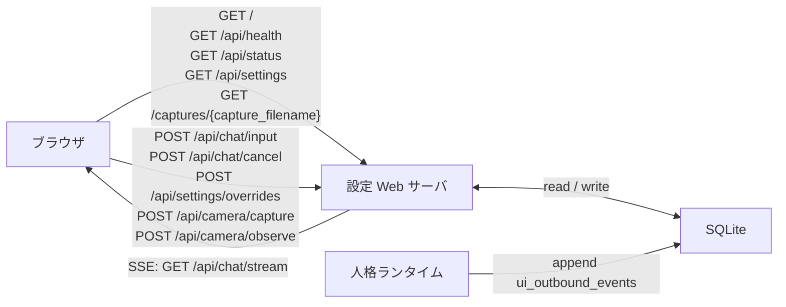

# WebAPI仕様

<!-- Block: Purpose -->
## このドキュメントの役割

- このドキュメントは、`FastAPI + Uvicorn` で提供する Web API を、エンドポイント単位で固定する正本である
- 目的は、ブラウザチャット、最小ブラウザ UI、`SSE` 配信、設定変更、状態参照を、実装前に曖昧なく決めることにある
- Web サーバの責務分割は `docs/30_システム設計.md` を見る
- ランタイムとの受け渡し仕様は `docs/31_ランタイム処理仕様.md` を見る
- SQLite の保存先は `docs/34_SQLite論理スキーマ.md` を見る
- 入出力 JSON 本文と `SSE data` の形は `docs/36_JSONデータ仕様.md` を見る
- 起動前の seed 前提は `docs/37_起動初期化仕様.md` を見る
- 入力重複、`cancel`、`SSE` 保持運用は `docs/38_入力ストリーム運用仕様.md` を見る
- 設定キー、型制約、`apply_scope` は `docs/39_設定キー運用仕様.md` を見る
- API の path、HTTP method、各エンドポイントの役割、`SSE` の接続方式で迷ったら、このドキュメントを正本として扱う

<!-- Block: Scope -->
## このドキュメントで固定する範囲

- 固定するのは、初期実装で提供する HTTP API、最小ブラウザ UI の入口、`SSE` の仕様である
- 固定するのは、ブラウザ UI から使う制御面 API であり、内部 Python 関数の呼び出しではない
- 固定するのは、エンドポイントの意味、受付条件、主要な成功応答、主要な失敗応答である
- 固定しないのは、認証方式の最終仕様、CORS の最終ポリシー、OpenAPI の自動生成細部である

<!-- Block: Common Rules -->
## 共通ルール

<!-- Block: Transport -->
### 伝送の基本方針

- ブラウザからサーバへの要求は、`GET` と `POST` に分ける
- 状態変更や入力受付は、必ず `POST` を使う
- 継続的なサーバ発の通知は、`SSE` を使う
- `SSE` はサーバ -> ブラウザの一方向とし、ブラウザ -> サーバの逆方向は別の `POST` で扱う
- WebSocket は初期段階では採用しない

<!-- Block: Json Rules -->
### JSON の基本方針

- JSON のキーは `snake_case` に統一する
- ただし、`GET /api/settings` の `effective_settings` だけは、`docs/39_設定キー運用仕様.md` と同じドット区切り設定キーをそのままキー名に使ってよい
- 時刻は、原則として UTC unix milliseconds を `integer` で返す
- ID は、文字列または単調増加整数をそのまま返し、UI 側で意味づけしない
- 任意項目を省略するときは `null` ではなく未出現を許す

<!-- Block: Error Envelope -->
### エラー応答の基本形

- `2xx` 以外の応答本文は、少なくとも `error_code`、`message`、`request_id` を持つ JSON とする
- `request_id` は、その HTTP リクエスト単位で Web サーバが生成する追跡 ID である
- エラー時も HTML を返さず、必ず JSON を返す
- `404 Not Found`、`405 Method Not Allowed`、リクエスト検証失敗も、この error envelope に統一する

```json
{
  "error_code": "invalid_request",
  "message": "channel must be browser_chat",
  "request_id": "req_..."
}
```

<!-- Block: Channel Rules -->
### 初期チャネルの固定

- 初期のブラウザチャット用チャネルは `browser_chat` に固定する
- `pending_inputs.channel` は、初期段階では `browser_chat` だけを使う
- `ui_outbound_events.channel` も、初期段階では `browser_chat` を標準値にする
- 複数 UI チャネルの分離は後段で追加してよいが、初期段階では前提にしない

<!-- Block: Endpoint Group -->
## エンドポイント一覧

<!-- Block: Endpoint Summary -->
### 初期実装で提供する API

- `GET /`
- `GET /api/health`
- `GET /api/status`
- `GET /api/settings`
- `POST /api/settings/overrides`
- `POST /api/chat/input`
- `POST /api/chat/cancel`
- `POST /api/camera/capture`
- `POST /api/camera/observe`
- `GET /api/chat/stream`
- `GET /captures/{capture_filename}`

- 下の Mermaid 図は、ブラウザ、`設定 Web サーバ`、`人格ランタイム`、`SQLite` の受け渡しを要約したものである



<!-- Block: Browser UI -->
## `GET /`

<!-- Block: Browser UI Purpose -->
### 役割

- 最小のブラウザチャット UI を返す
- 同一オリジンで `POST /api/chat/input`、`POST /api/chat/cancel`、`POST /api/camera/capture`、`GET /api/chat/stream`、`GET /api/status`、`GET /api/settings`、`GET /captures/{capture_filename}` を使う
- `src/otomekairo/web/static/` に置く HTML / CSS / JavaScript を返す

<!-- Block: Browser UI Rules -->
### 初期実装で固定すること

- ログイン画面は持たず、起動直後にそのままチャット UI を表示する
- 初期実装の見た目は `tmp/CocoroGhost/static/` に近いヘッダ、チャット欄、設定欄、ステータスバー構成にしてよい
- `Mic` はブラウザの標準 `SpeechRecognition` を使って音声入力し、認識結果を `POST /api/chat/input` へ流す
- `Cam` は `POST /api/camera/capture` で静止画を取得し、返った画像をサムネイル表示し、次の `POST /api/chat/input` へ添付してよい
- `設定保存` は、初期実装では主要な一部設定だけを `POST /api/settings/overrides` へ流す
- `browse` の初期実装では、UI は少なくとも `browse_queued` と `browse_completed` の `notice` を見分けられるようにしてよい
- UI 側で永続ストレージを前提にしない
- UI は `browser_chat` チャネル専用として扱う

<!-- Block: Health -->
## `GET /api/health`

<!-- Block: Health Purpose -->
### 役割

- Web サーバ自体が応答可能かを返す
- ランタイムの詳細状態までは返さない

<!-- Block: Health Response -->
### 成功応答

```json
{
  "status": "ok",
  "server_time": 1760000000000
}
```

- `status` は `ok` に固定する
- `server_time` は、応答時点の UTC unix milliseconds とする

<!-- Block: Status -->
## `GET /api/status`

<!-- Block: Status Purpose -->
### 役割

- 現在の人格ランタイムの参照用スナップショットを返す
- Web サーバは状態を更新せず、`self_state`、`attention_state`、`body_state`、`world_state`、`drive_state`、`task_state` の正本を読み出す

<!-- Block: Status Response -->
### 成功応答

```json
{
  "server_time": 1760000000000,
  "runtime": {
    "is_running": false
  },
  "self_state": {
    "current_emotion": {
      "v": 0.12,
      "a": 0.18,
      "d": 0.03,
      "labels": ["calm"]
    }
  },
  "attention_state": {
    "primary_focus": "browser_chat"
  },
  "task_state": {
    "active_task_count": 1,
    "waiting_task_count": 0
  }
}
```

- `runtime.is_running` は Web サーバ観点の観測値であり、心拍監視や最終更新時刻から決める
- `runtime.last_cycle_id` は、短周期が 1 回以上完了している場合だけ返す
- `last_commit_id` は、`commit_records.commit_id` の最新値がある場合だけ返す
- 初回起動直後で短周期未実行のときは、`runtime.is_running=false` とし、`last_cycle_id` と `last_commit_id` は省略する
- 全状態を丸ごと返さず、UI 表示に必要な要点だけを返す

<!-- Block: Settings Get -->
## `GET /api/settings`

<!-- Block: Settings Get Purpose -->
### 役割

- 現在有効な設定値と、未反映の設定変更要求を返す
- `config/default_settings.json` の既定値、`runtime_settings`、`settings_overrides` の `queued / claimed` を参照して構成する

<!-- Block: Settings Get Response -->
### 成功応答

```json
{
  "effective_settings": {
    "llm.default_model": "...",
    "llm.temperature": 0.7
  },
  "pending_overrides": [
    {
      "override_id": "ovr_...",
      "key": "llm.default_model",
      "status": "queued",
      "created_at": 1760000000000
    }
  ]
}
```

- `effective_settings` は、UI で編集対象にする設定だけを、`docs/39_設定キー運用仕様.md` と同じドット区切りキーで返す
- `effective_settings` は、`config/default_settings.json` の既定値に対して、`runtime_settings.values_json` を上書きした現在有効値を返す
- `apply_scope="next_boot"` で `applied` 済みの設定は、次回ランタイム起動で materialize されるまで `effective_settings` に即時反映しない
- 秘密情報は返さない

<!-- Block: Settings Post -->
## `POST /api/settings/overrides`

<!-- Block: Settings Post Purpose -->
### 役割

- 設定変更要求を `settings_overrides` へ積む
- Web サーバは設定を即時反映しない

<!-- Block: Settings Post Request -->
### 入力 JSON

```json
{
  "key": "llm.default_model",
  "requested_value": "openrouter/.../model",
  "apply_scope": "runtime"
}
```

- 必須項目は `key`、`requested_value`、`apply_scope` とする
- `key` は `docs/39_設定キー運用仕様.md` に登録された値だけを受け付ける
- `apply_scope` は、キーごとに許可された値だけを受け付ける
- `requested_value` の型と範囲は、キーごとの定義に従って検証する

<!-- Block: Settings Post Response -->
### 成功応答

```json
{
  "accepted": true,
  "override_id": "ovr_...",
  "status": "queued"
}
```

- 成功時は `202 Accepted` を返す
- DB には `settings_overrides.status="queued"` で挿入する
- 未登録キー、`apply_scope` 不一致、型違反、範囲違反は `400 Bad Request` で拒否する

<!-- Block: Chat Input -->
## `POST /api/chat/input`

<!-- Block: Chat Input Purpose -->
### 役割

- ブラウザからのチャット入力を `pending_inputs` に積む
- Web サーバは応答本文をその場で生成しない

<!-- Block: Chat Input Request -->
### 入力 JSON

```json
{
  "text": "おはよう",
  "client_message_id": "cli_msg_001",
  "attachments": [
    {
      "attachment_kind": "camera_still_image",
      "capture_id": "cap_0123456789abcdef0123456789abcdef"
    }
  ]
}
```

- `text` と `attachments` はどちらも任意だが、少なくともどちらか 1 つは必要とする
- `client_message_id` は任意だが、送る場合はクライアント側の再送判定に使える安定値とする
- `text` を送る場合、空文字列、空白のみ、`4000` 文字超は `400` とする
- `attachments` は任意で、送る場合は `camera_still_image` の配列とする
- 各添付は `capture_id` を必須とし、`POST /api/camera/capture` で作った画像だけを受け付ける

<!-- Block: Chat Input Write -->
### DB への写像

- `pending_inputs` に 1 件追加する
- `source` は `web_input` に固定する
- `channel` は `browser_chat` に固定する
- `client_message_id` がある場合は、`pending_inputs.client_message_id` にも同じ値を入れる
- `payload_json` には、少なくとも `input_kind="chat_message"`、`text`、必要なら `client_message_id` を入れる
- 追加時の `status` は `queued` に固定する
- 同じ `(channel, client_message_id)` が既にある場合は、追加せず `409 Conflict` を返す

<!-- Block: Chat Input Response -->
### 成功応答

```json
{
  "accepted": true,
  "input_id": "inp_...",
  "status": "queued",
  "channel": "browser_chat"
}
```

- 成功時は `202 Accepted` を返す
- ここでは人格応答本文を返さない

<!-- Block: Chat Cancel -->
## `POST /api/chat/cancel`

<!-- Block: Chat Cancel Purpose -->
### 役割

- 現在進行中のブラウザチャット応答に対する停止要求を積む
- 停止要求も直接ランタイムを中断せず、通常の入力として扱う

<!-- Block: Chat Cancel Request -->
### 入力 JSON

```json
{
  "target_message_id": "msg_..."
}
```

- `target_message_id` は任意とし、省略時は「現在のブラウザチャット応答全体」を対象にしてよい
- 実際の停止対象の解決は `docs/38_入力ストリーム運用仕様.md` に従う

<!-- Block: Chat Cancel Write -->
### DB への写像

- `pending_inputs` に 1 件追加する
- `source` は `web_input` に固定する
- `channel` は `browser_chat` に固定する
- `payload_json` には、少なくとも `input_kind="cancel"` と、必要なら `target_message_id` を入れる
- 追加時の `status` は `queued` に固定する

<!-- Block: Chat Cancel Response -->
### 成功応答

```json
{
  "accepted": true,
  "status": "queued"
}
```

- 成功時は `202 Accepted` を返す

<!-- Block: Camera Capture -->
## `POST /api/camera/capture`

<!-- Block: Camera Capture Purpose -->
### 役割

- ブラウザから現在のカメラ静止画を 1 枚取得する
- Web サーバは `pytapo` と `ffmpeg` を使って JPEG を生成し、`data/camera/` へ保存する
- 応答では保存先の相対パスと、同一オリジンで読める `image_url` を返す

<!-- Block: Camera Capture Request -->
### 入力 JSON

- リクエスト本文は不要である

<!-- Block: Camera Capture Response -->
### 成功応答

```json
{
  "capture_id": "cap_...",
  "image_path": "data/camera/cap_....jpg",
  "image_url": "/captures/cap_....jpg",
  "captured_at": 1760000000000
}
```

- 成功時は `201 Created` を返す
- `capture_id` は、不透明な capture 識別子である
- `image_path` は、サーバ作業ディレクトリ基準の保存先相対パスである
- `image_url` は、その静止画をブラウザが再取得するための同一オリジン URL である
- カメラ接続設定が不足している場合は `409 Conflict` を返す
- ストリーム接続や JPEG 生成に失敗した場合は `500 Internal Server Error` を返す

<!-- Block: Camera Observe -->
## `POST /api/camera/observe`

<!-- Block: Camera Observe Purpose -->
### 役割

- 現在のカメラ静止画を 1 枚取得し、そのまま自発観測入力として `pending_inputs` に積む
- Web サーバは `source=self_initiated`、`input_kind=chat_message`、`camera_still_image` 添付 1 件で認知待ち入力を作る
- 返した時点では応答本文は生成せず、後続のランタイム短周期で認知処理する

<!-- Block: Camera Observe Request -->
### 入力 JSON

- リクエスト本文は不要である

<!-- Block: Camera Observe Response -->
### 成功応答

```json
{
  "accepted": true,
  "input_id": "inp_...",
  "status": "queued",
  "channel": "browser_chat",
  "capture_id": "cap_...",
  "image_path": "data/camera/cap_....jpg",
  "image_url": "/captures/cap_....jpg",
  "captured_at": 1760000000000
}
```

- 成功時は `202 Accepted` を返す
- `input_id` は、生成された自発観測入力の ID である
- `status` は `queued` に固定する
- `channel` は `browser_chat` に固定する
- `capture_id`、`image_path`、`image_url`、`captured_at` は、同時に取得した静止画の情報である
- カメラ接続設定が不足している場合は `409 Conflict` を返す
- ストリーム接続や JPEG 生成に失敗した場合は `500 Internal Server Error` を返す

<!-- Block: Camera Capture Asset -->
## `GET /captures/{capture_filename}`

<!-- Block: Camera Capture Asset Purpose -->
### 役割

- `POST /api/camera/capture` で保存した JPEG を同一オリジンで返す
- ブラウザ UI は、この path をサムネイルと原寸表示の両方に使ってよい

<!-- Block: Chat Stream -->
## `GET /api/chat/stream`

<!-- Block: Chat Stream Purpose -->
### 役割

- `ui_outbound_events` を `SSE` としてブラウザへ配信する
- 応答トークン、自発メッセージ、状態通知を、生成順で継続的に受け取るための読み出し専用ストリームである

<!-- Block: Chat Stream Query -->
### クエリとヘッダ

- `channel` クエリは任意とし、省略時は `browser_chat` を使う
- `Last-Event-ID` ヘッダがあれば、その値より大きい `ui_event_id` から再開する
- `Last-Event-ID` が無効な整数なら `400` とする

<!-- Block: Chat Stream Read -->
### DB の読み出し

- `ui_outbound_events` から `channel` 一致かつ `ui_event_id > last_event_id` の行だけを読み出す
- Web サーバは、配信済み状態を DB へ書き戻さない
- 接続維持のため、イベントがない間は 15 秒以内の間隔で heartbeat コメントを流してよい

<!-- Block: SSE Format -->
### `SSE` の固定形式

- `id:` には `ui_event_id` を入れる
- `event:` には `event_type` を入れる
- `data:` には `payload_json` を 1 行 JSON として入れる
- 1 イベントは、`id`、`event`、`data`、空行の順に流す
- ただし、保持範囲外からの再開で合成する一時的な `stream_reset` `notice` だけは、`id:` を付けずに流してよい

```text
id: 120
event: token
data: {"message_id":"msg_...","text":"お","chunk_index":0}

```

<!-- Block: SSE Event Types -->
### `event_type` ごとの payload

- `token`
  - 役割: 応答の部分トークン
  - 必須項目: `message_id`, `text`, `chunk_index`
  - 任意項目: `is_final_chunk`

- `message`
  - 役割: 完成した 1 メッセージ
  - 必須項目: `message_id`, `role`, `text`, `created_at`
  - 任意項目: `source_cycle_id`, `related_input_id`
  - `role` は、少なくとも `assistant`、`system_notice` を区別する

- `status`
  - 役割: UI に見せる状態変化
  - 必須項目: `status_code`, `label`
  - 任意項目: `cycle_id`
  - `status_code` は、少なくとも `idle`, `thinking`, `speaking`, `waiting_external`, `browsing`, `processing_external_result` を区別する

- `notice`
  - 役割: 自発行動や外部通知などの補助通知
  - 必須項目: `notice_code`, `text`
  - `notice_code` は、初期実装では `browse_queued`, `browse_completed` のような進行通知も含んでよい

- `error`
  - 役割: UI に見せる明示エラー
  - 必須項目: `error_code`, `message`
  - 任意項目: `retriable`

<!-- Block: Disconnect Rules -->
### 切断と再接続

- ブラウザ切断はサーバ側の異常とみなさない
- 再接続時は、ブラウザが保持する `Last-Event-ID` で続きから読む
- `ui_outbound_events` の保持期間外まで古い `Last-Event-ID` が指定された場合は、利用可能な最古のイベントから再開する
- 必要なら、再開前に一時的な `stream_reset` の `notice` を返してよい
- ストリーム完了を意味する専用の HTTP close は定義せず、接続継続中に `message` や `status` で区切りを表現する

<!-- Block: Status Codes -->
## 主要な HTTP ステータス

- `200 OK`: 参照系 API と `SSE` 接続開始の成功
- `202 Accepted`: 入力や設定変更の受付成功
- `400 Bad Request`: JSON 不正、必須項目不足、無効な `Last-Event-ID`
- `404 Not Found`: 未定義 path
- `409 Conflict`: 同一 `client_message_id` の二重受付を拒否するとき
- `500 Internal Server Error`: Web サーバ側の明示的な処理失敗

<!-- Block: Fixed Decisions -->
## このドキュメントで確定したこと

- ブラウザチャットの入力は `POST /api/chat/input`、継続出力は `GET /api/chat/stream` の `SSE` で分離する
- Web サーバは応答本文を生成せず、`pending_inputs` と `ui_outbound_events` の橋渡し、および保持期限切れストリーム行の削除だけを行う
- `SSE` の再開位置は `ui_outbound_events.ui_event_id` と `Last-Event-ID` で管理する
- `POST /api/chat/cancel` も即時中断ではなく、通常の入力要求としてランタイムへ渡す
- 初期のブラウザチャット用チャネルは `browser_chat` に固定する
- このドキュメントを基準に、次は FastAPI の route 実装または schema 定義を作る
