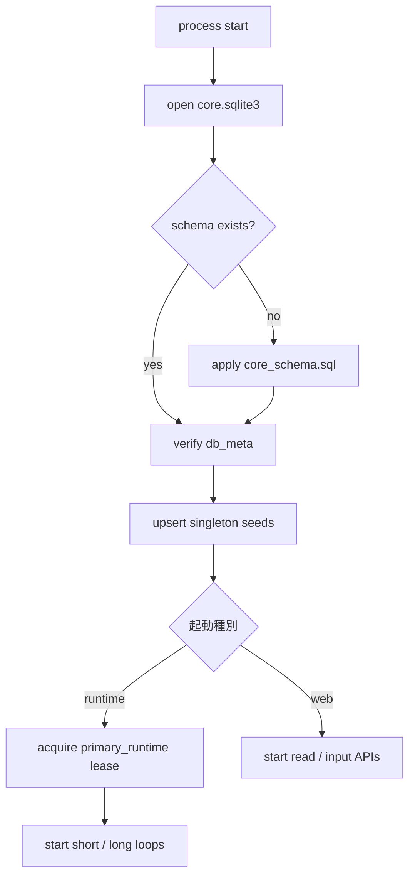
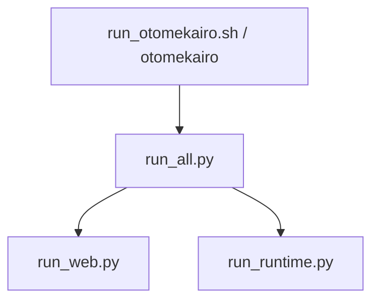

# 起動初期化仕様

<!-- Block: Purpose -->
## このドキュメントの役割

- このドキュメントは、`core.sqlite3` の初回初期化、単一断面テーブルの seed、スキーマ版確認、排他起動を固定する正本である
- 目的は、初回起動と再起動のたびに「どこまで準備できていればランタイムを開始してよいか」を曖昧にしないことにある
- テーブル定義は `docs/34_SQLite論理スキーマ.md` を見る
- 実際の SQL 文は `sql/core_schema.sql` を見る
- ランタイム本体の処理順は `docs/31_ランタイム処理仕様.md` を見る
- 起動順、初期 row、排他制御で迷ったら、このドキュメントを正本として扱う

<!-- Block: Scope -->
## このドキュメントで固定する範囲

- 固定するのは、初期起動前に必要な DB 準備、単一断面 state の初期値、スキーマ版確認、単一ランタイム起動の排他方式である
- 固定するのは、`人格ランタイム` と `設定 Web サーバ` の開始前に完了しているべき前提である
- 固定しないのは、OS サービス化、プロセスマネージャ固有の設定、配布形態ごとの起動コマンドである

<!-- Block: Core Principles -->
## 起動の共通原則

- DB 準備が完了する前に、`人格ランタイム` も `設定 Web サーバ` も通常動作へ入らない
- 単一断面テーブルは、常に「0 行」ではなく「1 行の正本」がある状態で起動を終える
- スキーマ版が一致しない場合でも、明示的に定義した one-step migration だけは起動前に適用してよい
- 同じ人格個体に対して、同時に複数の `人格ランタイム` を起動しない
- `設定 Web サーバ` は起動してよいが、`人格ランタイム` の排他 lease は取得しない

<!-- Block: Metadata Group -->
## 起動前に成立しているべきメタ状態

<!-- Block: Db Meta -->
### `db_meta`

- `db_meta` は、起動前判定に必要なメタ情報を保持する
- 初期段階で必須の `meta_key` は、`schema_version`、`schema_name`、`initialized_at`、`initializer_version` の 4 つである
- `db_meta.meta_value_json` は、各キーの値を JSON で保持する
- `schema_version` は、初期値 `6` の整数 JSON に固定する
- `schema_name` は、初期値 `core_schema` の文字列 JSON に固定する
- `initialized_at` は、初回初期化完了時刻の整数 JSON に固定する
- `initializer_version` は、初回初期化を行った起動処理側の版を示す文字列 JSON に固定する

<!-- Block: Runtime Lease -->
### `runtime_leases`

- `runtime_leases` は、ランタイム排他起動のための lease を保持する
- 初期段階で使う `lease_name` は、`primary_runtime` に固定する
- `owner_token` は、起動プロセスが生成する一意の起動トークンである
- `heartbeat_at` と `expires_at` は、lease が生きているかを判定する基準である
- lease が存在しないか、`expires_at < now` のときだけ、新しい起動が取得してよい

<!-- Block: Boot Flow -->
## 起動フロー

<!-- Block: Shared Boot -->
### 共通の起動前処理

1. `core.sqlite3` を開く
2. `sql/core_schema.sql` が未適用なら適用する
3. 既存 DB が旧版なら、定義済みの one-step migration を順に適用して `schema_version=6` へ上げる
4. `db_meta` の必須キーを upsert して、`schema_version=6` と `schema_name=core_schema` を確認する
5. 単一断面テーブルの seed 行を upsert する
6. ここまで成功したときだけ、後続の Web サーバまたはランタイム起動へ進む

- `sql/core_schema.sql` は idempotent に再適用する前提ではなく、「未作成なら適用、作成済みなら版確認」に分けて扱う
- `db_meta` の値が期待と一致しない場合、その場で起動を失敗として終了する
- `schema_version=2` から `3`、`schema_version=3` から `4`、`schema_version=4` から `5`、`schema_version=5` から `6` への migration だけを行ってよい
- 旧スキーマ版 `1` の DB を見つけても、起動を失敗にする

- 下の Mermaid 図は、共通起動前処理から `人格ランタイム` と `設定 Web サーバ` が分岐する流れを示す

<!-- Block: Runtime Boot -->
### `人格ランタイム` の起動手順

1. 共通の起動前処理を完了する
2. `runtime_leases` で `primary_runtime` の lease を取得する
3. lease 取得に成功したら、`settings_overrides` の `apply_scope="next_boot"` で `applied` 済みの最新値を `runtime_settings` へ materialize する
4. `owner_token` を保持したまま `短周期ループ` と `長周期ループ` の管理へ入る
5. 起動中は定期的に `heartbeat_at` と `expires_at` を更新する
6. 正常終了時は、保持中の `primary_runtime` lease を解放する

- `heartbeat` 間隔は 5 秒以下に固定する
- `expires_at` は、少なくとも `heartbeat_at + 15000ms` に固定する
- 起動中に自分の `owner_token` と異なる lease へ置き換わっていた場合、そのランタイムは異常として停止する

<!-- Block: Web Boot -->
### `設定 Web サーバ` の起動手順

1. 共通の起動前処理を完了する
2. `runtime_leases` の取得は行わない
3. `人格ランタイム` が不在でも、参照系 API と入力受付 API は起動してよい

- `GET /api/status` は、ランタイム不在でも seed 済み state を読める状態で起動する
- `人格ランタイム` が不在のときの表示は、API 応答側の `runtime.is_running=false` で表す
- 初回起動直後で短周期未実行の間は、`runtime.last_cycle_id` と `runtime.last_commit_id` を返さない

<!-- Block: Combined Launcher -->
### 引数なしの統合起動

- 初期実装では、`./run_otomekairo.sh` を引数なしの最短起動経路として扱う
- `run_otomekairo.sh` は、`src/` を `PYTHONPATH` に追加してから `otomekairo.boot.run_all` を起動する
- `run_all.py` は、`設定 Web サーバ` と `人格ランタイム` を同じ親プロセスで起動する
- `run_all.py`、`run_web.py`、`run_runtime.py` は、それぞれ `launcher / web / runtime` 用の共通ロガーを初期化し、`log/otomekairo-*.log` に `DEBUG` の通常テキストログを出し、端末には `INFO` 以上を出しつつ、JSON や `context` の辞書は見やすく整形して表示する
- `run_web.py` は、既定では `0.0.0.0:8000` に bind し、ブラウザからは `http://127.0.0.1:8000/` を開く前提にする
- `run_web.py` は、Uvicorn のアクセスログを有効のまま使い、`/api/status` と `/api/chat/stream` だけをフィルタして定期ログを抑止する
- `run_runtime.py` は、`LiteLLM` の `DEBUG` ログを `log/otomekairo-runtime.log` に残し、端末には通常 `INFO` 以上だけを出してよい
- `otomekairo` の console script も、同じく `run_all.py` を起動する
- 起動時に `runtime_leases.primary_runtime` の有効 lease が既にあれば、新しい `人格ランタイム` は起動せず、既存ランタイムを再利用する
- どちらかの子プロセスが終了した場合、親プロセスは両方を停止して終了する
- Web とランタイムを分けて確認したい場合だけ、`run_web.py` と `run_runtime.py` を別プロセスで直接起動する

<!-- Block: Seed Values -->
## 単一断面テーブルの初期値

<!-- Block: Self Seed -->
### `self_state` の seed

- `row_id=1` を upsert する
- `personality_json` は、`docs/36_JSONデータ仕様.md` の固定 shape に従い、`trait_values` をすべて `0.0`、`preferred_interaction_style` を `neutral / balanced / balanced / balanced`、`learned_preferences` と `learned_aversions` を空配列、`habit_biases.preferred_action_types`、`habit_biases.preferred_observation_kinds`、`habit_biases.avoided_action_styles` をすべて空配列で初期化した固定オブジェクトにする
- `current_emotion_json` は、`primary_label=calm`、`valence=0.0`、`arousal=0.0`、`dominance=0.0`、`stability=1.0`、`active_biases` をすべて `0.0` にした固定オブジェクトにする
- `long_term_goals_json` は、`{"goals":[]}` に固定する
- `relationship_overview_json` は、`{"relationships":[]}` に固定する
- `invariants_json` は、`forbidden_action_types=[]`、`forbidden_action_styles=[]`、`required_confirmation_for=[]`、`protected_targets=[]` の固定オブジェクトにする
- `personality_updated_at` は、初回 seed 時の現在時刻で初期化する
- `updated_at` は、初回 seed 時の現在時刻で初期化する
- `personality_json` を変更する更新では、`personality_updated_at` と `updated_at` を同じ transaction で同時更新する
- 感情、目標、関係性、`invariants` だけを変更する更新では、`updated_at` だけを更新し、`personality_updated_at` は進めない

<!-- Block: Runtime Settings Seed -->
### `runtime_settings` の seed

- `row_id=1` を upsert する
- `values_json` は、`config/default_settings.json` を正本として、`docs/39_設定キー運用仕様.md` にある全設定キーを既定値で埋めた完全オブジェクトに固定する
- `value_updated_at_json` は、`values_json` と同じ全設定キーを持ち、各値を seed 時の現在時刻にした完全オブジェクトに固定する
- `updated_at` は初回 seed 時の現在時刻で初期化する
- 再起動時は、既存の `values_json` を上書きせず、不足している設定キーだけを既定値で補完する
- 再起動時は、既存の `value_updated_at_json` を上書きせず、不足している設定キーだけをその時点の現在時刻で補完する

<!-- Block: Attention Seed -->
### `attention_state` の seed

- `row_id=1` を upsert する
- `primary_focus_json` は `{"kind":"idle"}` に固定する
- `secondary_focuses_json`、`suppressed_items_json`、`revisit_queue_json` は空配列 `[]` に固定する

<!-- Block: Body Seed -->
### `body_state` の seed

- `row_id=1` を upsert する
- `posture_json` は `{"mode":"idle"}` に固定する
- `mobility_json`、`sensor_availability_json`、`output_locks_json`、`load_json` は空オブジェクト `{}` に固定する

<!-- Block: World Seed -->
### `world_state` の seed

- `row_id=1` を upsert する
- `location_json` は `{"state":"unknown"}` に固定する
- `situation_summary` は `unknown` に固定する
- `surroundings_json`、`affordances_json`、`constraints_json`、`attention_targets_json`、`external_waits_json` は空オブジェクト `{}` に固定する

<!-- Block: Drive Seed -->
### `drive_state` の seed

- `row_id=1` を upsert する
- `drive_levels_json` は空オブジェクト `{}` に固定する
- `priority_effects_json` は、`task_progress_bias`、`exploration_bias`、`maintenance_bias`、`social_bias` をすべて `0.0` で持つオブジェクトに固定する
- 既存行にこれら 4 キーが欠けている場合は、起動時の seed で正規化してよい

<!-- Block: Recovery -->
## 再起動と異常終了時の扱い

- 前回の `runtime_leases.primary_runtime` が残っていても、`expires_at < now` なら回収してよい
- `db_meta` は再起動時に消さず、`initialized_at` を維持する
- 単一断面テーブルの seed は、再起動時も「不足列を埋める upsert」として毎回走らせてよい
- 既存の state 本文を seed 値で上書きしてはならない
- lease の回収は、期限切れ判定だけで行い、所有者不明の強制削除を常用しない

<!-- Block: Fixed Decisions -->
## このドキュメントで確定したこと

- 起動前に `db_meta` と単一断面 state の整備を完了させる
- スキーマ版 `4` と `core_schema` が一致しない場合は起動しない
- `人格ランタイム` の排他起動は `runtime_leases.primary_runtime` の lease で管理する
- `設定 Web サーバ` は seed 済み DB を前提に起動し、lease は取得しない
- 単一断面テーブルは、空ではなく初期 row を持つ状態で起動を終える
