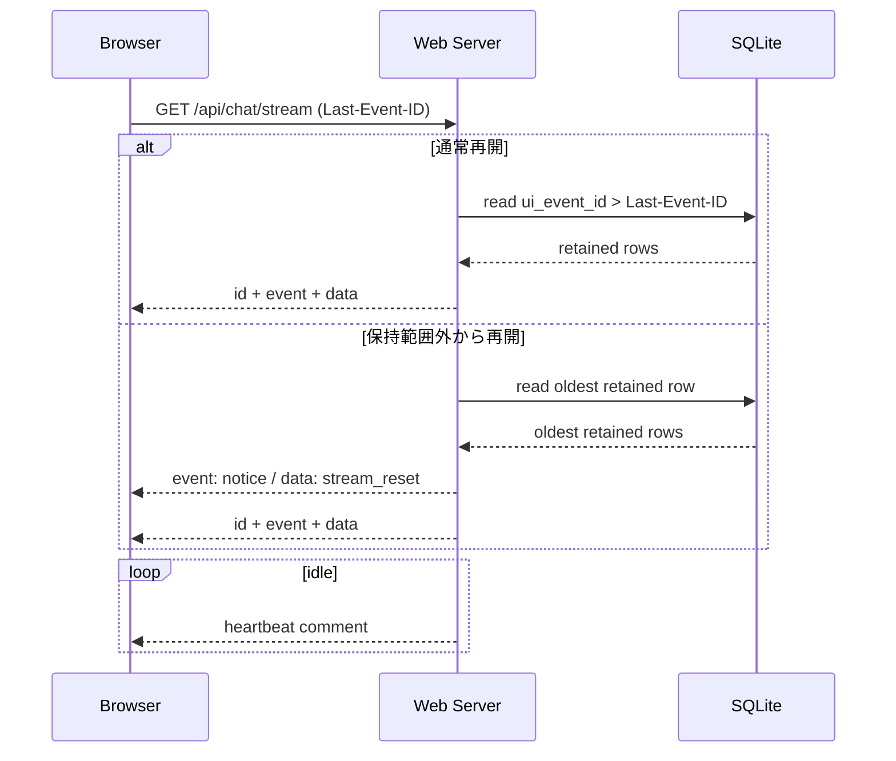

# 入力ストリーム運用仕様

<!-- Block: Purpose -->
## このドキュメントの役割

- このドキュメントは、`pending_inputs`、`ui_outbound_events`、ブラウザチャット入力、`SSE` 再接続の運用規則を固定する正本である
- 目的は、入力重複、停止要求、ストリーム保持期間の扱いを、実装前に曖昧にしないことにある
- Web API の path とエンドポイントの役割は `docs/35_WebAPI仕様.md` を見る
- JSON のキーと型は `docs/36_JSONデータ仕様.md` を見る
- テーブル定義は `docs/34_SQLite論理スキーマ.md` を見る
- ランタイム側の受け渡しは `docs/31_ランタイム処理仕様.md` を見る
- 起動前の seed 前提は `docs/37_起動初期化仕様.md` を見る
- 入力重複、`cancel`、`SSE` の保持と再開で迷ったら、このドキュメントを正本として扱う

<!-- Block: Scope -->
## このドキュメントで固定する範囲

- 固定するのは、`client_message_id` の重複受付規則、`cancel` の解決規則、`ui_outbound_events` の保持と削除、`SSE` 再接続時の補助挙動である
- 固定するのは、初期の `browser_chat` チャネルだけである
- 固定しないのは、複数 UI チャネル、WebSocket、将来の複数ブラウザセッション分離である

<!-- Block: Current Input Kinds -->
## current の入力種別

- current の `pending_inputs` でこの運用に乗るのは `chat_message`、`camera_observation`、`network_result`、`cancel` である
- `client_message_id` の重複規則が直接かかるのは `chat_message` だけである
- `camera_observation`、`network_result`、`cancel` は current 実装では `client_message_id` を持たない
- current の `camera_observation` は、`POST /api/camera/observe` から入る `source=camera` / `trigger_reason=self_initiated` と、`look` 成功後に runtime が積む `source=post_action_followup` / `trigger_reason=post_action_followup` の 2 系統を持ってよい

<!-- Block: Client Message Group -->
## `client_message_id` の運用

<!-- Block: Client Message Rules -->
### 受付規則

- `POST /api/chat/input` で `client_message_id` がある場合、Web サーバは同じ値を `pending_inputs.client_message_id` にも保存する
- 重複判定の単位は、`(channel, client_message_id)` に固定する
- `client_message_id` がない入力は、重複判定の対象にしない
- `client_message_id` がある入力は、同一 `channel` で同じ値を再利用してはならない

<!-- Block: Client Message Conflict -->
### 重複時の扱い

- 既存の `pending_inputs` に同じ `(channel, client_message_id)` がある場合、Web サーバは新規行を追加しない
- 既存行の `status` が `queued`、`claimed`、`consumed` のいずれでも、`409 Conflict` として扱う
- 既存行の `status` が `discarded` でも、同一 `client_message_id` の再利用は許可しない
- 同じ `client_message_id` で本文が違う場合も、同じく `409 Conflict` として扱う

<!-- Block: Client Message Response -->
### 重複時の応答

- `409 Conflict` の本文は、通常の error envelope を使う
- `error_code` は `duplicate_client_message_id` に固定する
- `message` は、人間向けに「既に受け付けた入力」であることを示す短文にする
- `request_id` に加えて、任意で `existing_input_id` を返してよい

<!-- Block: Cancel Group -->
## `cancel` の運用

<!-- Block: Cancel Target -->
### 対象の解決規則

- `cancel` は、`browser_chat` の現在進行中の応答だけを対象にする
- 現在進行中の応答とは、まだ最終 `message` を確定していない `message_id` 単位の出力である
- `target_message_id` が省略された場合、現在進行中の `browser_chat` 応答全体を対象にする
- `target_message_id` がある場合、その値が現在進行中の `message_id` と一致するときだけ有効とする

<!-- Block: Cancel Effects -->
### 停止時の効果

- 有効な `cancel` を受理した場合、ランタイムは対象 `message_id` に対する後続の `token` 追記を停止する
- 有効な `cancel` を受理した場合、その応答は新しい確定 `message` 行を作らず、途中まで流した `token` 列だけを残して終了してよい
- `cancel` は、人格全体の長期タスクや別チャネルの行動まで中断しない
- すでに確定済みの `message` 行や過去の `ui_outbound_events` は取り消さない

<!-- Block: Cancel Miss -->
### 対象が見つからない場合

- 現在進行中の応答が存在しない場合、その `cancel` は `discarded` にする
- `target_message_id` が現在進行中の `message_id` と一致しない場合も、その `cancel` は `discarded` にする
- `discard_reason` は、少なくとも `cancel_target_not_found` を区別する
- `cancel` が `discarded` でも、暗黙に別の応答や別の行動へ適用してはならない

<!-- Block: Stream Retention Group -->
## `ui_outbound_events` の保持と削除

<!-- Block: Retention Window -->
### 保持条件

- `ui_outbound_events` は append-only で追記するが、無期限保持はしない
- `browser_chat` では、少なくとも「直近 24 時間」と「直近 20000 件」の両方を満たす範囲を保持する
- 削除対象にしてよいのは、`created_at < now - 86400000` かつ `ui_event_id < latest_ui_event_id - 20000` を同時に満たす行だけである
- この条件を満たさない最近の行は、古い `Last-Event-ID` への配慮のため保持する

<!-- Block: Retention Owner -->
### 削除主体

- `ui_outbound_events` の削除主体は、`設定 Web サーバ` 側の stream janitor に固定する
- `人格ランタイム` は `ui_outbound_events` を追記してよいが、削除や更新は行わない
- stream janitor は、1 分に 1 回以下の頻度で保持条件を評価してよい
- 保持条件の評価と削除は、通常の `SSE` 配信と同じ DB を使ってよい

<!-- Block: Reconnect Group -->
## `SSE` の再接続運用

<!-- Block: Normal Resume -->
### 通常再開

- `Last-Event-ID` が保持中の範囲にある場合、`ui_event_id > Last-Event-ID` の行からそのまま再開する
- Web サーバは、配信済み状態を DB に書き戻さない
- heartbeat コメントは 15 秒以内の間隔で流してよい

<!-- Block: Stale Resume -->
### 保持範囲外からの再開

- `Last-Event-ID` が保持中の最古 `ui_event_id` より古い場合、保持中の最古イベントから再開する
- このとき Web サーバは、DB へ書き込まず、先頭に 1 回だけ補助的な `notice` イベントを合成してよい
- 合成 `notice` を出す場合、`notice_code` は `stream_reset`、`text` は再開位置が切り詰められたことを示す短文に固定する
- 合成 `notice` は配信時の一時イベントであり、`ui_outbound_events` へ保存しない
- 合成 `notice` は `ui_event_id` を持たないため、`SSE` では `id:` を付けずに `event: notice` と `data:` だけを流す

- 下の Mermaid 図は、通常再開と保持範囲外再開の分岐を要約したものである

<!-- Block: Fixed Decisions -->
## このドキュメントで確定したこと

- `client_message_id` の重複判定は `(channel, client_message_id)` に固定する
- `cancel` は現在進行中の `browser_chat` 応答だけを対象にし、見つからなければ `discarded` にする
- `ui_outbound_events` は無期限保持せず、24 時間かつ 20000 件の保持窓で削除する
- `ui_outbound_events` の削除主体は Web サーバ側の stream janitor に固定する
- `Last-Event-ID` が古すぎる場合は、最古から再開し、必要なら一時的な `stream_reset` notice を返してよい
