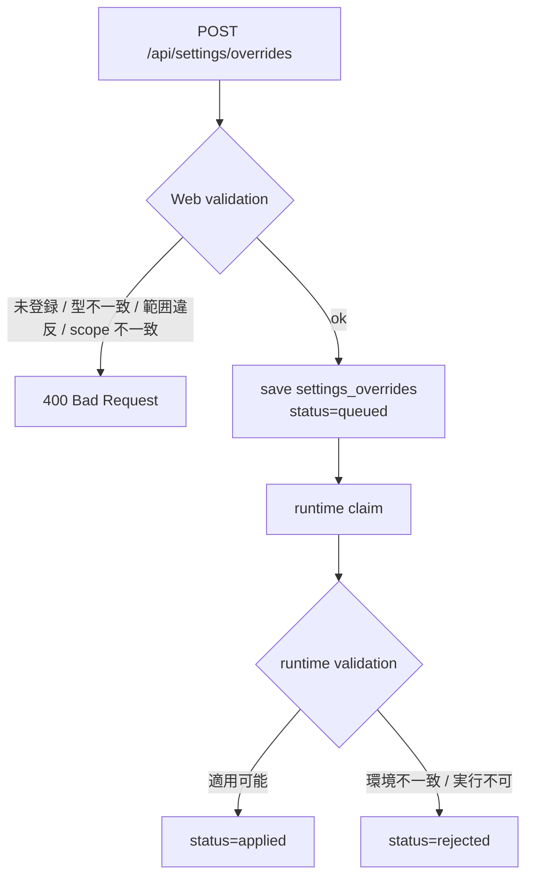

# 設定キー運用仕様

<!-- Block: Purpose -->
## このドキュメントの役割

- このドキュメントは、`settings_overrides.key` で受け付けてよい設定キー、型、適用範囲、検証規則を固定する正本である
- 目的は、Web API からどの設定を変えてよいか、どこで `400` と `rejected` を分けるかを曖昧にしないことにある
- このドキュメントは個別キー更新の制約を扱うものであり、設定UI専用のプリセットや全体保存モデルは `docs/42_設定UI仕様.md` を正本とする
- Web API の受付経路は `docs/35_WebAPI仕様.md` を見る
- JSON の形は `docs/36_JSONデータ仕様.md` を見る
- 保存先テーブルは `docs/34_SQLite論理スキーマ.md` を見る
- 設定キー、型制約、適用範囲で迷ったら、このドキュメントを正本として扱う

<!-- Block: Scope -->
## このドキュメントで固定する範囲

- 固定するのは、初期段階で Web API から変更できる設定キーだけである
- 固定するのは、各キーの `value_type`、許可 `apply_scope`、基本の値制約、Web サーバとランタイムの責務分担である
- 固定しないのは、ファイルパス、OS 依存値、将来の内部専用キーである

<!-- Block: Core Principles -->
## 共通原則

- `settings_overrides.key` は、このドキュメントに登録されたキーだけを受け付ける
- 登録されていない `key` は、Web サーバが `400 Bad Request` で拒否し、`settings_overrides` へ保存しない
- `requested_value` の JSON 型が登録された `value_type` と一致しない場合、Web サーバが `400 Bad Request` で拒否する
- 範囲、列挙、最小長などの基本制約に違反する場合も、Web サーバが `400 Bad Request` で拒否する
- 参照先プロバイダ未設定、デバイス不在、現在状態と衝突するなどの実行時条件は、ランタイム側で評価し、必要なら `rejected` にする
- `apply_scope` は、登録された許可集合に含まれる値だけを受け付ける
- 初期公開キーでは、`requested_value` に `object` と `array` を受け付けない
- 秘密情報や認証情報も、登録されたキーであれば Web API から変更してよい
- `apply_scope="runtime"` は同じ短周期で `runtime_settings` に反映する
- `apply_scope="next_boot"` は `applied` 後も即時反映せず、次回ランタイム起動時に `runtime_settings` へ materialize する

<!-- Block: Validation Split -->
## 検証責務の分割

<!-- Block: Web Validation -->
### Web サーバが拒否する条件

- 未登録の `key`
- `apply_scope` の不一致
- `requested_value` の型不一致
- 数値の最小値・最大値違反
- 文字列長の最小値・最大値違反（空文字を許可しないキーでの空値を含む）
- 列挙値の不一致

<!-- Block: Runtime Validation -->
### ランタイムが `rejected` にする条件

- 登録キーではあるが、現在の実行環境では適用不能
- LLM モデル名が、起動中の利用可能一覧に存在しない
- 実行中タスクや安全条件の都合で、その短周期では反映してはならない
- `next_boot` 専用の前提に反する即時適用要求

<!-- Block: Error Codes -->
## Web API のエラーコード

- 未登録キー: `unknown_settings_key`
- `apply_scope` 不一致: `invalid_settings_scope`
- 型不一致または値制約違反: `invalid_settings_value`

- 下の Mermaid 図は、設定変更要求がどこで拒否され、どこで `applied` / `rejected` に分かれるかを示す

<!-- Block: Allowed Keys -->
## 許可する設定キー

<!-- Block: Llm Keys -->
### LLM 関連

- `llm.model`
  - `value_type`: `string`
  - 許可 `apply_scope`: `runtime`, `next_boot`
  - 制約: 1 文字以上 256 文字以下
  - 役割: 認知処理に使う `provider/model` 形式のモデル識別子を切り替える

- `llm.base_url`
  - `value_type`: `string`
  - 許可 `apply_scope`: `runtime`, `next_boot`
  - 制約: 0 文字以上 512 文字以下
  - 役割: 認知生成に使う Base URL を切り替える。空文字は未指定を表す

- `llm.embedding_model`
  - `value_type`: `string`
  - 許可 `apply_scope`: `runtime`, `next_boot`
  - 制約: 1 文字以上 256 文字以下
  - 役割: 埋め込み生成に使う `provider/model` 形式のモデル識別子を切り替える

- `llm.embedding_base_url`
  - `value_type`: `string`
  - 許可 `apply_scope`: `runtime`, `next_boot`
  - 制約: 0 文字以上 512 文字以下
  - 役割: 埋め込み生成に使う Base URL を切り替える。空文字は未指定を表す

- `llm.temperature`
  - `value_type`: `number`
  - 許可 `apply_scope`: `runtime`, `next_boot`
  - 制約: `0.0 <= value <= 2.0`
  - 役割: 認知系 LLM の温度を調整する

- `llm.max_output_tokens`
  - `value_type`: `integer`
  - 許可 `apply_scope`: `runtime`, `next_boot`
  - 制約: `256 <= value <= 8192`
  - 役割: 1 回の LLM 出力上限を調整する

<!-- Block: Runtime Keys -->
### ランタイム関連

- `runtime.idle_tick_ms`
  - `value_type`: `integer`
  - 許可 `apply_scope`: `runtime`, `next_boot`
  - 制約: `250 <= value <= 60000`
  - 役割: アイドル時の最小 tick 間隔を調整する

- `runtime.long_cycle_min_interval_ms`
  - `value_type`: `integer`
  - 許可 `apply_scope`: `runtime`, `next_boot`
  - 制約: `1000 <= value <= 300000`
  - 役割: 長周期ループの最短間隔を調整する

- `runtime.context_budget_tokens`
  - `value_type`: `integer`
  - 許可 `apply_scope`: `runtime`, `next_boot`
  - 制約: `1024 <= value <= 32768`
  - 役割: `cognition_input` の構成時に使う上限トークンを調整する

<!-- Block: Behavior Keys -->
### 振る舞い関連

- `behavior.second_person_label`
  - `value_type`: `string`
  - 許可 `apply_scope`: `runtime`, `next_boot`
  - 制約: 0 文字以上 128 文字以下
  - 役割: ユーザーの呼び方を保持し、認知プロンプトへ反映する

- `behavior.system_prompt`
  - `value_type`: `string`
  - 許可 `apply_scope`: `runtime`, `next_boot`
  - 制約: 0 文字以上 20000 文字以下
  - 役割: `CocoroConsole` 相当の会話指示を含む振る舞い本文を保持し、認知プロンプトへ反映する

- `behavior.addon_prompt`
  - `value_type`: `string`
  - 許可 `apply_scope`: `runtime`, `next_boot`
  - 制約: 0 文字以上 20000 文字以下
  - 役割: 任意の追加指示を保持し、認知プロンプトへ補助情報として反映する

- `behavior.response_pace`
  - `value_type`: `string`
  - 許可 `apply_scope`: `runtime`, `next_boot`
  - 制約: 1 文字以上 32 文字以下
  - 役割: `careful`、`balanced`、`quick` のいずれかで応答ペースを上書きする

- `behavior.proactivity_level`
  - `value_type`: `string`
  - 許可 `apply_scope`: `runtime`, `next_boot`
  - 制約: 1 文字以上 32 文字以下
  - 役割: `low`、`medium`、`high` のいずれかで自発性傾向を保持する

- `behavior.browse_preference`
  - `value_type`: `string`
  - 許可 `apply_scope`: `runtime`, `next_boot`
  - 制約: 1 文字以上 32 文字以下
  - 役割: `avoid`、`balanced`、`prefer` のいずれかで検索傾向を保持する

- `behavior.notify_preference`
  - `value_type`: `string`
  - 許可 `apply_scope`: `runtime`, `next_boot`
  - 制約: 1 文字以上 32 文字以下
  - 役割: `quiet`、`balanced`、`proactive` のいずれかで通知傾向を保持する

- `behavior.speech_style`
  - `value_type`: `string`
  - 許可 `apply_scope`: `runtime`, `next_boot`
  - 制約: 1 文字以上 32 文字以下
  - 役割: `gentle`、`neutral`、`firm` のいずれかで話し方を上書きする

- `behavior.verbosity_bias`
  - `value_type`: `string`
  - 許可 `apply_scope`: `runtime`, `next_boot`
  - 制約: 1 文字以上 32 文字以下
  - 役割: `short`、`balanced`、`detailed` のいずれかで説明量の傾向を保持する

<!-- Block: Sensor Keys -->
### 感覚入力関連

- `sensors.camera.enabled`
  - `value_type`: `boolean`
  - 許可 `apply_scope`: `runtime`
  - 制約: 追加制約なし
  - 役割: Web カメラ観測の有効化を切り替える

- `sensors.microphone.enabled`
  - `value_type`: `boolean`
  - 許可 `apply_scope`: `runtime`
  - 制約: 追加制約なし
  - 役割: マイク観測の有効化を切り替える

<!-- Block: Character Keys -->
### キャラクター関連

- `character.vrm_file_path`
  - `value_type`: `string`
  - 許可 `apply_scope`: `runtime`, `next_boot`
  - 制約: 0 文字以上 1024 文字以下
  - 役割: キャラクターに対応する VRM ファイルパスを保持する

- `character.material.convert_unlit_to_mtoon`
  - `value_type`: `boolean`
  - 許可 `apply_scope`: `runtime`, `next_boot`
  - 制約: 追加制約なし
  - 役割: Unlit マテリアルを MToon として扱うかを切り替える

- `character.material.enable_shadow_off`
  - `value_type`: `boolean`
  - 許可 `apply_scope`: `runtime`, `next_boot`
  - 制約: 追加制約なし
  - 役割: 指定メッシュへの影無効化を使うかを切り替える

- `character.material.shadow_off_meshes`
  - `value_type`: `string`
  - 許可 `apply_scope`: `runtime`, `next_boot`
  - 制約: 0 文字以上 4096 文字以下
  - 役割: 影を落とさないメッシュ名をカンマ区切りで保持する

<!-- Block: TTS Keys -->
### 音声出力関連

- `speech.tts.enabled`
  - `value_type`: `boolean`
  - 許可 `apply_scope`: `runtime`, `next_boot`
  - 制約: 追加制約なし
  - 役割: TTS 出力を有効化または無効化する

- `speech.tts.provider`
  - `value_type`: `string`
  - 許可 `apply_scope`: `runtime`, `next_boot`
  - 制約: 1 文字以上 64 文字以下
  - 役割: `aivis-cloud`、`voicevox`、`style-bert-vits2` のどれを使うかを切り替える

- `speech.tts.aivis_cloud.endpoint_url`
  - `value_type`: `string`
  - 許可 `apply_scope`: `runtime`, `next_boot`
  - 制約: 0 文字以上 512 文字以下
  - 役割: `Aivis Cloud API` の接続先 URL を保持する

- `speech.tts.aivis_cloud.model_uuid`
  - `value_type`: `string`
  - 許可 `apply_scope`: `runtime`, `next_boot`
  - 制約: 0 文字以上 128 文字以下
  - 役割: `Aivis Cloud API` のモデル UUID を保持する

- `speech.tts.aivis_cloud.speaker_uuid`
  - `value_type`: `string`
  - 許可 `apply_scope`: `runtime`, `next_boot`
  - 制約: 0 文字以上 128 文字以下
  - 役割: `Aivis Cloud API` の話者 UUID を保持する

- `speech.tts.aivis_cloud.style_id`
  - `value_type`: `integer`
  - 許可 `apply_scope`: `runtime`, `next_boot`
  - 制約: `0 <= value <= 999999`
  - 役割: `Aivis Cloud API` のスタイル ID を保持する

- `speech.tts.aivis_cloud.use_ssml`
  - `value_type`: `boolean`
  - 許可 `apply_scope`: `runtime`, `next_boot`
  - 制約: 追加制約なし
  - 役割: `Aivis Cloud API` へ SSML として送るかを切り替える

- `speech.tts.aivis_cloud.language`
  - `value_type`: `string`
  - 許可 `apply_scope`: `runtime`, `next_boot`
  - 制約: 1 文字以上 32 文字以下
  - 役割: `Aivis Cloud API` の言語コードを保持する

- `speech.tts.aivis_cloud.speaking_rate`
  - `value_type`: `number`
  - 許可 `apply_scope`: `runtime`, `next_boot`
  - 制約: `0.25 <= value <= 4.0`
  - 役割: `Aivis Cloud API` の話速を保持する

- `speech.tts.aivis_cloud.emotional_intensity`
  - `value_type`: `number`
  - 許可 `apply_scope`: `runtime`, `next_boot`
  - 制約: `0.0 <= value <= 2.0`
  - 役割: `Aivis Cloud API` の感情強度を保持する

- `speech.tts.aivis_cloud.tempo_dynamics`
  - `value_type`: `number`
  - 許可 `apply_scope`: `runtime`, `next_boot`
  - 制約: `0.0 <= value <= 2.0`
  - 役割: `Aivis Cloud API` のテンポ変化量を保持する

- `speech.tts.aivis_cloud.pitch`
  - `value_type`: `number`
  - 許可 `apply_scope`: `runtime`, `next_boot`
  - 制約: `-1.0 <= value <= 1.0`
  - 役割: `Aivis Cloud API` の音高補正値を保持する

- `speech.tts.aivis_cloud.volume`
  - `value_type`: `number`
  - 許可 `apply_scope`: `runtime`, `next_boot`
  - 制約: `0.0 <= value <= 2.0`
  - 役割: `Aivis Cloud API` の音量補正値を保持する

- `speech.tts.aivis_cloud.output_format`
  - `value_type`: `string`
  - 許可 `apply_scope`: `runtime`, `next_boot`
  - 制約: 1 文字以上 16 文字以下
  - 役割: `Aivis Cloud API` の出力フォーマットを保持する

- `speech.tts.voicevox.endpoint_url`
  - `value_type`: `string`
  - 許可 `apply_scope`: `runtime`, `next_boot`
  - 制約: 0 文字以上 512 文字以下
  - 役割: `VOICEVOX Engine` の接続先 URL を保持する

- `speech.tts.voicevox.speaker_id`
  - `value_type`: `integer`
  - 許可 `apply_scope`: `runtime`, `next_boot`
  - 制約: `0 <= value <= 999999`
  - 役割: `VOICEVOX Engine` の話者 ID を保持する

- `speech.tts.voicevox.speed_scale`
  - `value_type`: `number`
  - 許可 `apply_scope`: `runtime`, `next_boot`
  - 制約: `0.5 <= value <= 2.0`
  - 役割: `VOICEVOX Engine` の話速を保持する

- `speech.tts.voicevox.pitch_scale`
  - `value_type`: `number`
  - 許可 `apply_scope`: `runtime`, `next_boot`
  - 制約: `-0.15 <= value <= 0.15`
  - 役割: `VOICEVOX Engine` の音高補正値を保持する

- `speech.tts.voicevox.intonation_scale`
  - `value_type`: `number`
  - 許可 `apply_scope`: `runtime`, `next_boot`
  - 制約: `0.0 <= value <= 2.0`
  - 役割: `VOICEVOX Engine` の抑揚量を保持する

- `speech.tts.voicevox.volume_scale`
  - `value_type`: `number`
  - 許可 `apply_scope`: `runtime`, `next_boot`
  - 制約: `0.0 <= value <= 2.0`
  - 役割: `VOICEVOX Engine` の音量補正値を保持する

- `speech.tts.voicevox.pre_phoneme_length`
  - `value_type`: `number`
  - 許可 `apply_scope`: `runtime`, `next_boot`
  - 制約: `0.0 <= value <= 1.5`
  - 役割: `VOICEVOX Engine` の発話前無音を保持する

- `speech.tts.voicevox.post_phoneme_length`
  - `value_type`: `number`
  - 許可 `apply_scope`: `runtime`, `next_boot`
  - 制約: `0.0 <= value <= 1.5`
  - 役割: `VOICEVOX Engine` の発話後無音を保持する

- `speech.tts.voicevox.output_sampling_rate`
  - `value_type`: `integer`
  - 許可 `apply_scope`: `runtime`, `next_boot`
  - 制約: `8000 <= value <= 48000`
  - 役割: `VOICEVOX Engine` の出力サンプリングレートを保持する

- `speech.tts.voicevox.output_stereo`
  - `value_type`: `boolean`
  - 許可 `apply_scope`: `runtime`, `next_boot`
  - 制約: 追加制約なし
  - 役割: `VOICEVOX Engine` のステレオ出力を切り替える

- `speech.tts.style_bert_vits2.endpoint_url`
  - `value_type`: `string`
  - 許可 `apply_scope`: `runtime`, `next_boot`
  - 制約: 0 文字以上 512 文字以下
  - 役割: `Style-Bert-VITS2 API` の接続先 URL を保持する

- `speech.tts.style_bert_vits2.model_name`
  - `value_type`: `string`
  - 許可 `apply_scope`: `runtime`, `next_boot`
  - 制約: 0 文字以上 128 文字以下
  - 役割: `Style-Bert-VITS2 API` のモデル名を保持する

- `speech.tts.style_bert_vits2.model_id`
  - `value_type`: `integer`
  - 許可 `apply_scope`: `runtime`, `next_boot`
  - 制約: `0 <= value <= 999999`
  - 役割: `Style-Bert-VITS2 API` のモデル ID を保持する

- `speech.tts.style_bert_vits2.speaker_name`
  - `value_type`: `string`
  - 許可 `apply_scope`: `runtime`, `next_boot`
  - 制約: 0 文字以上 128 文字以下
  - 役割: `Style-Bert-VITS2 API` の話者名を保持する

- `speech.tts.style_bert_vits2.speaker_id`
  - `value_type`: `integer`
  - 許可 `apply_scope`: `runtime`, `next_boot`
  - 制約: `0 <= value <= 999999`
  - 役割: `Style-Bert-VITS2 API` の話者 ID を保持する

- `speech.tts.style_bert_vits2.style`
  - `value_type`: `string`
  - 許可 `apply_scope`: `runtime`, `next_boot`
  - 制約: 1 文字以上 128 文字以下
  - 役割: `Style-Bert-VITS2 API` の音声スタイル名を保持する

- `speech.tts.style_bert_vits2.style_weight`
  - `value_type`: `number`
  - 許可 `apply_scope`: `runtime`, `next_boot`
  - 制約: `0.0 <= value <= 10.0`
  - 役割: `Style-Bert-VITS2 API` のスタイル強度を保持する

- `speech.tts.style_bert_vits2.sdp_ratio`
  - `value_type`: `number`
  - 許可 `apply_scope`: `runtime`, `next_boot`
  - 制約: `0.0 <= value <= 1.0`
  - 役割: `Style-Bert-VITS2 API` の SDP 比率を保持する

- `speech.tts.style_bert_vits2.noise`
  - `value_type`: `number`
  - 許可 `apply_scope`: `runtime`, `next_boot`
  - 制約: `0.0 <= value <= 10.0`
  - 役割: `Style-Bert-VITS2 API` のノイズ量を保持する

- `speech.tts.style_bert_vits2.noise_w`
  - `value_type`: `number`
  - 許可 `apply_scope`: `runtime`, `next_boot`
  - 制約: `0.0 <= value <= 10.0`
  - 役割: `Style-Bert-VITS2 API` のノイズ幅を保持する

- `speech.tts.style_bert_vits2.length`
  - `value_type`: `number`
  - 許可 `apply_scope`: `runtime`, `next_boot`
  - 制約: `0.25 <= value <= 4.0`
  - 役割: `Style-Bert-VITS2 API` の発話長補正を保持する

- `speech.tts.style_bert_vits2.language`
  - `value_type`: `string`
  - 許可 `apply_scope`: `runtime`, `next_boot`
  - 制約: 1 文字以上 32 文字以下
  - 役割: `Style-Bert-VITS2 API` の言語コードを保持する

- `speech.tts.style_bert_vits2.auto_split`
  - `value_type`: `boolean`
  - 許可 `apply_scope`: `runtime`, `next_boot`
  - 制約: 追加制約なし
  - 役割: `Style-Bert-VITS2 API` の自動分割を切り替える

- `speech.tts.style_bert_vits2.split_interval`
  - `value_type`: `number`
  - 許可 `apply_scope`: `runtime`, `next_boot`
  - 制約: `0.0 <= value <= 30.0`
  - 役割: `Style-Bert-VITS2 API` の分割間隔を保持する

- `speech.tts.style_bert_vits2.assist_text`
  - `value_type`: `string`
  - 許可 `apply_scope`: `runtime`, `next_boot`
  - 制約: 0 文字以上 4096 文字以下
  - 役割: `Style-Bert-VITS2 API` の補助テキストを保持する

- `speech.tts.style_bert_vits2.assist_text_weight`
  - `value_type`: `number`
  - 許可 `apply_scope`: `runtime`, `next_boot`
  - 制約: `0.0 <= value <= 10.0`
  - 役割: `Style-Bert-VITS2 API` の補助テキスト強度を保持する

<!-- Block: STT Keys -->
### 音声認識関連

- `speech.stt.enabled`
  - `value_type`: `boolean`
  - 許可 `apply_scope`: `runtime`, `next_boot`
  - 制約: 追加制約なし
  - 役割: STT 入力を有効化または無効化する

- `speech.stt.provider`
  - `value_type`: `string`
  - 許可 `apply_scope`: `runtime`, `next_boot`
  - 制約: 1 文字以上 64 文字以下
  - 役割: 現在は `amivoice` のみを受け付ける

- `speech.stt.wake_word`
  - `value_type`: `string`
  - 許可 `apply_scope`: `runtime`, `next_boot`
  - 制約: 0 文字以上 1024 文字以下
  - 役割: 音声認識を開始する起動ワード列を保持する

- `speech.stt.amivoice.profile_id`
  - `value_type`: `string`
  - 許可 `apply_scope`: `runtime`, `next_boot`
  - 制約: 0 文字以上 256 文字以下
  - 役割: AmiVoice の profile ID を保持する

- `speech.stt.amivoice.api_key`
  - `value_type`: `string`
  - 許可 `apply_scope`: `runtime`, `next_boot`
  - 制約: 0 文字以上 4096 文字以下
  - 役割: AmiVoice の APPKEY を保持する

<!-- Block: Integration Keys -->
### 外部連携関連

- `integrations.sns.enabled`
  - `value_type`: `boolean`
  - 許可 `apply_scope`: `runtime`
  - 制約: 追加制約なし
  - 役割: SNS API 経由の発信を有効化または停止する

- `integrations.notify_route`
  - `value_type`: `string`
  - 許可 `apply_scope`: `runtime`, `next_boot`
  - 制約: 1 文字以上 64 文字以下
  - 役割: 外部通知の既定経路を切り替える

<!-- Block: Secret Keys -->
### API キー・トークン関連

- `llm.api_key`
  - `value_type`: `string`
  - 許可 `apply_scope`: `runtime`, `next_boot`
  - 制約: 0 文字以上 4096 文字以下
  - 役割: 認知生成に使う LLM プロバイダの API キーを保持する

- `llm.embedding_api_key`
  - `value_type`: `string`
  - 許可 `apply_scope`: `runtime`, `next_boot`
  - 制約: 0 文字以上 4096 文字以下
  - 役割: 埋め込み生成に使うプロバイダの API キーを保持する

- `speech.tts.aivis_cloud.api_key`
  - `value_type`: `string`
  - 許可 `apply_scope`: `runtime`, `next_boot`
  - 制約: 0 文字以上 4096 文字以下
  - 役割: `Aivis Cloud API` の API キーを保持する

- `speech.stt.amivoice.api_key`
  - `value_type`: `string`
  - 許可 `apply_scope`: `runtime`, `next_boot`
  - 制約: 0 文字以上 4096 文字以下
  - 役割: AmiVoice 音声認識に使う API キーを保持する

- `integrations.discord.bot_token`
  - `value_type`: `string`
  - 許可 `apply_scope`: `runtime`, `next_boot`
  - 制約: 0 文字以上 4096 文字以下
  - 役割: Discord 通知に使う Bot トークンを保持する

- `integrations.discord.channel_id`
  - `value_type`: `string`
  - 許可 `apply_scope`: `runtime`, `next_boot`
  - 制約: 0 文字以上 256 文字以下
  - 役割: Discord 通知の送信先チャンネル ID を保持する

<!-- Block: Rejected Keys -->
## Web API で受け付けない設定

- `policies.*` は、命令階層や安全方針に直結するため受け付けない
- `paths.*`、`storage.*` のようなローカルパス変更は受け付けない
- 未登録の `config/` キーは、たとえ内部に存在していても受け付けない

- API キーやトークンも、登録されたキーであれば受け付けてよい

<!-- Block: Fixed Decisions -->
## このドキュメントで確定したこと

- `settings_overrides.key` は登録済みキーだけを受け付ける
- 基本的な型・範囲・`apply_scope` の検証は Web サーバで行う
- 実行環境依存の適用可否はランタイムが評価し、必要なら `rejected` にする
- `runtime` scope の `applied` は、そのまま現在有効値へ反映する
- `next_boot` scope の `applied` は、次回ランタイム起動まで現在有効値へ反映しない
- 初期公開キーでは `object` と `array` の `requested_value` は受け付けない
- ローカルパス変更に当たる未登録キーは Web API で受け付けない
