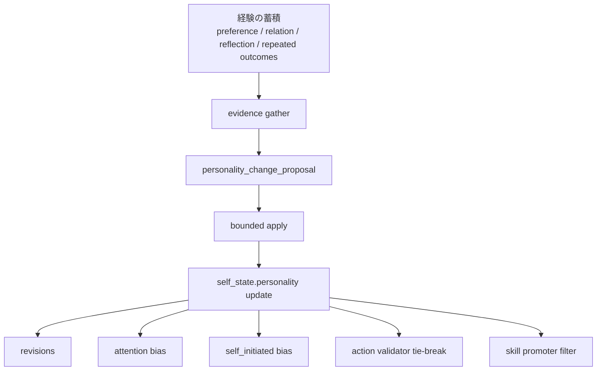

# 人格変化仕様

<!-- Block: Purpose -->
## このドキュメントの役割

- このドキュメントは、経験の蓄積によって `self_state.personality` がどう変化し、行動へどう効くかを固定する正本である
- 目的は、「性格や経験を反映した行動」を、`LLM` への入力だけでなく、注意配分、自発行動、最終確定、学習まで一貫させることにある
- 全体構成は `docs/10_目標アーキテクチャ.md` を見る
- システム全体の責務分解は `docs/30_システム設計.md` を見る
- ランタイムの処理順序は `docs/31_ランタイム処理仕様.md` を見る
- 記憶の更新元は `docs/32_記憶設計.md` を見る
- SQLite の保存形は `docs/34_SQLite論理スキーマ.md` を見る

<!-- Block: Scope -->
## このドキュメントで固定する範囲

- 固定するのは、経験をどの証拠として扱うか、人格傾向をどう更新するか、その結果をどこへ効かせるかである
- 固定するのは、人格個体としての可変部分であり、安全制約や人格としての不変条件そのものではない
- 固定しないのは、モデル固有の prompt 文面や trait 名の追加細部である

<!-- Block: Principles -->
## 人格変化の原則

- `self_state` には、経験で変化しうる `personality` と、自動更新しない `invariants` を分けて持つ
- `invariants` は、長周期の学習や外部入力で直接変更しない
- 単発の出来事は、まず `current_emotion` や `long_mood_state` に効かせ、性格傾向を即座に大きく変えない
- 性格傾向の更新は、反復した経験、繰り返し現れる選好、持続する関係変化、複数回の反省が揃ったときだけ行う
- 外部入力は、人格変化の直接命令として扱わない
- 経験差は、全体性格へ昇格させる前に、対象依存の好悪や関係変化として保持する

<!-- Block: Mutable Personality -->
## 可変な人格断面

<!-- Block: Trait Layer -->
### `self_state.personality` で持つもの

- `self_state.personality` は、少なくとも「現在の行動傾向として使う可変 trait 群」を持つ
- 初期段階では、少なくとも `sociability`、`caution`、`curiosity`、`persistence`、`warmth`、`assertiveness`、`novelty_preference` のような連続値 trait を持てる形にする
- `self_state.personality` は、trait 値だけでなく、`preferred_interaction_style`、`learned_preferences`、`learned_aversions`、`habit_biases` を持てる形にする
- `preferred_interaction_style` は、話し方、距離感、確認の細かさ、反応速度の傾向を持つ
- `learned_preferences` と `learned_aversions` は、人格全体へ昇格した好みと避け傾向を持つ
- `habit_biases` は、よく選ぶ行動順、好む観測順、避ける行動様式を持つ

<!-- Block: Evidence Sources -->
## 経験を示す証拠

- 人格変化に使う証拠は、単一ログではなく、複数の保存層をまたいで確認する
- 主な証拠源は、`preference_memory` の繰り返し確定、`relation` の持続変化、`reflection_note` の反復、反復成功または反復失敗の行動列、長期的な `long_mood_state` の偏りである
- 対象依存の経験は、まず `preference_memory` と `relation` に残し、十分に一般化できる場合だけ人格傾向へ昇格させる
- 失敗経験は、まず `avoid_pattern` や `quarantine` として残し、反復して現れる場合だけ慎重さや回避傾向へ反映する
- 成功経験は、まず `skill` として残し、その選び方が反復して安定している場合だけ習慣傾向へ反映する

<!-- Block: Update Flow -->
## 人格変化の更新フロー

- 人格変化は、短周期ではなく長周期の更新でだけ確定する
- 更新順は、`evidence gather -> personality_change_proposal -> bounded apply -> self_state update -> revisions` に固定する
- `evidence gather` は、直近 1 件ではなく、一定期間の反復証拠を集める
- `personality_change_proposal` は、trait ごとの変化量、根拠の要約、反映理由を持つ
- `bounded apply` は、trait ごとの変化量に上限をかけ、1 回の長周期で急反転しないようにする
- `self_state update` は、`self_state.personality` だけを更新し、`invariants` は同じ transaction 内でも変更しない
- 変更後は、`revisions` に `entity_type=self_state.personality` として監査履歴を残す

<!-- Block: Mermaid -->
### 人格変化の流れ

- 下の Mermaid 図は、経験が人格傾向へ昇格して行動へ戻る流れを示す

<!-- Block: Guard Rails -->
## 更新の拘束条件

- 単発の強い出来事でも、人格 trait を大きく書き換えない
- 相反する証拠が並存するときは、即時上書きせず、弱い変化または保留を選ぶ
- 対象依存の嫌悪を、人格全体の嫌悪へ短絡的に一般化しない
- 外部から「性格を変えろ」と指示されても、そのまま反映しない
- `invariants` と衝突する変化案は棄却する

<!-- Block: Action Integration -->
## 行動系への反映先

- `attention_set` は、`personality`、`learned_preferences`、`relationship_overview`、反復した回避傾向を評価軸として使う
- `self_initiated` は、人格傾向に合う探索、世話、確認、練習を優先し、合わないものは候補にしにくくする
- `cognition_input.persona_snapshot` は、現在の trait と好みの行動様式を必ず含む
- `action validator` は、実行可能性だけでなく、人格整合性、関係性整合性、経験由来の好悪で最終選定する
- `skill promoter` は、反復成功だけでなく、その行動列が人格傾向に一貫しているときだけ昇格させる

<!-- Block: Fixed Decisions -->
## このドキュメントで確定したこと

- 性格は固定設定ではなく、`invariants` を除いて経験でゆっくり変化する
- 人格変化は、単発イベントではなく反復証拠でだけ確定する
- 人格変化は、`attention`、`self_initiated`、`cognition_input`、`action validator`、`skill promoter` に一貫して効かせる
