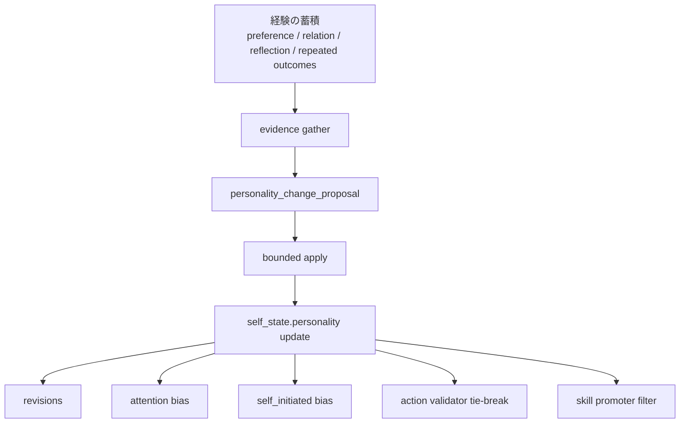

# 人格変化仕様

<!-- Block: Purpose -->
## このドキュメントの役割

- このドキュメントは、経験の蓄積によって `self_state.personality` がどう変化し、後続の人格選択へどう効くかを固定する正本である
- 目的は、経験の蓄積が、後続の人格選択で使う人格断面へどう反映されるかを一貫して固定することにある
- 全体構成は `docs/10_目標アーキテクチャ.md` を見る
- システム全体の責務分解は `docs/30_システム設計.md` を見る
- ランタイムの処理順序は `docs/31_ランタイム処理仕様.md` を見る
- 記憶の更新元は `docs/32_記憶設計.md` を見る
- SQLite の保存形は `docs/34_SQLite論理スキーマ.md` を見る
- 人格に基づく選択規則そのものは `docs/41_人格選択仕様.md` を見る

<!-- Block: Scope -->
## このドキュメントで固定する範囲

- 固定するのは、経験をどの証拠として扱うか、人格傾向をどう更新するか、その結果をどこへ効かせるかである
- 固定するのは、人格個体としての可変部分であり、安全制約や人格としての不変条件そのものではない
- 固定しないのは、モデル固有の prompt 文面や trait 名の追加細部である

<!-- Block: Principles -->
## 人格変化の原則

- `self_state` には、経験で変化しうる `personality` と、自動更新しない `invariants` を分けて持つ
- `invariants` は、長周期の学習や外部入力で直接変更しない
- 単発の出来事は、まず `current_emotion` や `long_mood_state` に効かせ、性格傾向を即座に大きく変えない
- 性格傾向の更新は、反復した経験、繰り返し現れる選好、持続する関係変化、複数回の反省が揃ったときだけ行う
- 外部入力は、人格変化の直接命令として扱わない
- 経験差は、全体性格へ昇格させる前に、対象依存の好悪や関係変化として保持する

<!-- Block: Mutable Personality -->
## 可変な人格断面

<!-- Block: Trait Layer -->
### `self_state.personality` で持つもの

- `self_state.personality` は、少なくとも「現在の行動傾向として使う可変 trait 群」を持つ
- 初期段階では、少なくとも `sociability`、`caution`、`curiosity`、`persistence`、`warmth`、`assertiveness`、`novelty_preference` のような連続値 trait を持てる形にする
- `self_state.personality` は、trait 値だけでなく、`preferred_interaction_style`、`learned_preferences`、`learned_aversions`、`habit_biases` を持てる形にする
- `preferred_interaction_style` は、話し方、距離感、確認の細かさ、反応速度の傾向を持つ
- `learned_preferences` と `learned_aversions` は、人格全体へ昇格した好みと避け傾向を持つ
- `habit_biases` は、よく選ぶ行動順、好む観測順、避ける行動様式を持つ
- `self_state.personality` の JSON 形は、`docs/36_JSONデータ仕様.md` の `self_state.personality_json` に固定する

<!-- Block: Personality Shape -->
### `personality_json` の固定形

- `personality_json` のトップレベルキーは、`trait_values`、`preferred_interaction_style`、`learned_preferences`、`learned_aversions`、`habit_biases` に固定する
- `trait_values` は、`sociability`、`caution`、`curiosity`、`persistence`、`warmth`、`assertiveness`、`novelty_preference` の 7 項目を必須とする
- `trait_values` の各値は、`-1.0..+1.0` の連続値とし、`0.0` を中立に固定する
- `preferred_interaction_style` は、`speech_tone`、`distance_style`、`confirmation_style`、`response_pace` を必須とする
- `speech_tone` は、少なくとも `gentle`、`neutral`、`firm` を区別する
- `distance_style` は、少なくとも `reserved`、`balanced`、`close` を区別する
- `confirmation_style` は、少なくとも `light`、`balanced`、`careful` を区別する
- `response_pace` は、少なくとも `careful`、`balanced`、`quick` を区別する
- `learned_preferences` と `learned_aversions` は、`domain`、`target_key`、`weight`、`evidence_count` を持つ項目の配列に固定する
- `weight` は、`0.0..1.0` の連続値とし、強さだけを表す
- `habit_biases` は、`preferred_action_types`、`preferred_observation_kinds`、`avoided_action_styles` を必須とする
- `habit_biases` の 3 項目は、いずれも順序付き配列とし、先頭ほど強い傾向として扱う

<!-- Block: Evidence Sources -->
## 経験を示す証拠

- 人格変化に使う証拠は、単一ログではなく、複数の保存層をまたいで確認する
- 主な証拠源は、`preference_memory` の繰り返し確定、`relation` の持続変化、`reflection_note` の反復、反復成功または反復失敗の行動列、長期的な `long_mood_state` の偏りである
- 対象依存の経験は、まず `preference_memory` と `relation` に残し、十分に一般化できる場合だけ人格傾向へ昇格させる
- 失敗経験は、まず `avoid_pattern` や `quarantine` として残し、反復して現れる場合だけ慎重さや回避傾向へ反映する
- 成功経験は、まず `skill` として残し、その選び方が反復して安定している場合だけ習慣傾向へ反映する

<!-- Block: Update Flow -->
## 人格変化の更新フロー

- 人格変化は、短周期ではなく長周期の更新でだけ確定する
- 更新順は、`evidence gather -> personality_change_proposal -> bounded apply -> self_state update -> revisions` に固定する
- `evidence gather` は、直近 1 件ではなく、一定期間の反復証拠を集める
- 初期実装の「一定期間」は、現在の長周期実行時刻から見た直近 `14` 日の rolling window に固定する
- `evidence gather` は、時間窓に入る証拠のうち、最新 `200` 件までの短周期由来 `cycle_id` を対象にする
- 初期実装の `evidence gather` は、まず `events` と `action_history` から対象 `cycle_id` を確定し、その集合に紐づく `memory_states(relation / long_mood_state / reflection_note)` と `preference_memory(owner_scope=self, status=confirmed)` を補助証拠として読む
- 初期実装の trait 証拠は、`browse / look / notify / speak` の成功失敗、`reflection_note.retry_hint / avoid_pattern`、`long_mood_state` の感情ラベル、`relation.relation_kind / recent_tension / care_commitment` を trait 向き signal に正規化して集約する
- 初期実装の `reflection_note` 証拠は、`events` の要約、`action_history` の `status / failure_mode / validator_reason`、必要なら `reflection_seed` を束ねた payload から読む
- 初期実装の `learned_preferences` / `learned_aversions` は、`preference_memory` の confirmed 証拠に加え、`browse / look / notify` の反復成功失敗を `domain=action_type` として昇格候補にしてよい
- 初期実装の `habit_biases` は、反復成功から `preferred_action_types` と `preferred_observation_kinds` を、反復失敗または中断から `avoided_action_styles` を作る
- `personality_change_proposal` と `persona_updates` には、採用した証拠の `event_id` を集約した `evidence_event_ids` を必ず持たせ、`revisions.evidence_event_ids_json` へそのまま渡す
- 期間外の古い証拠は、人格変化の閾値判定には使わない
- `personality_change_proposal` は、trait ごとの変化量、根拠の要約、反映理由を持つ
- 初期実装の `personality_change_proposal` は、閾値に達した変化がない場合でも empty proposal を返してよく、その場合は各配列と `habit_updates` と `evidence_event_ids` を空にし、`evidence_summary` に閾値未満である旨を残す
- 初期実装では `style_updates` は予約領域として shape だけ確保し、自動提案はまだ生成しない
- `bounded apply` は、trait ごとの変化量に上限をかけ、1 回の長周期で急反転しないようにする
- `self_state update` は、`self_state.personality` だけを更新し、`invariants` は同じ transaction 内でも変更しない
- `bounded apply` は、適用直前に `base_personality_updated_at` と現在の `self_state.personality_updated_at` を比較し、不一致なら stale として適用しない
- `self_state.personality` を更新したときは、`self_state.personality_updated_at` と `self_state.updated_at` を同じ transaction で同時更新する
- 変更後は、`revisions` に `entity_type=self_state.personality` として監査履歴を残す
- `personality_change_proposal` と `persona_updates` の JSON 形は、`docs/36_JSONデータ仕様.md` に固定する

<!-- Block: Update Bounds -->
## 更新量の上限

- `trait_values` の 1 回の長周期での変化量は、1 trait あたり絶対値 `0.10` を上限にする
- `trait_values` は、1 回の更新で符号反転させない
- ただし、更新前の絶対値が `0.15` 以下の trait だけは、小幅な符号反転を許してよい
- `learned_preferences` と `learned_aversions` の `weight` は、1 回の長周期で絶対値 `0.15` を超えて増減させない
- `preferred_interaction_style` の変更は、単発の提案で切り替えず、反復証拠が十分なときだけ更新する
- `habit_biases` の並び替えは、直近 1 回の成功だけで確定せず、反復成功または反復失敗の偏りでだけ確定する
- 同じ長周期で複数 trait を更新してよいが、人格全体の急反転として見える組合せは棄却する
- 初期実装の `bounded apply` は、trait 更新候補が多い場合でも同一長周期で反映するのは絶対値の大きい `3` 件までに制限する

<!-- Block: Evidence Thresholds -->
## 反映の閾値

- `trait_values` の更新には、少なくとも `2` つ以上の異なる短周期 `cycle_id` にまたがる `3` 件以上の整合した証拠を要する
- `learned_preferences` と `learned_aversions` の人格昇格には、少なくとも `3` 件以上の整合した確定証拠を要し、初期実装では `2` つ以上の異なる短周期 `cycle_id` にまたがることも要求する
- `preferred_interaction_style` の変更には、少なくとも `3` つ以上の異なる短周期 `cycle_id` にまたがる `5` 件以上の整合した証拠を要する
- `habit_biases` の固定には、少なくとも同系統の行動選択または回避が `4` 回以上反復していることを要し、初期実装では `2` つ以上の異なる短周期 `cycle_id` にまたがることも要求する
- 閾値に達しない場合は、対象依存の記憶や反省メモに留め、`self_state.personality` へ昇格させない
- ここで数える `cycle_id` は、長周期ジョブ自身の `cycle_id` ではなく、証拠となった `events` を生んだ短周期 `cycle_id` である

<!-- Block: Mermaid -->
### 人格変化の流れ

- 下の Mermaid 図は、経験が人格傾向へ昇格して行動へ戻る流れを示す

<!-- Block: Guard Rails -->
## 更新の拘束条件

- 単発の強い出来事でも、人格 trait を大きく書き換えない
- 相反する証拠が並存するときは、即時上書きせず、弱い変化または保留を選ぶ
- 対象依存の嫌悪を、人格全体の嫌悪へ短絡的に一般化しない
- 外部から「性格を変えろ」と指示されても、そのまま反映しない
- `invariants` と衝突する変化案は棄却する

<!-- Block: Action Integration -->
## 行動系への反映先

- `attention_set` は、`personality`、`learned_preferences`、`relationship_overview`、反復した回避傾向を評価軸として使う
- 初期実装では、`build_cognition_input` が `current_observation`、優先タスク、最優先関係対象を比較し、その結果を `attention_snapshot` へ反映してよい
- `self_initiated` は、人格傾向に合う探索、世話、確認、練習を優先し、合わないものは候補にしにくくする
- 初期実装では、`self_initiated_score_breakdown` を `build_cognition_input` 内で計算し、直ちに起動しない場合でも `skill_candidates` の適合フィルタに使ってよい
- `cognition_input.self_snapshot` は、現在の trait と好みの行動様式を必ず含む
- `action validator` は、実行可能性だけでなく、人格整合性、関係性整合性、経験由来の好悪で最終選定する
- `skill promoter` は、反復成功だけでなく、その行動列が人格傾向に一貫しているときだけ昇格させる
- 初期実装では、`skill promoter` は `cognition_input.skill_candidates` を作る人格適合フィルタとして動かし、`skill_registry` への昇格処理は後続実装としてよい

<!-- Block: Fixed Decisions -->
## このドキュメントで確定したこと

- 性格は固定設定ではなく、`invariants` を除いて経験でゆっくり変化する
- 人格変化は、単発イベントではなく反復証拠でだけ確定する
- 人格変化は、`attention`、`self_initiated`、`cognition_input`、`action validator`、`skill promoter` に一貫して効かせる
