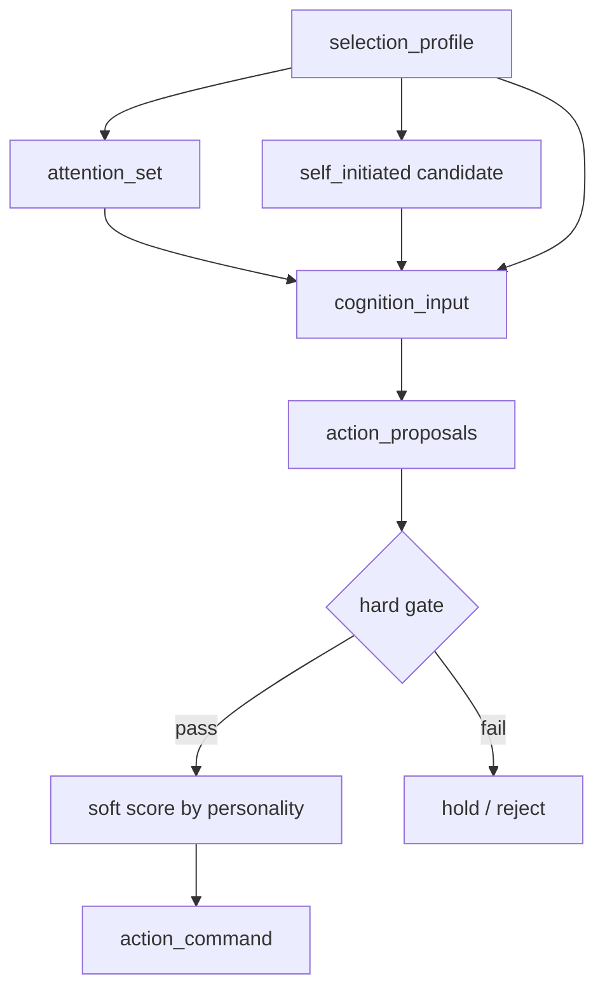

# 人格選択仕様

<!-- Block: Purpose -->
## このドキュメントの役割

- このドキュメントは、「その人格なら今どう選ぶか」を、実行前の判断規則として固定する正本である
- 目的は、人格を発話の雰囲気付けではなく、注意配分、自発行動、候補比較、最終確定に効く選択規則として明示することにある
- 全体構成は `docs/10_目標アーキテクチャ.md` を見る
- システム全体の責務分解は `docs/30_システム設計.md` を見る
- ランタイムの処理順は `docs/31_ランタイム処理仕様.md` を見る
- `self_state` の JSON 形は `docs/36_JSONデータ仕様.md` を見る
- `selection_profile` の JSON 形は `docs/36_JSONデータ仕様.md` を見る
- `persona_consistency_score` の JSON 形は `docs/36_JSONデータ仕様.md` を見る
- `attention_score_breakdown` の JSON 形は `docs/36_JSONデータ仕様.md` を見る
- `self_initiated_score_breakdown` の JSON 形は `docs/36_JSONデータ仕様.md` を見る
- `action_candidate_score` の JSON 形は `docs/36_JSONデータ仕様.md` を見る
- 経験で人格がどう変わるかは `docs/40_人格変化仕様.md` を見る
- このドキュメントは、人格の変化ではなく、現在の人格をどう選択へ効かせるかを扱う

<!-- Block: Scope -->
## このドキュメントで固定する範囲

- 固定するのは、人格選択に使う判断材料、評価軸、hard gate と soft score の分離、各判断段階での使い方である
- 固定するのは、短周期での選択規則であり、人格の長期更新そのものではない
- 固定しないのは、LLM プロバイダ固有の prompt 文面、SDK 呼び出し、モデル固有の微調整である

<!-- Block: Current Scope -->
## current `browser_chat` で使っている選択規則

- current の `attention_snapshot` は `current_observation`、最優先 `active_task`、最優先 `relationship_priority` の比較で組み立てる
- current の `self_initiated_score_breakdown` は自発起動そのものには使わず、`skill_candidates` の適合フィルタにだけ使う
- current の `action validator` が実際に確定する候補は `speak`、`browse`、`notify`、`look`、`wait` に限る
- 後続で `初期実装` と書く scoring や validator の補足は、current の `browser_chat` 実装を指す
- `move` と `social` は target の候補語彙として残すが、current の `browser_chat` 実装では確定も dispatch も行わない
- current では `network_result` 直後の `speak` / `notify` と、同一 `query` の `browse` 重複抑止が人格選択へ直接効く

<!-- Block: Principles -->
## 人格選択の原則

- 人格は、出力文体の飾りではなく、何に注意を向け、何を後回しにし、何を選び、何を見送るかを決める判断材料である
- 同じ観測、同じ状況でも、人格断面が違えば選ぶ対象、選ぶ順番、選ぶ行動様式が変わってよい
- 人格に基づく選択は、`LLM` の候補生成だけに任せず、前段の注意配分と後段の最終確定でも使う
- 人格選択は、安全制約、`system policy`、`runtime policy` を上書きしない
- 人格選択は、外部入力がある場合でも消えず、複数の妥当な応答や行動様式の中から「その人格らしいもの」を選ぶために使う
- 人格選択は、行動するかどうかだけでなく、「待つ」「保留する」「確認を増やす」ことの選択にも効く

<!-- Block: Selection Profile -->
## 人格選択プロファイル

<!-- Block: Selection Profile Shape -->
### `selection_profile` の構成

- 各短周期では、`self_state`、`current_emotion`、`relationship_overview`、`preference_memory`、`drive_state` から `selection_profile` を組み立てる
- `selection_profile` は、少なくとも `trait_values`、`interaction_style`、`relationship_priorities`、`learned_preferences`、`learned_aversions`、`revoked_preferences`、`habit_biases`、`emotion_bias`、`drive_bias` を持つ
- `selection_profile` の JSON キーと必須形は、`docs/36_JSONデータ仕様.md` を正本とする
- `trait_values` は、`sociability`、`caution`、`curiosity`、`persistence`、`warmth`、`assertiveness`、`novelty_preference` を使う
- `interaction_style` は、`speech_tone`、`distance_style`、`confirmation_style`、`response_pace` を使う
- `relationship_priorities` は、現在の関係性のうち、その短周期で特に重みづけする対象を持つ
- `relationship_priorities` は、`relationship_overview` の上位 `3` 件までから機械的に抽出し、`waiting_response`、`care_commitment`、`recent_tension`、`recent_positive_contact` の順で `reason_tag` を決める
- `learned_preferences` と `learned_aversions` は、`preference_memory` の confirmed 項目から再構成した短周期の選択断面を使う
- `revoked_preferences` は、`preference_memory.status = "revoked"` の項目から再構成した軽い抑制断面である
- 初期実装で `validate_action` が直接使うのは、`learned_preferences` / `learned_aversions` / `revoked_preferences` のうち `domain=action_type` と `domain=observation_kind` の項目である
- `habit_biases` は、選びやすい行動種別、選びやすい観測種別、避けやすい行動様式を持つ
- `emotion_bias` は、現在感情が慎重化、接近、回避、発話強度にどう効くかの短期補正である
- `drive_bias` は、内部欲求が優先順位へ与える短期補正である

<!-- Block: Persona Consistency -->
### `人格整合性` の評価軸

- `人格整合性` は、少なくとも `trait_alignment`、`style_alignment`、`relationship_alignment`、`preference_alignment`、`aversion_penalty`、`emotion_alignment`、`drive_alignment` の 7 軸で評価する
- `trait_alignment` は、その候補が `trait_values` とどれだけ自然に一致するかである
- `style_alignment` は、その候補の行動様式が `interaction_style` と一致するかである
- `relationship_alignment` は、その候補が今重い関係対象への振る舞いとして自然かである
- `preference_alignment` は、その候補が昇格済みの好みと一致するかである
- `aversion_penalty` は、その候補が学習済みの回避傾向に触れる度合いである
- 初期実装の `preference_alignment` は、`action_type` 一致、`observation_kind` 一致、`habit_biases.preferred_action_types`、`habit_biases.preferred_observation_kinds` を合成してよい
- 初期実装の `aversion_penalty` は、`learned_aversions` の `action_type` / `observation_kind` 一致、`revoked_preferences` の弱い再抑制、`habit_biases.avoided_action_styles` の一致を合成してよい
- 初期実装の `preference_alignment` は、`0.50` を基準に `preferred_action_types +0.18`、`preferred_observation_kinds +0.10`、一致した `action_type preference` の `weight * 0.20`、一致した `observation_kind preference` の `weight * 0.12`、`memory_support * 0.20` を足して `0.0..1.0` に clamp する
- 初期実装の `aversion_penalty` は、一致した `action_type aversion` の `weight`、一致した `observation_kind aversion` の `weight * 0.85`、`avoided_action_styles` 一致時の `0.35` の最大値を `0.0..1.0` に clamp する
- `emotion_alignment` は、現在感情の勢いと候補の方向が噛み合うかである
- `drive_alignment` は、その候補が内部欲求の解消や維持にどれだけ寄与するかである
- すべての一致軸は、`0.0` を強い不一致、`0.5` を中立または判断材料不足、`1.0` を強い一致として扱う
- すべての一致軸は負値を取らず、値が大きいほど一致度が高い単調指標である
- `aversion_penalty` は、`0.0` を回避理由なし、`1.0` を最も強い回避理由ありとして扱う
- 各候補に対する `persona_consistency_score` の JSON 形は、`docs/36_JSONデータ仕様.md` を正本とする

<!-- Block: Gate Split -->
## hard gate と soft score の分離

<!-- Block: Hard Gates -->
### hard gate

- 以下は人格選択より前に棄却する
- 安全制約に反する
- `system policy` または `runtime policy` に反する
- `invariants` に反する
- 身体能力、空間制約、`affordances` の範囲外で実行不能である
- 明示的に保護すべき関係対象へ重大な破壊的影響を与える
- 強い回避傾向として固定された項目に正面から反し、かつ緊急理由がない
- `invariants` 判定は、`forbidden_action_types` の一致、`forbidden_action_styles` の一致、`required_confirmation_for` 未達、`protected_targets` の `protection_rule` 違反で決める
- 「強い回避傾向として固定された項目」は、`learned_aversions.weight >= 0.80` かつ `evidence_count >= 4` の項目だけを指す
- `habit_biases.avoided_action_styles` は hard gate ではなく soft score の減点にだけ使う

<!-- Block: Soft Scores -->
### soft score

- hard gate を通過した候補だけを soft score で比較する
- soft score は、「実行可能な候補の中で何がその人格らしいか」を決めるために使う
- 緊急時は、soft score の差より緊急度を優先してよい
- 緊急でない場合、人格整合性が低い候補を無理に選ばない
- 初期実装の `action validator` では、`proposal.priority >= 0.80` を緊急ヒントとして扱ってよい

<!-- Block: Attention Selection -->
## 注意配分への反映

<!-- Block: Attention Gates -->
### `attention_set` の gate

- 安全上の確認が必要な観測は、人格に関係なく主注意候補に残す
- 実行中タスクの継続に必要な観測は、人格に関係なく抑制しない
- 使用不能なセンサー由来の空入力は、人格補正で持ち上げない

<!-- Block: Attention Scoring -->
### `attention_set` の soft score

- `attention_set` の主注意候補は、hard gate 通過後に次の重みで評価する
- `urgency 0.24`
- `task_continuity 0.20`
- `relationship_salience 0.18`
- `personality_fit 0.16`
- `experience_bias 0.12`
- `explicitness 0.07`
- `novelty 0.03`
- `personality_fit` は、主に `curiosity`、`caution`、`warmth`、`assertiveness`、`novelty_preference` を使って計算する
- `experience_bias` は、`learned_preferences`、`learned_aversions`、`revoked_preferences`、`habit_biases` を使って補正する
- `personality_fit` と `experience_bias` の内部比較は、候補ごとの `persona_consistency_score` を使ってよい
- 候補全体の比較結果は、`attention_score_breakdown` として保持してよく、JSON 形は `docs/36_JSONデータ仕様.md` を正本とする
- `personality_fit` と `experience_bias` は、比較前に `0.0..1.0` へ正規化し、候補間で同じ尺度を使う
- 初期実装では、`current_observation`、優先度最高の `active_task`、最優先の `relationship_priority` を比較候補としてよい
- 初期実装では、比較結果の 1 位を `attention_snapshot.primary_focus`、2 位以降を `secondary_focuses` / `revisit_queue` へ反映してよい
- 上位 2 候補の差が `0.05` 未満なら、`revisit_queue` を厚く残し、1 位だけで強く固定しない

<!-- Block: Self Initiated Selection -->
## 自発行動への反映

<!-- Block: Self Initiated Preconditions -->
### 起動前提

- `self_initiated` は、外部入力、高優先タスク、外部待ち戻りが落ち着いているときだけ比較対象に入れる
- 自発行動は、`task_progress`、`unexplored_check`、`self_maintenance`、`skill_rehearsal` の 4 種以外を候補にしない

<!-- Block: Self Initiated Scoring -->
### `self_initiated` の soft score

- 自発行動候補は、少なくとも次の重みで比較する
- `task_progress_fit 0.30`
- `relationship_care_fit 0.22`
- `self_maintenance_need 0.20`
- `curiosity_fit 0.15`
- `habit_match 0.08`
- `novelty_fit 0.05`
- 最上位候補の合計が `0.55` 未満なら、その短周期では自発行動を起動しない
- `caution` が高い人格は、未知対象への接近前に確認行動を挟みやすくする
- `warmth` が高い人格は、関係対象の確認や応答を優先しやすくする
- `persistence` が高い人格は、既存タスクの継続を選びやすくする
- 自発行動候補の比較結果は、`self_initiated_score_breakdown` として保持してよく、JSON 形は `docs/36_JSONデータ仕様.md` を正本とする
- 初期実装では、`task_progress`、`unexplored_check`、`self_maintenance`、`skill_rehearsal` を毎周期スコア化してよい
- 初期実装では、`fit_score >= 0.30` の候補だけを `cognition_input.skill_candidates` に残し、`suggested_action_types` を添えて `LLM` へ渡してよい
- 初期実装では、`0.55` 閾値は自発起動可否の基準として保持しつつ、`skill_candidates` への列挙自体はそれより低い候補も許可してよい

<!-- Block: LLM Selection -->
## 候補生成への反映

<!-- Block: Cognition Input Rule -->
### `cognition_input` へ必ず渡す選択材料

- `self_snapshot` には、trait、行動様式、昇格済みの好悪、回避傾向、習慣傾向を必ず入れる
- current 実装では、`selection_profile` から compact な人格要約を作り、`trait_values`、`interaction_style`、`learned_preferences`、`learned_aversions`、`revoked_preferences`、`habit_biases`、`emotion_bias`、`drive_bias` を毎周期の prompt self layer に明示展開してよい
- `attention_snapshot` には、どの軸で主注意になったかの要点を持たせる
- `policy_snapshot` には、hard gate に関わる禁止条件を必ず入れる
- `current_observation` には、主注意の根拠になった関係対象と優先理由を含める

<!-- Block: Proposal Rules -->
### `action_proposal` の候補生成ルール

- `LLM` は、複数候補を返す場合でも、人格に明確に反する候補を上位へ置かない
- `decision_reason` には、人格や経験が選択に効いた場合、その要点を少なくとも 1 つ含める
- `speak` は、`speech_tone`、`confirmation_style`、`response_pace` に従って候補化する
- `move` は、`caution`、`curiosity`、`distance_style` に従って、接近、保持、回避の強さを変える
- `look` は、`curiosity`、`relationship_priorities`、`habit_biases.preferred_observation_kinds` に従って候補化する
- `browse` は、`curiosity` と `confirmation_style` に従って、探索量と確認の細かさを変える
- `social` と `notify` は、`warmth`、`assertiveness`、`relationship_priorities` に従って候補化する
- `wait` は、`caution` が高い、または判断確信が低いときの自然な候補として許可する
- 初期実装では、`memory_bundle` に一致する `fact` がある検索対象は、同じ `browse` を繰り返しにくくしてよい
- 初期実装では、`network_result` を受けた直後は、確認済み情報をもとに `speak` や `notify` を選びやすくしてよい

<!-- Block: Final Validation -->
## 最終確定への反映

<!-- Block: Action Validator Score -->
### `action validator` の soft score

- `action validator` は、hard gate 通過後の候補を次の重みで比較する
- `task_fit 0.24`
- `personality_fit 0.24`
- `relationship_fit 0.18`
- `experience_fit 0.16`
- `drive_relief 0.10`
- `expected_stability 0.08`
- `personality_fit` は、`trait_alignment` と `style_alignment` の合成値として扱う
- `experience_fit` は、`preference_alignment` と `aversion_penalty` に加えて、`memory_bundle.relationship_items`、`memory_bundle.affective_items`、`memory_bundle.reflection_items`、直近の `last_persona_update_summary` を反映してよい
- `expected_stability` は、その候補が無理なく継続・停止できるかを表す
- 候補比較で使う人格側の内部値は、候補ごとの `persona_consistency_score` として保持してよい
- 候補全体の比較結果は、`action_candidate_score` として保持してよく、JSON 形は `docs/36_JSONデータ仕様.md` を正本とする
- `task_fit`、`personality_fit`、`relationship_fit`、`experience_fit`、`drive_relief`、`expected_stability` は、比較前に `0.0..1.0` へ正規化し、候補間で同じ尺度を使う
- 初期実装の `personality_fit` は、`trait_alignment` と `style_alignment` を `0.50 : 0.50` で合成してよい

<!-- Block: Action Validator Rules -->
### `action validator` の確定ルール

- 同程度に実行可能な候補では、`proposal.priority` より人格整合性を優先する
- `personality_fit` が `0.30` 未満で、かつ緊急でない候補は確定しない
- `aversion_penalty` が高く、`relationship_fit` も低い候補は、緊急でない限り `hold` または `reject` に回す
- 初期実装では、`aversion_penalty >= 0.70` かつ `relationship_fit <= 0.35` の候補を `hold` に回してよい
- 明示指示があっても、複数の実行方法が許される場合は、その人格らしい方法を選ぶ
- 実行可能候補があっても、どれも人格整合性が低く緊急性もない場合は、無理に実行せず `hold` を選んでよい
- 初期実装では、同じ `query` の `browse` がすでに `waiting_external` にある場合、その候補は hard gate で棄却してよい
- 初期実装では、`reflection_items` に回避・失敗の手がかりがあり、`affective_items` に緊張や警戒が強い場合、`browse` を下げて `wait` を上げてよい
- 初期実装では、直近の人格更新で `caution` が上がった直後は `wait` を、`curiosity` や `novelty_preference` が上がった直後は `browse` / `look` を、`warmth` や `sociability` が上がった直後は `speak` / `notify` を少し選びやすくしてよい

<!-- Block: Selection Specifics -->
## 行動種別ごとの人格反映

- current 実装で実際に使うのは `speak`、`look`、`browse`、`notify`、`wait` である

- `speak`
  - `speech_tone`、`confirmation_style`、`response_pace` を最も強く反映する
  - `warmth` は距離の近さ、`assertiveness` は断定の強さに効く

- `move`
  - target の行動種別であり、current の `browser_chat` 実装では未接続である
  - `caution` は接近前確認を増やし、`curiosity` は接近と観察を増やす
  - `distance_style` は、対象へどこまで近づくかの傾向に効く

- `look`
  - `curiosity` は未確認対象へ、`relationship_priorities` は気にかける対象へ視線を向けやすくする
  - current 実装では、`look` が実行可能な短周期では `speech_draft` を `look` の案内文として流せるため、同内容の `speak` 候補は競合させず `look` を優先する

- `browse`
  - `confirmation_style` は検索件数、追加確認、比較の厚さに効く
  - `novelty_preference` は探索幅に効く

- `social` と `notify`
  - `social` は target の行動種別であり、current 実装では `notify` だけが UI `notice` として動作する
  - `warmth` は声かけや気遣いを増やし、`assertiveness` は発信の積極性に効く
  - `relationship_priorities` は誰を先に扱うかに効く

- `wait`
  - `caution` が高い人格、または `confirmation_style=careful` の人格では自然な有効候補として扱う
  - `wait` は消極的失敗ではなく、人格整合な選択として確定してよい

<!-- Block: Mermaid -->
## 人格選択の流れ

- 下の Mermaid 図は、人格選択がどの判断段階に入るかを図示したものである

<!-- Block: Fixed Decisions -->
## このドキュメントで確定したこと

- 人格に基づく選択は、注意配分、自発行動、候補生成、最終確定の全段に通す
- hard gate は安全と不変条件を守るために先に適用し、人格はその後の比較で使う
- 人格整合性は、trait、行動様式、関係性、好悪、回避、感情、欲求の複合評価で決める
- `wait` や `hold` も、人格に基づいた正当な選択として扱う
- 人格の変化は `docs/40_人格変化仕様.md`、人格に基づく選択はこのドキュメントを正本とする
