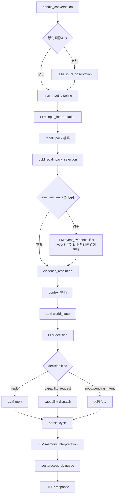

# LLM 呼び出し実行フロー調査

## 目的

応答速度改善の検討に使うため、現行実装の LLM 呼び出し経路、直列実行、並列実行、非同期実行の境界を整理する。

## 結論

通常会話のユーザー応答は、`visual_observation` がある場合を除くと、次の LLM 呼び出しを同期直列で待つ。

1. `input_interpretation`
2. `recall_pack_selection`
3. `event_evidence` 0 件以上
4. `world_state`
5. `decision`
6. `reply`
7. `memory_interpretation`

`event_evidence` はイベント単位で複数回呼ぶ。現行実装では event 単位の LLM 圧縮だけを上限 3 worker で並列実行し、event 選定、DB 読み込み、最終順序はコード側で固定する。

`memory_interpretation` はレスポンス返却前に同期実行される。ベクトル索引、記憶訂正、内省要約はバックグラウンド worker に送られるため、通常応答の直接待ち時間には入らない。

`LLMClient` と `llm.transport` は同期 API である。`async def` や `await` を使う LLM 呼び出し経路はない。

## 通常会話フロー

入口は `ServiceInputCycleMixin.handle_conversation` である。

実装上の順序は `_run_input_pipeline` 内で、想起入力、内部コンテキスト、decision、出力の順に並ぶ。`world_state` は内部コンテキスト構築中に呼ばれる。

### 直列待ち

| 順序 | 呼び出し | 実装箇所 | 待ち方 | 備考 |
|---:|---|---|---|---|
| 0 | `visual_observation` | `service/input/visual.py` | 同期直列 | 添付画像または vision result 画像がある場合だけ実行する。 |
| 1 | `input_interpretation` | `service/input/pipeline.py` | 同期直列 | `recall_hint` と `answer_contract` を 1 回の構造化 LLM で得る。 |
| 2 | `recall_pack_selection` | `recall/builder.py`, `recall/selection.py` | 同期直列 | 候補が空ならスキップする。 |
| 3 | `event_evidence` | `recall/event_evidence.py` | 同期待ち、event 単位は上限付き並列 | `requested_event_ids` の順序を保持し、LLM 圧縮結果を元順序へ戻す。 |
| 4 | `world_state` | `service/input/world_state_source_pack.py` | 同期直列 | 失敗時は直前の foreground world_state を使い続ける。 |
| 5 | `decision` | `service/input/pipeline.py` | 同期直列 | 出力契約違反時は repair prompt で 1 回再試行する。 |
| 6 | `reply` | `service/input/pipeline.py` | 同期直列 | `decision.kind == reply` の場合だけ実行する。 |
| 7 | `memory_interpretation` | `service/memory.py`, `memory/consolidator.py` | 同期直列 | HTTP response 返却前に実行する。 |

## LLMClient と transport

`LLMClient` の各 `generate_*` は同期関数である。実モデルでは `llm.transport.complete_text` を呼び、LiteLLM の `completion(**request_kwargs)` を同期実行する。

構造化出力は `_generate_structured_payload` を通る。各呼び出しは最大 2 回試行する。1 回目の JSON parse または契約検証に失敗すると、元 messages、失敗応答、repair prompt を追加して 2 回目を呼ぶ。契約違反が起きると、該当 LLM 呼び出しの待ち時間が最大 2 倍になる。

`reply` は構造化 JSON ではなくテキスト補完 1 回である。`generate_recall_hint` は旧経路として残っているが、通常 pipeline は `generate_input_interpretation` を使う。

timeout は role 定義の `timeout_seconds` または `request_timeout_seconds` を使い、未指定時は completion が 90 秒である。OpenRouter embedding の直接 API は 600 秒である。

## 非同期実行

### capability result cycle

`wait_for_response` ではない capability result は、`ServiceSpontaneousCapabilityCycleMixin._start_async_capability_result_cycle` が daemon thread を立て、別スレッドで `_execute_async_capability_result_cycle` を実行する。

この非同期 cycle の中身は、通常 pipeline と同じく LLM 呼び出しを同期直列で実行する。HTTP の capability result 受信処理は thread 起動後にすぐ返るが、follow-up 応答や追加判断は background thread 内で完了を待つ。

### background memory postprocess

`ServiceMemoryMixin.start_background_memory_postprocess_worker` は `otomekairo-background-memory-postprocess` thread を起動する。通常応答の `memory_interpretation` 後に postprocess job が queue に入る。

worker は queue を 1 件ずつ処理する。worker 内の順序は次である。

1. `memory_correction_reconciliation`
2. `generate_embeddings`
3. `memory_reflection_summary` 0 件以上

この worker は単一 thread であり、job 間並列はない。`memory_reflection_summary` も scope ごとに順番に呼ぶ。

### background wake

background wake scheduler は daemon thread で動く。wake cycle 本体は `_wake_execution_lock` により直列化される。wake cycle 内では、必要に応じて `pending_intent_selection` を呼び、その後は通常 pipeline と同じ LLM 呼び出しを同期直列で実行する。

## 並列実行の有無

現行の LLM 呼び出しに、同一 cycle 内の明示的な並列実行はない。

並列に見える箇所は別 thread の独立 cycle である。

| 種類 | 実体 | LLM 呼び出しの並列性 |
|---|---|---|
| ユーザー会話 | HTTP request thread | 直列 |
| capability result follow-up | daemon thread | thread 内は直列 |
| background wake | daemon thread | `_wake_execution_lock` により wake cycle は直列 |
| memory postprocess | daemon worker | queue を 1 件ずつ直列処理 |
| event evidence | 同一 request thread 内の thread pool | event 単位 LLM 圧縮だけ上限 3 並列 |

## 応答時間の主なネック候補

### 1. 通常応答前の LLM 呼び出し数が多い

通常会話で `reply` まで進む場合、少なくとも `input_interpretation`、`world_state`、`recall_pack_selection`、`decision`、`reply`、`memory_interpretation` を待つ。`event_evidence` が発生すると追加で最大複数回待つ。

### 2. `memory_interpretation` がレスポンス返却前にある

`_complete_input_success` は cycle 永続化後、`_finalize_memory_trace` を同期実行する。ここで `MemoryConsolidator.consolidate_turn` が `generate_memory_interpretation` を呼ぶ。ユーザーに返す文面はすでに生成済みだが、HTTP response は記憶統合の完了まで返らない。

### 3. `event_evidence` は event 件数と provider 制限の影響を受ける

`RecallEventEvidenceMixin._build_event_evidence` は event 単位の LLM 圧縮を上限 3 worker で並列実行する。標準 event と precise event が合わせて 4 件以上になる場合、複数 wave で待つ。provider rate limit や repair retry が発生すると、この段の待ち時間が伸びる。

### 4. repair retry が隠れた遅延になる

構造化 LLM は契約違反や JSON parse 失敗時に 1 回 repair retry を行う。`decision`、`recall_pack_selection`、`event_evidence`、`world_state`、`memory_*` で発生する。ログには `parse_failed`、`validation_failed`、`attempt=2` が出る。

### 5. `world_state` はほぼ毎 cycle 呼ばれる

`_build_pipeline_internal_contexts` は `_refresh_world_state_context` を毎回呼ぶ。`world_state` 生成に失敗しても cycle は継続するため、速度優先なら呼び出し条件やスキップ条件を検討する余地がある。

### 6. OpenRouter embedding timeout が長い

OpenRouter embedding 直接呼び出しの timeout は 600 秒である。これは background worker 側の遅延だが、queue 滞留を増やし、後続の wake 判断や inspection 上の pending job に影響する。

## 計測に使える既存情報

既存ログは LLM ごとに `start`、`attempt`、`done`、`failed` を出す。ログを時刻付きで集計すれば、role 別の待ち時間を概算できる。

主なログ component は次である。

| component | 例 |
|---|---|
| `LLM` | `input_interpretation start`, `decision attempt=1`, `reply done`, `validation_failed` |
| `Pipeline` | `input_interpretation start/done`, `recall_pack start/done`, `decision start/done`, `reply start/done` |
| `Memory` | `turn consolidation start/done` |
| `MemoryWorker` | `job start/done` |
| `CapabilityResult` | `async cycle queued/start/done` |
| `Wake` | `start`, `selection`, `done` |

cycle trace には `recall_pack_selection`、`event_evidence_generation`、`world_state_trace`、`memory_trace` が保存される。完全 prompt や生 LLM 応答全文は標準保存されない。

## パフォーマンス改善の検討候補

### 優先度 高

1. `memory_interpretation` を response 後の postprocess job に移す
   - ユーザー応答文は `reply` 後に確定している。
   - 現状は記憶統合が終わるまで HTTP response が返らない。
   - 実装時は cycle trace の初期 memory trace を `queued` にし、worker で `memory_interpretation` から実行する設計に変える。

2. `event_evidence` の並列数と失敗率を計測する
   - event 単位の LLM 圧縮は上限 3 worker で並列実行する。
   - `requested_event_count`、`succeeded_event_count`、`failed_items`、provider の rate limit を合わせて見る。
   - 並列数を上げる場合は、他の LLM 呼び出しとの競合と API エラー率を確認する。

3. role 別の latency 計測を追加する
   - `complete_text` と `generate_embeddings` の前後で elapsed_ms をログに出す。
   - operation、model、attempt、messages_count、response_chars、elapsed_ms を残す。
   - 秘密値、完全 prompt、生レスポンス全文は残さない。

### 優先度 中

4. `world_state` の呼び出し条件を絞る
   - 毎 cycle の LLM 呼び出しになっている。
   - `client_context`、`observation_summary`、`capability_result_summary`、入力種別に意味ある source context がない場合はスキップする案がある。
   - ただし docs 上の world_state 方針との同期が必要である。

5. `recall_pack_selection` と `event_evidence` の入力候補をさらに絞る
   - 候補数、選択セクション数、イベント数が遅延に直結する。
   - `SECTION_LIMITS` と `EVENT_EVIDENCE_LIMIT` の調整で LLM 入力と呼び出し数を制御できる。

6. 構造化出力の契約違反率を下げる
   - retry が起きる role は速度にも品質にも効く。
   - `attempt=2` の発生率が高い role の prompt と schema 指示を優先して直す。

### 優先度 低

7. background memory worker の job 並列化
   - ユーザー応答の直接速度には効きにくい。
   - queue 滞留が wake や inspection の判断に影響する場合に検討する。
   - store 更新順序と同一 memory unit の競合を制御する必要がある。

## 追加調査メモ

- `model=mock*` は LLM transport を使わず内蔵 mock を返す。
- generation role は LiteLLM、OpenRouter embedding は直接 HTTP を使う。
- `web_search_options` と `reasoning_effort` は role 定義から transport に渡る。応答速度に影響するため、role 別設定確認の対象である。
- `max_output_tokens` は role 定義から `max_tokens` として渡る。`reply` や構造化出力の上限が大きいほど待ち時間が伸びる。
- wake cycle は `_wake_execution_lock` により重複実行しない。速度改善で wake を並列化する場合は自発発話の衝突制御が必要である。
