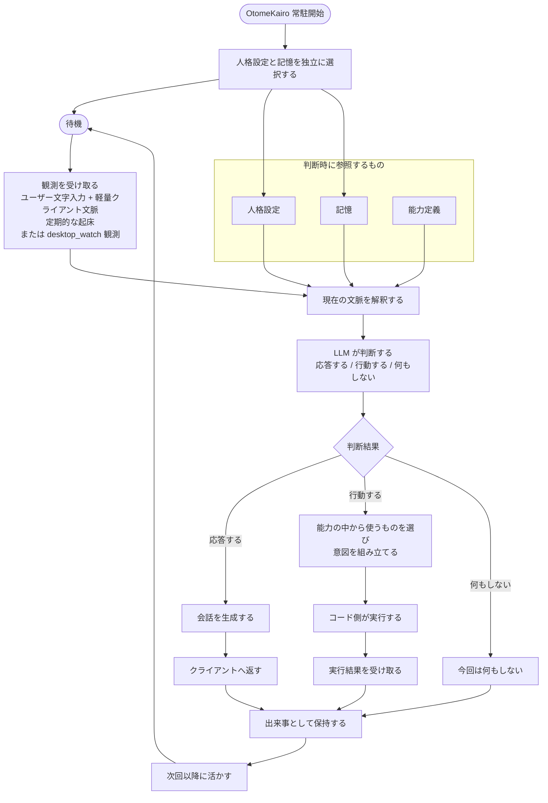

# アーキテクチャ

## 基本構成

OtomeKairo は、常駐する AI サーバとして存在し、`CocoroConsole` はその接点のひとつとして扱う。

大きな構成要素は次のとおりである。

- クライアント
  - 現時点では `CocoroConsole`
- OtomeKairo サーバ
  - 会話、判断、記憶、行動選択の中心
- LLM 層
  - LiteLLM 経由で利用する
- モデル設定
  - 役割割り当てと接続設定を管理する
- デバッグ記録
  - 判断サイクルを後から追跡できるようにする
- 人格設定
  - AI の性格や振る舞い方針を与える
- 記憶領域
  - 過去の出来事や派生した理解を保持する
- 能力定義
  - 現在何ができるかを外部化して管理する

## 中心ループ

OtomeKairo の中心は、観測して判断し、必要なら応答または行動し、その結果を次に活かす循環である。

高水準では、次の流れを前提とする。

1. 観測を受け取る
2. 現在の文脈と記憶を踏まえて解釈する
3. 応答するか、行動するか、何もしないかを判断する
4. 実行結果を受け取る
5. 出来事として保持し、次回以降に活かす

このループは、ユーザー入力時だけでなく、定期的な起床でも動きうる。

## 処理フロー

上記の中心ループを、現時点の上位設計だけに基づいて図示すると次のようになる。

判断サイクルごとに、観測、想起、判断、結果の要約をデバッグ記録として残す。
これは記憶とは別の検証用記録であり、記憶の正本そのものではない。

## 判断責務の置き方

OtomeKairo では、会話だけでなく行動判断も LLM に寄せる方針を取る。
ただし、実行範囲まで LLM に無制限に委ねるのではなく、責務を次のように分ける。

- LLM
  - 何をすべきかを判断する
  - 応答や意図を組み立てる
- コード
  - 何を実行対象とするかを定義する
  - 判断結果を受け取り、実行要求に変換する
  - 外部との接続や状態管理を担う

## 通信境界

最初のクライアントは `CocoroConsole` だが、OtomeKairo はそれ専用の API を持つ。
既存システムとの互換性よりも、OtomeKairo にとって自然な責務分割を優先する。

そのため、初期段階では次の考え方を取る。

- クライアント都合ではなく、OtomeKairo 側の概念に沿って API を考える
- `CocoroConsole` 側の調整は後から行える前提にする
- 将来クライアントが増えても、中心の責務はサーバ側に残す

## システム境界

OtomeKairo と `CocoroConsole` の関係は、UI と本体の関係として扱う。

この段階では、責務を次のように分ける。

- `CocoroConsole`
  - ユーザーが OtomeKairo と接するための UI
  - 観測入力の送信
  - 表示と操作の提供
  - server-driven event/control stream の受信
  - `desktop_watch` 用 capture request への応答
  - OtomeKairo が持つ設定を編集するための操作面
  - 設定資源を送受信する
- OtomeKairo
  - 設定の正本を持つ
  - 会話の生成を担う
  - 自発動作の判断を担う
  - `desktop_watch` の server-driven command 発行を担う
  - 人格、記憶、能力、モデル設定、ランタイム状態を管理する

つまり、`CocoroConsole` は判断主体ではなく、OtomeKairo の入出力面を担う存在である。
また、起床間隔のような動作設定も OtomeKairo が保持し、`CocoroConsole` はその編集 UI として振る舞う。

## 接続方式と信頼境界

OtomeKairo は Linux サーバ上で常駐し、`CocoroConsole` は別マシンから接続する。

この前提のもとで、基本設計では次を置く。

- 通信は、クライアントとサーバの明示的な接続として扱う
- 永続状態、設定、判断主体の正本は OtomeKairo 側に置く
- `CocoroConsole` は観測入力と操作要求を送るが、状態や判断の正にはならない
- 利用範囲はローカルネットワーク内に限定する
- `CocoroConsole` と OtomeKairo の通信経路は HTTPS に固定する
- 初回接続は `CocoroConsole` 起点の bootstrap として扱う
- 通常 API は `console_access_token` で認証する

MVP では、証明書フィンガープリント確認を接続の必須手順にはしない。
信頼境界の中心が OtomeKairo 側にあることと、HTTP 平文を使わないことは、この段階で固定する。
接続と認証の具体フローは `11_接続と認証.md` を正とする。

## 状態の層

OtomeKairo では、状態を役割ごとに分けて考える。

- 現在観測
  - その時点で受け取った生の入力。ユーザー文字入力、軽量クライアント文脈、起床発生、capture result などを含む
- `world_state`
  - 現在観測から取り出した、次の判断にも持ち越したい外界条件
- 作業文脈
  - その回の判断のために一時的に組み立てる文脈。正本にはしない
- 記憶
  - 生の出来事から育った継続知識。嗜好、人物理解、関係、話題継続などを含む
- 永続設定
  - 明示的な設定操作でのみ変わる正本。`selected_persona_id`、`selected_memory_set_id`、`wake_policy`、`selected_model_preset_id` などを含む
- ランタイム状態
  - サーバが今どう動いているかの反映状態。読み込み済み参照、接続状態、起床スケジューラ稼働状態などを含む。外界条件は含めない
- 能力状態
  - 各能力の実行可否と制約。`available_now`、`auth_ready`、`cooldown_until` などを含む

## 常駐サーバとしての性質

OtomeKairo は一度起動したら継続的に存在し続けることを前提とする。

この前提には次の意味がある。

- セッションごとに人格や状態を作り直さない
- 自発判断の機会を持てる
- クライアントが切断されても存在が消えない

## モデル利用の方針

生成系は LiteLLM を利用し、用途ごとに役割を分けて設定できる前提を採る。
モデル役割の詳細な切り方と設定管理は `10_モデル役割詳細.md` を正とする。

## モデル役割の論理分割

現段階では、モデルの役割を次の論理単位で考える。

- 会話生成
- 自発判断と行動判断
- 記憶解釈
- 埋め込み

この役割分割は論理上のものであり、直ちに別々のモデル実体を要求するものではない。
OtomeKairo では、これらの割り当てを `model_preset` としてまとめ、`selected_model_preset_id` で選択する前提を取る。
