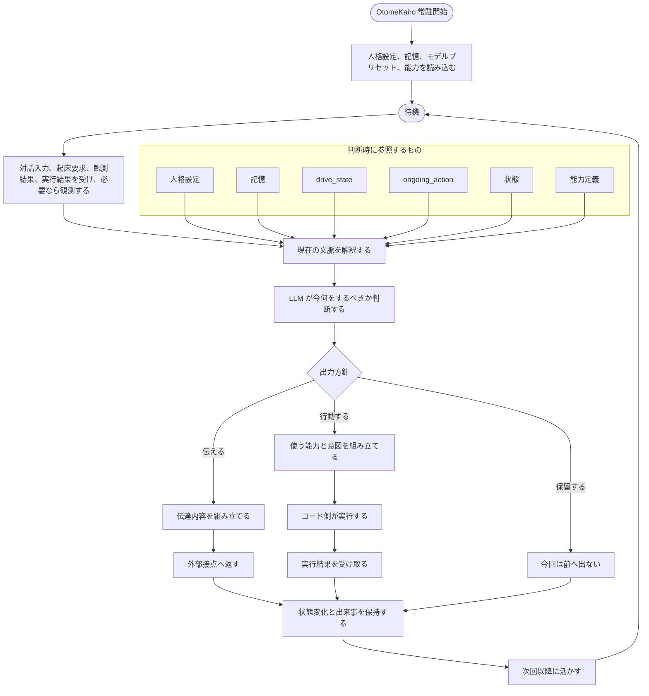

# アーキテクチャ

## 基本構成

OtomeKairo は、人と外界のあいだで継続的に存在し、観測し、理解し、判断し、働きかける本体である。
`CocoroConsole` はその具体的な接点のひとつであり、設計の中心そのものではない。

大きな構成要素は次のとおりである。

- 外部接点
  - 対話 UI
  - 感覚入力と身体出力の接続
  - 外部サービスやネットワークへの接続
  - 設定と運用の操作面
- OtomeKairo 本体
  - 認識、判断、記憶、行動選択の中心
- LLM 層
  - 解釈、判断、表現、記憶更新を支える
- モデルプリセット
  - 役割ごとのモデル割り当てと接続定義を管理する
- 人格設定
  - 持続的な行動傾向と表現傾向を与える
- 記憶領域
  - 経験とそこから育った理解を保持する
- 能力定義
  - 何ができるか、何ができないかを外部化する
- デバッグ記録
  - 判断と変化の経路を後から追跡できるようにする

記憶領域の上位意味は `04_人格と記憶.md`、詳細契約は `memory/` 配下を正とする。
移動、五感、外部アクセスは、この能力定義の拡張として実現する。
具体的には、センサ由来の観測は観測系 capability、物理デバイスへの作用は実行系 capability、ネットワーク利用は外部接続 capability として扱う。
ここでは capability の意味境界だけを固定し、具体的なハードウェア選定は固定しない。
capability manifest、binding、state の詳細契約は `17_capability_manifest.md` を正とする。

## 中心ループ

OtomeKairo の中心は、判断入力を受け、必要なら能動観測し、判断し、必要なら伝達または行動し、その結果を次に活かす循環である。

高水準では、次の流れを前提とする。

1. 対話入力、起床要求、観測結果、実行結果を受け、必要なら身体や外界を観測する
2. 人格設定、記憶、`drive_state`、`ongoing_action`、状態を踏まえて意味を組み立てる
3. 今何をするべきかを判断する
4. 伝える、行動する、保留するのいずれかを選ぶ
5. 結果を取り込み、必要なら追加観測する
6. 状態と記憶へ反映し、次回以降に活かす

このループは、外部からの働きかけがあるときだけでなく、自律的な判断機会でも動きうる。

## 処理フロー

判断サイクルごとに、入力、想起、判断、結果の要約をデバッグ記録として残す。
これは記憶とは別の検証用記録であり、記憶の正本そのものではない。

## 判断責務の置き方

OtomeKairo では、伝達も行動も同じ判断枠組みの中で扱う。
ただし、実行範囲まで LLM に無制限に委ねるのではなく、責務を次のように分ける。
意味判断はできる限り LLM が担い、コードは実行境界と正本整合性を担う。

- LLM
  - 入力と文脈を解釈する
  - 意図と表現を組み立てる
  - 能力の中から何を使うべきかを判断する
  - `ongoing_action` を継続、終了、保留のどれにするかを判断する
  - 意味的な優先付けや要約を担う
- コード
  - 能力と外部接点を定義する
  - 判断結果を実行要求に変換する
  - `ongoing_action` の状態管理を担う
  - 実行、接続、認証、状態管理を担う
  - validator、状態遷移、永続化、監査を担う

repo 全体の原則は [20_LLM判断優先方針.md](20_LLM判断優先方針.md) を正とする。

## 通信境界

OtomeKairo の外部接点は、本体都合の概念に沿って分ける。

- 対話面
  - 人とのやりとりを送受信する
- 観測面
  - 本体が能動取得した観測結果を扱う
- 自律面
  - 起床要求や自律判断の起点を扱う
- 実行面
  - 身体や外部サービスへの働きかけを仲介する
- 運用面
  - 設定変更と inspection を扱う

どの接点も判断主体ではなく、OtomeKairo の入出力面として振る舞う。

## システム境界

OtomeKairo と外部接点の責務は次のように分ける。

- 外部接点
  - 対話入力、観測結果、起床要求を送る
  - 応答や command を受け取る
  - 実行結果を返す
  - 設定と運用の UI を提供する
- OtomeKairo
  - 人格設定、記憶、設定定義、状態、デバッグ記録の正本を持つ
  - 現在文脈を構成する
  - 意図形成と行動選択を行う
  - 実行要求を発行する
  - 監査とデバッグ記録を保持する

`CocoroConsole` は、この外部接点の一実装として扱う。

## 接続方式と信頼境界

信頼境界の中心は、OtomeKairo 本体に置く。

- 現在設定、設定定義、記憶の正本は本体に置く
- 外部接点は入力、観測結果、操作要求を送るが、状態や判断の正にはならない
- 能力実行や外部接続は本体が管理する
- 外部接続は認証と暗号化を前提にする

具体的な接続方式と権限境界の詳細は `12_接続と権限境界.md` を正とする。

## 状態の層

OtomeKairo では、状態を役割ごとに分けて考える。

- `current_input`
  - その時点で受け取った生の入力。対話、感覚入力、外界イベント、実行結果などを含む
- `world_state`
  - 次の判断にも持ち越したい正規化済みの外界条件
- `runtime_state`
  - 本体が今どう動いているかの稼働状態
- `capability_state`
  - 各能力の実行可否と制約
- `drive_state`
  - 人格設定と記憶から派生する中期の志向状態
- `ongoing_action`
  - 最終目的へ向かう近距離の能力実行列
- 作業文脈
  - その回の判断のために一時的に組み立てる文脈。正本にはしない
- 記憶
  - 経験から育った継続知識
- 設定
  - 現在設定と設定定義として明示操作で変わる本体条件

## モデル利用の方針

生成系は LiteLLM を利用し、用途ごとに役割を分けて設定できる前提を採る。
モデルプリセットの詳細な切り方と設定管理は `10_モデルプリセット詳細.md` を正とする。

## モデル役割の論理分割

現段階では、生成系の role を少なくとも次の 8 つに分けて考える。

- `input_interpretation`
  - 想起入口と入力解釈を行う
- `recall_pack_selection`
  - `RecallPack` 候補の section 配置、採用候補、競合要約を決める
- `event_evidence_generation`
  - 選択済み `event` 群から短い根拠表現を作る
- `pending_intent_selection`
  - eligible な `pending_intent` 候補群から今扱う 1 件または `none` を決める
- `decision_generation`
  - 何をするべきかを判断する
- `expression_generation`
  - 伝達内容を整える
- `memory_interpretation`
  - 記憶更新や再整理に必要な解釈を行う
- `memory_reflection_summary`
  - `reflective consolidation` の `summary_text` を自然文で要約する

この役割分割は論理上のものであり、直ちに別々のモデル実体を要求するものではない。
OtomeKairo では、生成系 role の割り当てを `model_preset` としてまとめ、`selected_model_preset_id` で選択する前提を取る。
一方で、埋め込みモデルは生成系 role とは別に `memory_set` に属する設定として扱う。
