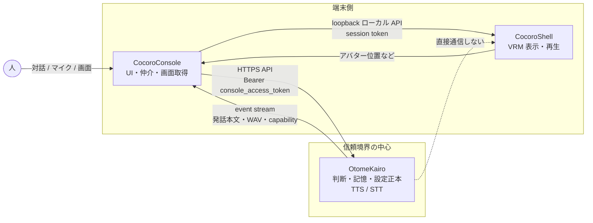
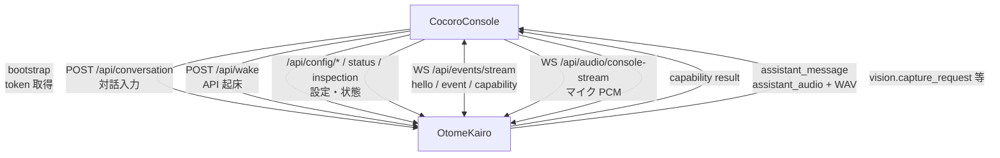
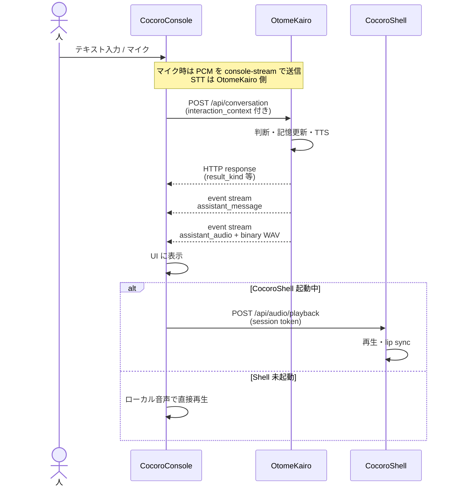
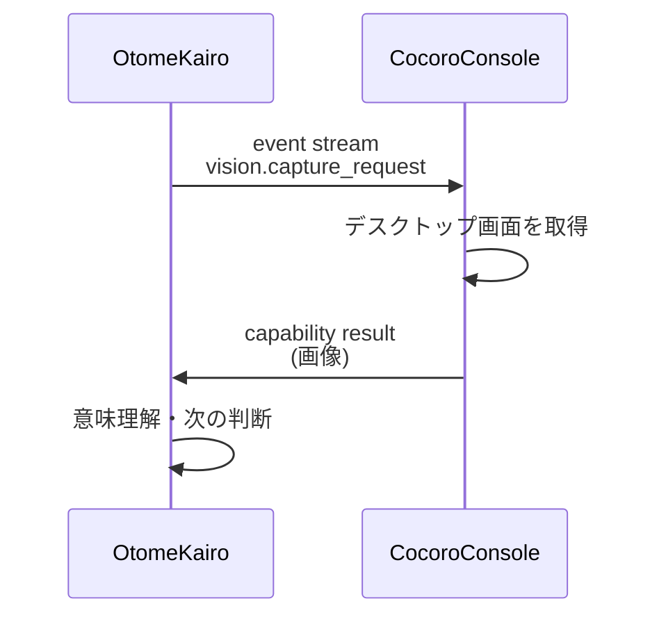
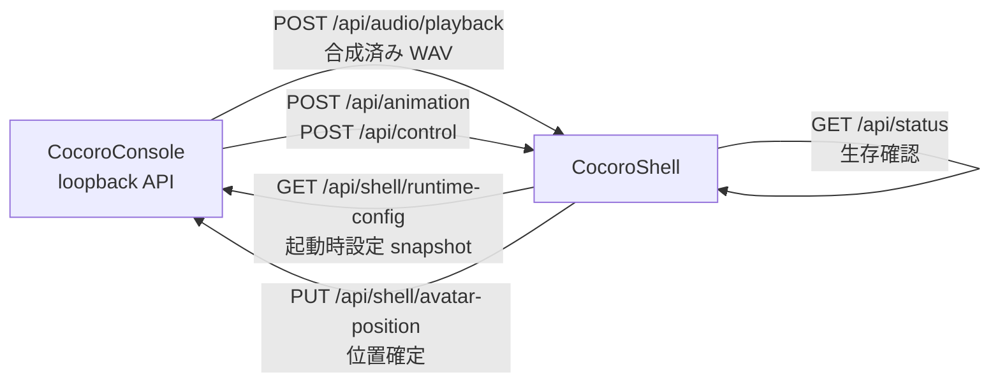
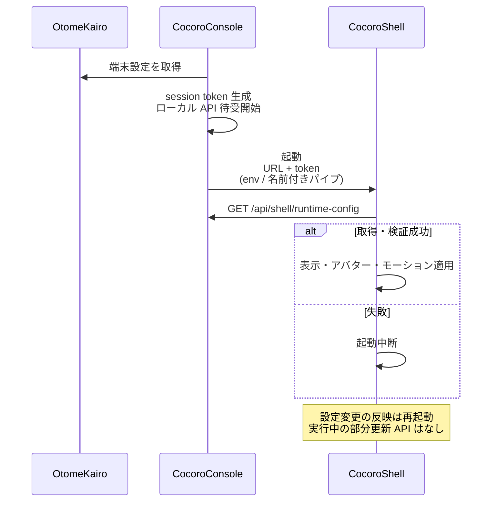
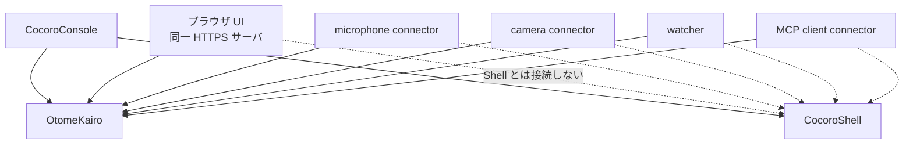

# OtomeKairo / CocoroConsole / CocoroShell

CocoroAI を構成する三つの実行単位の関係と、主な通信内容の概要である。
各 API の path・request / response の正本は [../api/](../api/) 配下を、接続と権限の意味境界は [接続と権限境界.md](接続と権限境界.md) を正とする。

## 役割分担

| 構成要素 | 技術 | 役割 |
| --- | --- | --- |
| **OtomeKairo** | Python HTTPS サーバ | 認識・判断・記憶・行動選択の本体。人格設定、記憶、設定定義、状態、デバッグ記録の正本を持つ |
| **CocoroConsole** | Windows WPF (.NET) | OtomeKairo の外部接点。チャット UI、端末固有設定、デスクトップ取得、Shell の起動と仲介 |
| **CocoroShell** | Unity (VRM アバター) | 透過オーバーレイ上の 3D 表示、合成済み WAV の発話再生、lip sync、モーション |

### 構成関係

- 信頼境界の中心は **OtomeKairo** にある。外部接点は観測と要求を送るが、判断や設定の正本にはならない。
- **CocoroShell は OtomeKairo を直接呼ばない**。Console が loopback API の境界となり、起動単位の session token で Shell を認証する。
- OtomeKairo の `console_access_token` は Shell へ渡さない。

## 何がどこで起きるか

| 処理 | OtomeKairo | CocoroConsole | CocoroShell |
| --- | --- | --- | --- |
| 意味判断・記憶更新 | 担う | しない | しない |
| STT / 話者識別 / 音声起動ワード | 担う | マイク PCM を送るだけ | しない |
| TTS（音声合成） | 担う | 合成済み WAV を受け取る | 合成しない（再生のみ） |
| 対話 UI・設定 UI | Web UI も配信 | 端末 UI の中心 | アバター表示 |
| デスクトップ画面取得 | 要求を出す | `vision.capture` を実行 | しない |
| VRM / モーション / 表示位置 | 端末設定として保持 | 編集・配送 | 実行時に適用 |

設定編集の分担（Web UI と Console）は [../api/README.md](../api/README.md) の「ブラウザUI配信面」を正とする。

## 通信の全体像

### 1. CocoroConsole ↔ OtomeKairo（HTTPS）

認証は bootstrap で得た `console_access_token`（`Authorization: Bearer ...`）。
接続確立の流れは [../api/bootstrapと入力.md](../api/bootstrapと入力.md)、権限境界は [接続と権限境界.md](接続と権限境界.md) を正とする。

| 方向 | 主な内容 | 代表 path |
| --- | --- | --- |
| Console → Server | 接続確立・token 取得 | `GET /api/bootstrap/*`、`POST .../acquire-console-access-token` |
| Console → Server | 対話入力（テキスト / 添付画像） | `POST /api/conversation` |
| Console → Server | API 起床（自律判断の機会） | `POST /api/wake` |
| Console → Server | 端末設定の接続・保存 | `/api/config/console-clients/{client_id}/...` |
| Console → Server | 設定編集・状態・inspection | `/api/config/*`、`/api/status`、`/api/inspection/*` |
| 双方向 WebSocket | event / capability / 発話音声 | `GET /api/events/stream` |
| Console → Server | マイク PCM | `GET /api/audio/console-stream` |
| Server → Console | 能力実行要求（例: 画面取得） | event: `vision.capture_request` など |
| Console → Server | 能力実行結果 | capability result 系 API |
| Server → Console | 発話本文・合成 WAV | event: `assistant_message`、`assistant_audio` + binary WAV |

**event stream 接続時**、Console は `hello` で `client_id`、受けられる capability（例: `vision.capture`）、`event_subscriptions`、`vision_sources` を提示する。詳細は [../api/event_stream.md](../api/event_stream.md)。

### 対話の典型フロー

### vision.capture の流れ

### 2. CocoroConsole ↔ CocoroShell（loopback ローカル API）

OtomeKairo の外部 API ではない。Console と Shell の間だけで使う。
wire の正本は [../api/状態と設定.md](../api/状態と設定.md#cocoroshellへの実行時設定配送)。

| 方向 | 内容 | 代表 path / 手段 |
| --- | --- | --- |
| 起動時 | 実行時設定 snapshot（表示・アバター・モーション） | Console: `GET /api/shell/runtime-config` |
| 起動時 | ローカル API URL と session token の受け渡し | Player: 環境変数 / Editor: 名前付きパイプ |
| Console → Shell | 合成済み WAV の再生 | Shell: `POST /api/audio/playback` |
| Console → Shell | アニメーション・制御 | Shell: `POST /api/animation`、`POST /api/control` |
| Shell → Console | アバター位置の確定 | Console: `PUT /api/shell/avatar-position` |
| 生存確認 | Shell の起動確認 | Shell: `GET /api/status` |

### Shell 起動順序

Shell 未起動時、Console は受信済み WAV をローカル音声出力で直接再生する。

### 3. その他の接点（本資料の範囲外の位置づけ）

OtomeKairo には Console 以外の外部接点もある。
これらも「外部接点」として同じ API 面に乗るが、Shell とは接続しない。
分類は [外部接点とAPI概念.md](外部接点とAPI概念.md)、connector 配置は [外部接続connector配置方針.md](外部接続connector配置方針.md) を正とする。

## 責務の境界（誤解しやすい点）

- **Shell は「声を作る側」ではない**。TTS は OtomeKairo、再生と口パクは Shell。
- **Console は判断主体ではない**。入力・表示・端末能力の仲介である。
- **人物同一性は connector / Console 側で確定**する。`person_ref` を付けて送り、OtomeKairo は表示名からの再推定をしない。
- **capability の契約は server が持つ**。client は `hello.caps` で「今受けられる能力」だけを通知する。
- **端末ごとの VRM・表示・モーションの正本は OtomeKairo**（`console_client_settings`）。Shell は起動時 snapshot だけをメモリに持つ。

## 関連ドキュメント

| 目的 | 文書 |
| --- | --- |
| 全体アーキテクチャ | [../foundation/アーキテクチャ.md](../foundation/アーキテクチャ.md) |
| 外部接点の面分け | [外部接点とAPI概念.md](外部接点とAPI概念.md) |
| 認証・権限・Shell 境界 | [接続と権限境界.md](接続と権限境界.md) |
| API wire 一覧 | [../api/README.md](../api/README.md) |
| 対話・wake | [../api/bootstrapと入力.md](../api/bootstrapと入力.md) |
| event stream・音声配送 | [../api/event_stream.md](../api/event_stream.md) |
| マイク PCM | [../api/audio_stream.md](../api/audio_stream.md) |
| 端末設定・Shell 配送 | [../api/状態と設定.md](../api/状態と設定.md) |
| capability 実行 | [../api/実行連携.md](../api/実行連携.md) |
| 用語 | [../../reference/用語表.md](../../reference/用語表.md) |
