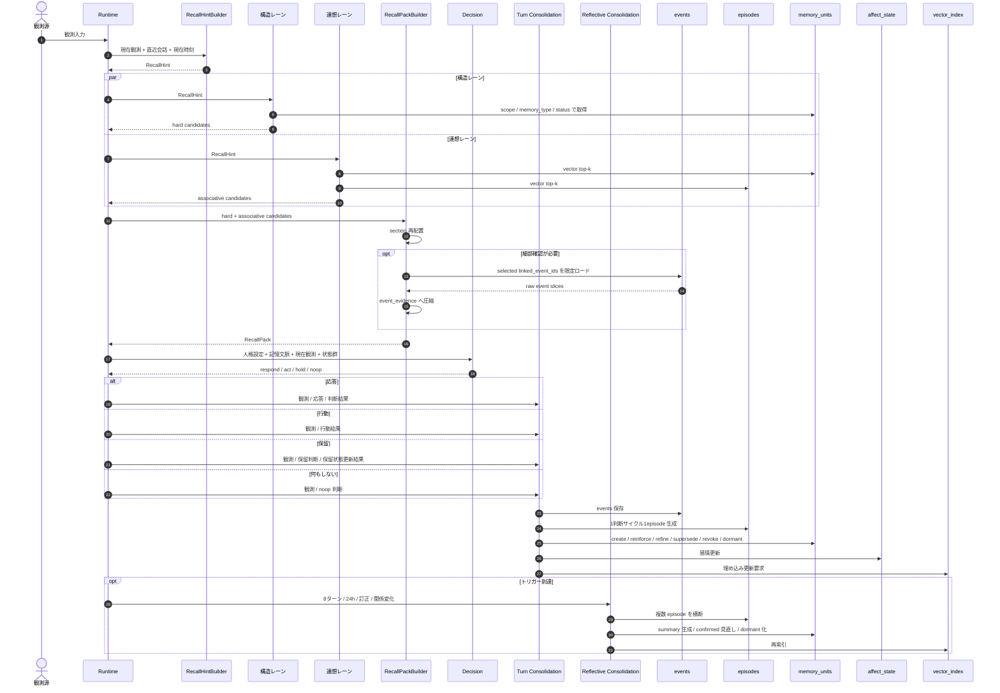
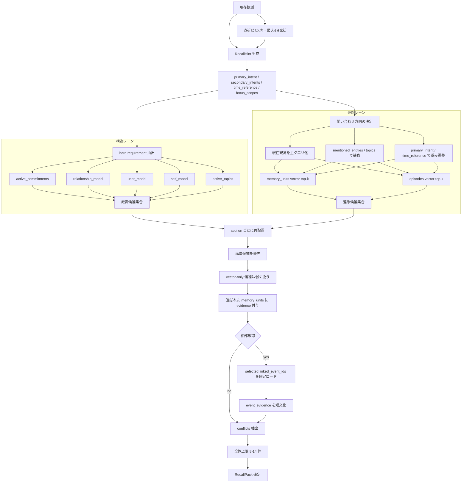
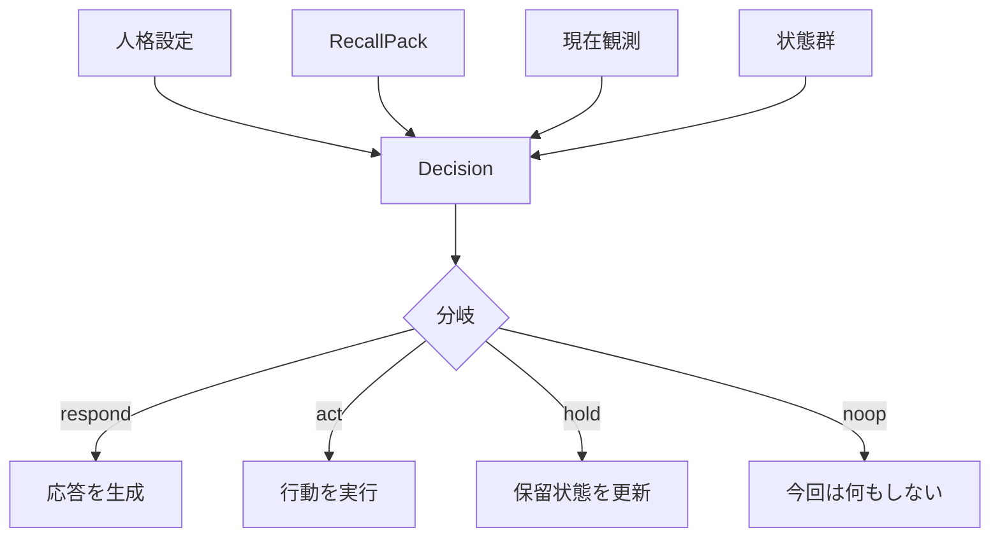
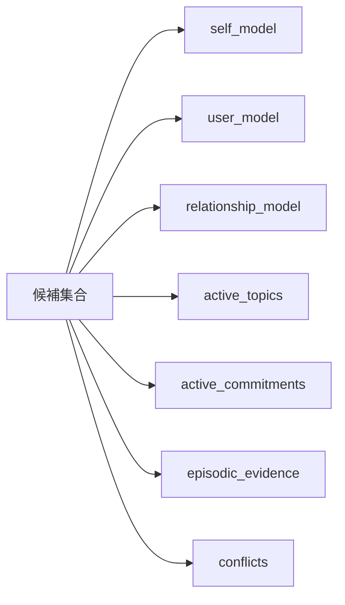

# 想起と判断フロー図

## 読み方

この文書は、次の順で読むと分かりやすい。

1. 全体ライフサイクル
2. 同期想起の詳細
3. 判断分岐の詳細
4. `RecallPack` への振り分け
5. 結果後の更新

特に重要なのは、OtomeKairo の判断が 1 本線ではなく、次の 4 層に分かれていることである。

- 同期想起
  - 判断直前に必要分だけ読む
- 判断分岐
  - 想起後に結果種別を決める
- ターン更新
  - 結果後に 1 ターン単位で記憶を育てる
- 反省整理
  - 数ターンまたは一定時間ごとに長期変化を再評価する

## 全体ライフサイクル

## 同期想起の詳細

## 判断分岐の詳細

## `RecallPack` への振り分け

