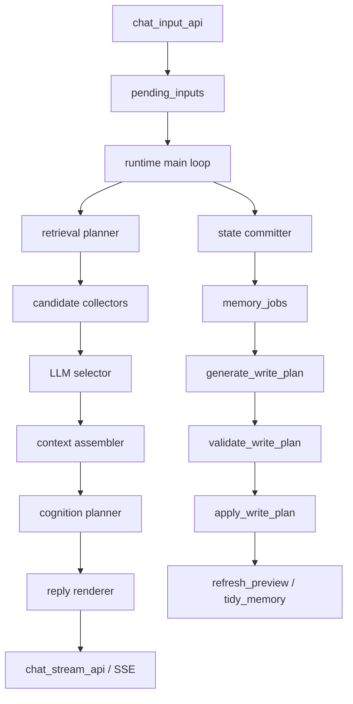

# CocoroGhost 統合設計案

<!-- Block: Purpose -->
## このドキュメントの役割

- このドキュメントは、CocoroGhost の強みを OtomeKairo へ取り込むための比較検討メモである
- このドキュメントは正本ではなく、採用前の設計判断、移行順序、破壊的変更の方針を固めるために使う
- 採用後の正本は `docs/10_目標アーキテクチャ.md`、`docs/30_システム設計.md`、`docs/31_ランタイム処理仕様.md`、`docs/32_記憶設計.md`、`docs/33_記憶ジョブ仕様.md`、`docs/34_SQLite論理スキーマ.md` に反映する

<!-- Block: Positioning -->
## 前提と立場

- OtomeKairo は、会話アプリではなく、常時稼働する人格ランタイムを目指す
- 会話は重要な入力経路だが、中心責務ではない
- CocoroGhost の強みは、主に `会話想起`、`長期記憶の検索`、`会話後の記憶育成` にある
- したがって、やるべきことは CocoroGhost の全体構造を複製することではなく、OtomeKairo の runtime 中心設計に対して、CocoroGhost の記憶会話能力を吸収することである
- 後方互換や二重系の維持は行わず、採用すると決めた段階で target へ置き換える

<!-- Block: Core Decision -->
## 結論

- 方針は `CocoroGhost を移植する` ではなく `CocoroGhost の良い sub-system を OtomeKairo に再実装する` である
- 中心に置くべきなのは、`multi-stage retrieval`、`LLM selector`、`memory write planning`、`preference / affect / graph enrichment` の 4 本柱である
- 守るべき OtomeKairo 側の原則は、`single runtime writer`、`chat input と stream の分離`、`DB apply の決定論性`、`chat-first に寄せない責務境界` の 4 つである

<!-- Block: Adopt -->
## 取り込むべきもの

### 1. 多段検索

- `vector` だけでなく、`events_fts`、reply 連鎖、thread、link、state_link、about_time、entity を並列に使う
- 候補収集は、1 本の検索関数ではなく、役割ごとの collector 群に分解する
- `recent_event_window` と長期記憶候補を分けて扱い、同じ内容の重複注入を避ける

### 2. LLM selector

- 候補収集は決定論で行い、最終的に今の会話へ効く候補を絞る部分だけを LLM に担当させる
- selector の出力は自由文ではなく、固定 shape の `SearchResultPack` とする
- selector には本文全量ではなく、preview と要約済みメタデータを渡す

### 3. 会話入力専用の文脈組み立て

- `recent_dialog`、`selected_memory_pack`、`stable_self_state`、`time_context` を別断面で持つ
- `confirmed_preferences` と `long_mood_state` は、検索の副産物ではなく、必須注入枠とする
- `event_preview_cache` を selector 向けの圧縮断面として使う

### 4. 記憶更新の意味解釈層

- `write_memory` を `semantic extraction -> validate -> apply` の 3 段に固定する
- LLM は意味解釈だけを担当し、SQLite の更新内容は validator と apply が確定する
- 更新対象は `memory_states` だけで終わらせず、`preference_memory`、`event_affects`、`event_links`、`event_threads`、`state_links`、`event_entities`、`state_entities` まで一貫して扱う

### 5. affect と preference の長期化

- 瞬間感情はイベント単位で持ち、持続感情は単一の `long_mood_state` として育てる
- 好き嫌い、苦手、避けたい話題、反応の良い話題は `confirmed_preferences` として別管理する
- `reply quality` だけでなく、次回の注意配分と話題選択に効く保存形にする

### 6. 観測可能性

- retrieval ごとに `retrieval_runs` を残し、どの collector が何件拾い、selector が何を採用したかを観測できるようにする
- memory write ごとに `generate` と `apply` を分けて記録し、失敗点を追跡できるようにする

<!-- Block: Reject -->
## 取り込まないもの

### 1. chat-first の全体設計

- OtomeKairo の主語は会話ではなく人格ランタイムであり、chat request が処理の中心になってはいけない
- 会話強化は、あくまで `browser_chat` 入力経路の強化として実装する

### 2. CocoroGhost の worker スレッド構成

- OtomeKairo は runtime が唯一の状態更新者であるべきであり、複数 writer を導入しない
- 並列化するなら read-only な候補収集と LLM 呼び出しだけに限定する

### 3. 単一 state テーブル中心の論理モデル

- OtomeKairo はすでに side table 群を持っており、より強い
- したがって `state` へ戻るのではなく、`memory_states + graph + entity + affect + preference` の分離を完成させる

### 4. フォールバックや二重経路

- 新 retrieval と旧 retrieval を併存させない
- 新 write plan と旧 write plan を併存させない
- 採用フェーズごとに置換し、中途半端な fallback は作らない

<!-- Block: Target Architecture -->
## 統合後の target architecture

### 1. chat 入力から応答までの流れ

1. `chat_input_api` は、いままでどおり `pending_inputs` へ enqueue する
2. runtime は `browser_chat` を取り出し、`recent_event_window` と現在状態を読む
3. `retrieval planner` が query, time, entities, thread hints を作る
4. collector 群が候補を並列収集する
5. `LLM selector` が `SearchResultPack` を作る
6. `context assembler` が `recent_dialog`、`selected_memory_pack`、`stable_self_state`、`time_context`、`confirmed_preferences`、`long_mood_state` を分けて `cognition_input` へ載せる
7. `cognition planner` は意図と応答方針を決める
8. `reply renderer` は応答文だけを生成し、SSE へ流す
9. 保存完了後に `memory_jobs` へ `generate_write_plan` と `refresh_preview` などを投入する
10. 長周期で `write_memory_plan_generate -> validate -> apply` を完了する

### 2. 新しい retrieval subsystem

- `retrieval planner`
  - 入力種別ごとの検索意図を決める
  - chat では `topic query`、`person query`、`time query`、`thread query` を切り分ける
- `candidate collectors`
  - `recent events collector`
  - `fts collector`
  - `vector recent collector`
  - `vector global collector`
  - `reply chain collector`
  - `event thread collector`
  - `event link collector`
  - `state link collector`
  - `entity expand collector`
  - `about time collector`
- `selector`
  - 候補を相互重複除去し、理由付きで `selected`、`rejected`、`reserve` に分ける
- `retrieval logger`
  - collector ごとの件数、latency、採用結果を `retrieval_runs` へ残す

### 3. 新しい context assembly

- `recent_dialog` は直近会話の生系列として別枠に置く
- `selected_memory_pack` は selector が選んだ長期記憶だけを入れる
- `stable_self_state` には現在の自己状態、進行中タスク、対人関係要約を入れる
- `time_context` には現在時刻と話題の対象時刻を入れる
- `confirmed_preferences` は嗜好の要約断面として別枠で入れる
- `long_mood_state` は単一の背景感情として別枠で入れる
- これにより、短期会話の流れと長期記憶が衝突せず、同じ事実の重複注入を避ける

### 4. cognition の分離

- 現在の `1 回の cognition で全部決める` 形をやめる
- `cognition planner` は、反応するか、何を重視するか、必要な行動があるかを決める
- `reply renderer` は、会話文の自然さと一貫性だけに集中する
- これにより、行動判断の schema と会話文生成の自由度を分離できる

### 5. memory write の分離

- `generate_write_plan`
  - 直近イベント列と応答結果から、構造化された `MemoryWritePlan` を作る
- `validate_write_plan`
  - shape、語彙、根拠イベント、stale 更新、重複、禁止更新を検査する
- `apply_write_plan`
  - SQLite へ決定論的に書き込む
- `refresh_preview`
  - selector 向け preview を再生成する
- `tidy_memory`
  - 完了済みタスク、重複 thread、期限切れ state を整理する

### 6. graph enriched memory

- event 間は `event_links` と `event_threads` でつなぐ
- state 間は `state_links` でつなぐ
- event と state の検索入口は `event_entities` と `state_entities` で正規化する
- affect は `event_affects` に保存し、背景感情は `long_mood_state` に集約する
- preference は `preference_memory` に保存し、会話入力では常に別枠で参照できるようにする

<!-- Block: Mermaid -->
## 統合後フロー図

<!-- Block: Schema Impact -->
## schema への影響

- 大枠のテーブル群は current のままで足りる
- 優先して完成させるべきなのは、`event_links`、`event_threads`、`state_links`、`event_entities`、`state_entities`、`event_preview_cache` の実運用である
- `retrieval_runs` には、collector 名、候補件数、selector 入力件数、採用件数、latency、query 種別を残せる shape が必要である
- `memory_jobs` には、少なくとも `generate_write_plan`、`apply_write_plan`、`refresh_preview`、`tidy_memory` の責務分割を明記する必要がある
- `preference_memory` と `long_mood_state` は、chat 用の special case ではなく、全入力種別から育つ一般記憶として扱う

<!-- Block: Module Split -->
## 実装時のモジュール分割案

### usecase

- `src/otomekairo/usecase/retrieval_plan.py`
- `src/otomekairo/usecase/retrieval_collectors.py`
- `src/otomekairo/usecase/retrieval_selector.py`
- `src/otomekairo/usecase/build_chat_context.py`
- `src/otomekairo/usecase/run_cognition_plan.py`
- `src/otomekairo/usecase/run_reply_render.py`
- `src/otomekairo/usecase/generate_write_memory_plan.py`

### runtime

- `src/otomekairo/runtime/main_loop.py`
  - `browser_chat` の解決手順を、retrieval、cognition、reply、job enqueue の順に整理する

### infra

- `src/otomekairo/infra/sqlite_state_store.py`
  - collector 用 query を追加する
  - side table の apply を完成させる
  - `retrieval_runs` と preview cache 更新を責務として持たせる

### web

- `src/otomekairo/web/chat_input_api.py`
  - 原則変更しない
- `src/otomekairo/web/chat_stream_api.py`
  - reply renderer の出力と整合するよう event 種別を整理する

<!-- Block: Migration Phases -->
## 段階的な置換フェーズ

### Phase 1: retrieval の全面置換

- 目的は、OtomeKairo の想起品質を CocoroGhost 水準へ上げること
- 先に collector 群と selector を導入し、`browser_chat` の retrieval を全面的に差し替える
- この段階で `retrieval_runs` を必須化する

### Phase 2: context assembly の再設計

- `build_cognition_input` を置き換え、`recent_dialog`、`selected_memory_pack`、`confirmed_preferences`、`long_mood_state` を別断面にする
- ここで token 予算配分も再設計する

### Phase 3: cognition と reply の分離

- `run_cognition` を、`反応計画` と `応答文生成` に分割する
- 行動判断の schema を安定させつつ、会話文だけを別 LLM 呼び出しへ分離する

### Phase 4: write_memory の強化

- `generate_write_plan -> validate -> apply` を明確に分離する
- side table 群への保存を完成させ、state 本体だけで終わる経路をなくす

### Phase 5: affect / preference / graph の完成

- `long_mood_state` の更新則を固定する
- preference の確度更新、revise、close を揃える
- link, thread, entity の継続運用を完成させる

### Phase 6: tidy と評価

- retrieval hit、thread 継続率、嗜好再現率、冗長注入率を観測する
- 不要な暫定コードを削除し、正本 docs へ昇格する

<!-- Block: Priority -->
## 最初に着手すべき順序

1. `retrieval_flow` を捨てて、新 retrieval subsystem を入れる
2. `build_cognition_input` を分解し、chat 用 context assembler を作る
3. `run_cognition` を `plan` と `render` に分ける
4. `write_memory_plan` と `sqlite_state_store` の side table 更新を完成させる
5. preview cache と `retrieval_runs` を運用へ入れる

<!-- Block: Risks -->
## 主要リスクと防止線

### リスク 1: OtomeKairo が chat-first に崩れる

- 防止線は、`main loop 中心`、`pending_inputs 中心`、`single writer` を維持することである

### リスク 2: retrieval が複雑化するだけで品質が上がらない

- 防止線は、collector ごとの観測と selector の採用理由を `retrieval_runs` へ残すことである

### リスク 3: LLM に DB 更新判断まで渡して整合性が壊れる

- 防止線は、LLM の責務を `semantic extraction` に限定し、apply を決定論へ固定することである

### リスク 4: 旧経路と新経路が併存してコードが濁る

- 防止線は、フェーズごとに既存経路を削除し、fallback を持たないことである

<!-- Block: Promotion -->
## このメモを正本へ昇格するときの更新先

- `docs/10_目標アーキテクチャ.md`
  - retrieval selector と reply renderer の責務を追加する
- `docs/30_システム設計.md`
  - retrieval subsystem と cognition 分離を責務分解へ反映する
- `docs/31_ランタイム処理仕様.md`
  - `browser_chat` の短周期手順を置き換える
- `docs/32_記憶設計.md`
  - `SearchResultPack`、preview cache、preference、affect、entity 展開を正本化する
- `docs/33_記憶ジョブ仕様.md`
  - `generate_write_plan`、`apply_write_plan`、`refresh_preview`、`tidy_memory` を job 単位で固定する
- `docs/34_SQLite論理スキーマ.md`
  - `retrieval_runs` と side table 群の責務を同期する

<!-- Block: Final Judgment -->
## 最終判断

- OtomeKairo は、基盤としては CocoroGhost より強い
- 弱いのは、会話想起の密度、選別、会話後の記憶育成である
- したがって、統合方針は `OtomeKairo を捨てる` ではなく `OtomeKairo の上に CocoroGhost 級の memory chat stack を載せる` で確定してよい
