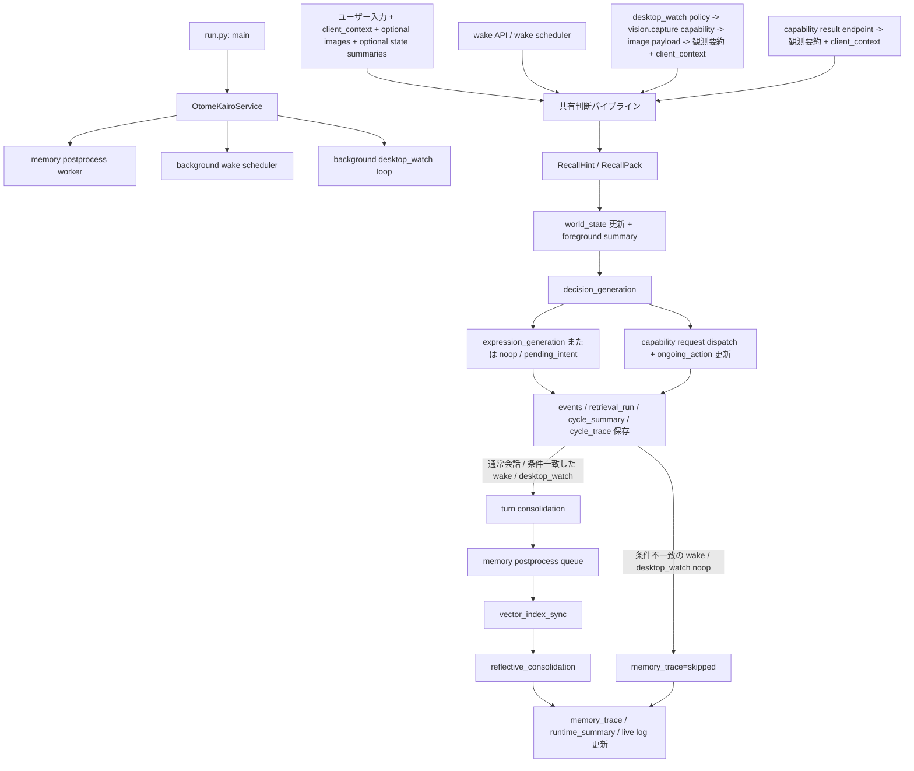
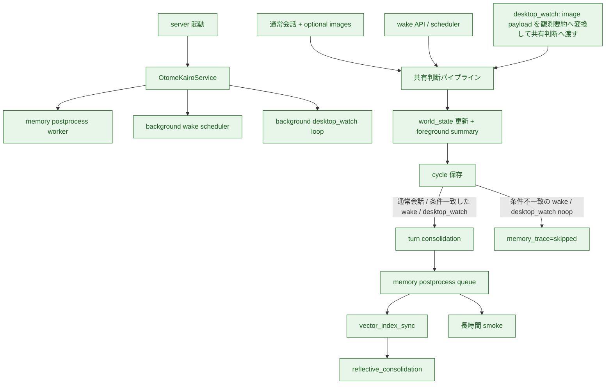
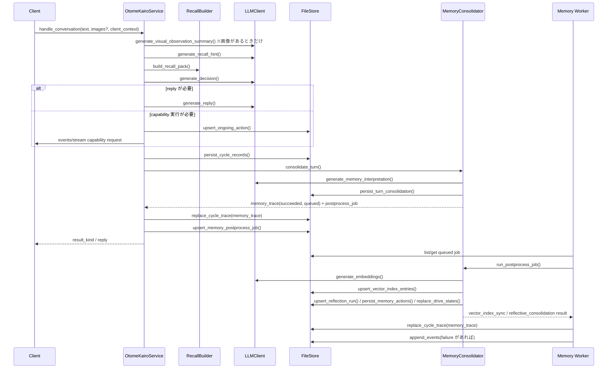

# 現行処理フロー

## この文書の役割

この文書は、**現在の実装が実際にどう流れているか** を素早く確認するための補助資料である。

- 責務境界や長く残る意味は `docs/design/` を正とする
- この文書は、現行コードの主要な流れを Mermaid で俯瞰するための要約である
- 関数分割や厳密な順序の最終正本は `src/` のコードとする

## 計画文書との分担

現在地、到達点、既知の制約、直近マイルストーン、優先順位、次の主作業は [01_現行計画.md](01_現行計画.md) を正とする。
この文書では、それらを重複管理せず、現行コードの流れと主要な処理経路だけを図で示す。

## この文書で扱う範囲

設計上の完成形、意味境界、責務分担は `docs/design/` を正とする。
この文書ではそれらを再掲せず、**現行コードが今どう流れているか** だけを扱う。

特に次はここで再掲しない。

- 完成形の全体像
- 直近マイルストーンの到達点一覧
- 直近マイルストーンの定義
- 後続拡張の優先順位

これらは [01_現行計画.md](01_現行計画.md) と `docs/design/` を参照する。

## 現行主要フロー

現行基盤で扱う主要処理フローは次である。

## 現行処理経路の補助図

現在の主要処理経路を図で示す。
色分けはこの図の視認補助であり、到達点の正本にはしない。

## 実装済みの詳細フロー

現時点で実装済みの通常会話フローは次である。

## `wake` と `desktop_watch` の現状

`wake` と `desktop_watch` と capability result は、判断自体は通常会話と同じ `_run_input_pipeline` を使う。
その中で `world_state` 第一段の更新と foreground summary までは共通で通す。
そのうえで、`reply`、保留意図更新、capability failure、意味のある `world_state` 変化が起きたサイクルだけ `turn consolidation` を走らせる。条件に当てはまらない `noop` は `memory_trace=skipped` のまま残す。

- `wake`
  - `pending_intent` の due 判定
  - cooldown 判定
  - `pending_intent` 候補が無くても、`drive_state / world_state / ongoing_action` に前景があれば共有判断パイプラインへ入る
  - 判断が `capability_request` のときは、汎用 dispatcher で capability request を stream へ配送し、`ongoing_action` を結果待ちにする
  - `reply` / `pending_intent` / 意味のある `world_state` 変化が起きたサイクルだけ episode 化する
- `desktop_watch`
  - `vision.capture` capability の binding を持つ client を自動選択する
  - 汎用 capability dispatcher で `vision.capture_request` を送り、共通 capability result endpoint から `vision.capture` result を受ける
  - capability result が取れない場合や image が 0 件のときは、通常は共有判断パイプラインへ入らずそのまま skip する。同期 wait timeout が起きた場合は internal failure cycle を残し、inspection から追えるようにする
  - capability state による dispatch 停止は request 作成前に skip し、監視試行として `last_watch_at` を更新して次回試行を通常 interval に戻す。同期 wait timeout は internal failure cycle を残し、同じく `last_watch_at` を更新する
  - image payload は raw のまま保持せず、短い観測要約へ変換して入力文と inspection に反映する
  - `client_context` と `vision.capture` の観測要約から `world_state` を更新し、foreground summary を判断入力へ入れる
  - `observation_summary.error` があるサイクルと、`reply` / `pending_intent` / 意味のある `world_state` 変化が起きたサイクルだけ episode 化する
  - inspection には `observation_summary` と `capability_request_summary` を残し、dispatch / timeout 比較には `result_trace.capability_dispatch_summary` を使う
  - `reply` のときだけ `desktop_watch` event を返し、`noop / pending_intent` のときは返さない
  - raw image payload の保存、OCR 全文抽出、UI 構造化はまだ入っていない
- capability result
  - `request_id`、`target_client_id`、`result_schema` を照合して accepted result にする
  - accepted async result は、対応する `ongoing_action` をいったん `active` に戻してから capability 共通の follow-up pipeline で新しい shared pipeline サイクルとして再判断する
  - `client_context` と capability ごとの result summary、必要なら観測要約から `world_state` を更新し、foreground summary を判断入力へ入れる
  - follow-up が `capability_request` のときは同じ `action_id` を `continued` として新しい capability request を stream へ配送する
  - follow-up が `pending_intent` のときは `on_hold` として `ongoing_action` を閉じる
  - `reply` が出たときは `events/stream` に `capability_result` event を返し、`reply / noop` の terminal は完了または中断で閉じる
  - inspection の `result_trace.trigger_compact_summary` では、capability_result follow-up と `wake / desktop_watch` を同じ outer shape で並べて見られるようにする
  - `ongoing_action_transition_summary` では `reason_code / reason_summary / transition_source` を capability family 共通の語彙に揃え、必要なら `decision_kind / result_error / detail_summary` を足して比較できるようにする
  - inspection の `result_trace.capability_dispatch_summary` では、follow-up request の dispatch outcome も capability family 共通の outer shape で追えるようにする
  - inspection の `result_trace.capability_result_followup_summary` では、source request / observation / decision / follow-up result / transition を capability family 共通の outer shape で追えるようにする
  - 現行の concrete result endpoint は `vision.capture` と `external.status` があり、accepted 後の follow-up 処理は capability_id ベースで共通化している

通常会話では、`images` がある場合だけ画像観測要約を先に行い、その短い要約を shared pipeline の判断入力へ足す。
`client_context` に `social_context_summary / environment_summary / location_summary / external_service_summary / body_state_summary / device_state_summary / schedule_summary` がある場合は、`world_state` source pack の structured context として shared pipeline へ渡す。
`vision.capture` result の `visual_summary_text` は `screen_context` へ、`external.status` result の `service / status_text` は `external_service_context` へ投影してから `world_state` 更新へ渡す。
capability result の `client_context.body_state_summary / device_state_summary / schedule_summary` は、それぞれ `body_context / device_context / schedule_context` の state-type 別 field として投影してから `world_state` 更新へ渡す。
wake と `desktop_watch` では、再評価対象として選ばれた pending-intent がある場合、その `intent_summary / reason_summary / not_before / expires_at` も `schedule_context` として `world_state` 更新へ渡す。
user event の `text` には元の入力文字列だけを残し、raw image payload や raw external payload は保存しない。

## 対応する主なコード

- 起動
  - `src/otomekairo/run.py`
- 通常会話
  - `src/otomekairo/service.py`
  - `src/otomekairo/service_input.py`
  - `src/otomekairo/recall.py`
  - `src/otomekairo/recall_association.py`
  - `src/otomekairo/recall_selection.py`
  - `src/otomekairo/llm.py`
- `wake` / `desktop_watch`
  - `src/otomekairo/service.py`
  - `src/otomekairo/service_spontaneous.py`
  - `src/otomekairo/llm.py`
- `turn consolidation` と postprocess job
  - `src/otomekairo/memory.py`
  - `src/otomekairo/service_memory.py`
- inspection / 永続化
  - `src/otomekairo/store.py`
  - `src/otomekairo/store_vector.py`
  - `src/otomekairo/store_clone.py`
