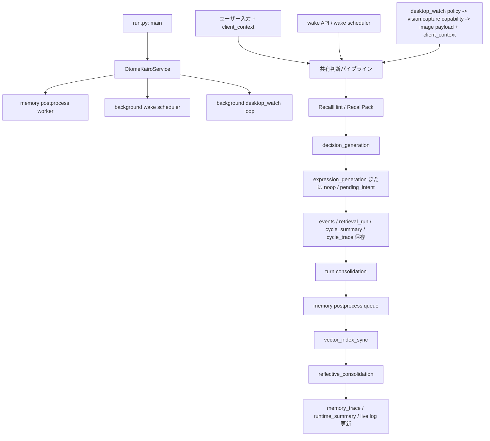
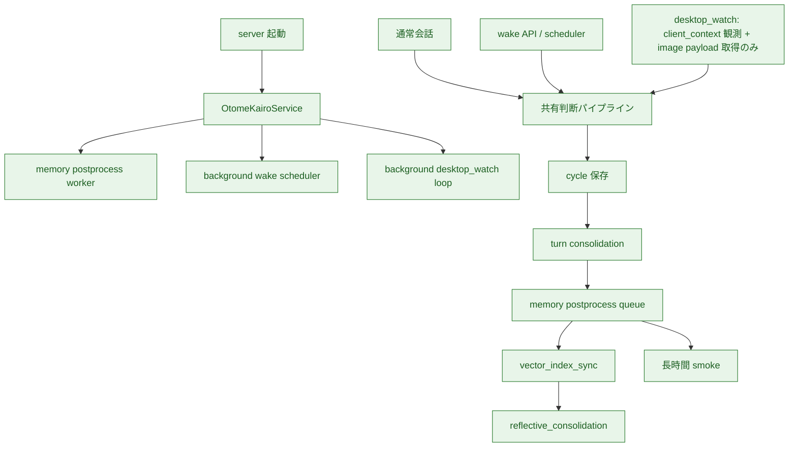
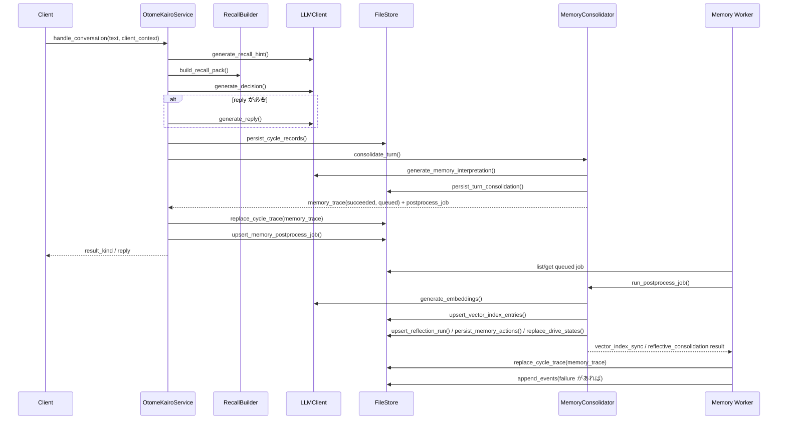

# 現行処理フロー

## この文書の役割

この文書は、**現在の実装が実際にどう流れているか** を素早く確認するための補助資料である。

- 責務境界や長く残る意味は `docs/design/` を正とする
- この文書は、現行コードの主要な流れを Mermaid で俯瞰するための要約である
- 関数分割や厳密な順序の最終正本は `src/` のコードとする

## この文書でいう「完成形」の分け方

この文書では、完成形を次の 2 段で分けて扱う。

- `設計上の完成形`
  - `docs/design/` と `docs/00_はじめに.md` の「現行設計の達成目標」が描く、現行設計ファミリーの完成形
- `直近の完成形`
  - 現在の実装ラインで、次のマイルストーンまでに通したい具体像

以降の図では、まず `設計上の完成形` を示し、そのあとで `直近の完成形` と現在の到達点を並べる。

## 設計上の完成形

現行設計ファミリーにおける完成形は、「会話するアプリ」ではなく、人格、記憶、状態、能力を持った本体が、
対話入力、起床要求、観測結果、実行結果を受け、必要なら人、身体、外界、ネットワークを観測し、必要なら伝達や行動を行い、その結果をまた次の判断へ戻す循環である。

上位設計から読むと、設計上の完成形は次を含む。

- 対話入力、起床要求、観測結果、実行結果を受け、必要なら人、身体、外界、ネットワークを継続的に観測する
- 人格設定、記憶、`drive_state`、`ongoing_action`、`world_state`、`runtime_state`、`capability_state`、能力マニフェストを合わせて判断文脈を組む
- 判断結果として、伝達、能力実行、保留意図、見送りを同じ枠組みで選ぶ
- 実行結果や外界変化を取り込み、必要なら追加観測して状態と記憶へ戻す
- 自律判断でも同じ中心ループを回す
- 監査、inspection、運用 API を通じて、判断経路と状態変化を追える

## 設計上の完成形に対する大枠ステータス

現在のコードを、設計上の完成形に対して大きく見ると次である。

| 領域 | 設計上の完成形 | 現在 | 状態 |
|------|------|------|------|
| 入力入口 | 対話入力、起床要求、能動観測、実行結果を同じ本体へ流す | 通常会話、`wake`、`desktop_watch` の入口はあるが、入力面の一般化は途中 | 一部実装 |
| 判断結果 | 伝達、能力実行、保留意図、見送りを同じ枠組みで扱う | 伝達と `pending_intent` / `noop` はある。汎用の能力実行判断は未完 | 一部実装 |
| 実行と結果取り込み | 能力マニフェストに基づいて実行し、結果を新しい入力として戻す | `vision.capture` capability の request / response はあるが、能力ファミリー全体としての一般化は未完 | 一部実装 |
| 状態層 | `world_state`、`runtime_state`、`capability_state`、`drive_state`、`ongoing_action`、設定、保留意図を判断と更新に使う | `drive_state` の第一段更新と判断文脈投入、`ongoing_action` の `vision.capture` 向け第一段状態遷移はあるが、汎用 capability 実行と他状態層の広がりは未完 | 一部実装 |
| 記憶更新 | `turn consolidation`、埋め込み更新、再整理、根拠確認まで通る | 第一段の同期保存と後段 worker はあるが、品質改善と精密根拠確認は未完 | 一部実装 |
| 運用と検査 | inspection、status、stream、長時間検証、回帰確認が揃う | inspection / status / stream と段階的な long smoke はある。`observation_summary`、`capability_request_summary`、`drive_state_update`、`ongoing_action_exists` も追える。回帰確認は未整備 | 一部実装 |

## 直近の完成形

ここでいう `直近の完成形` は、現在の計画から見た次の完成状態である。
つまり、設計上の完成形そのものではなく、**今の実装ラインで目指している近い着地点** を指す。

現時点の計画から読むと、直近マイルストーンは次である。

- 通常会話、`wake`、`desktop_watch` が共有の判断パイプラインに入る
- 通常会話は `turn consolidation` まで同期で記憶へ反映する
- embedding 更新と `reflective consolidation` は background worker が後段で処理する
- `reflective consolidation` は `drive_state` の第一段更新まで処理する
- `desktop_watch` は現行ラインでは `vision.capture` の image payload を取得するが、共有判断へは `client_context` 主体で入る
- 判断文脈と inspection には `drive_state` 要約と `ongoing_action` 要約を入れる
- 長時間 smoke が完了している

一方で、通常会話の画像入力、`vision.capture` の image payload 意味理解、`relationship / self` の要約品質改善、精密根拠確認は後続拡張として扱う。

## ステータス凡例

- `実装済み`
  - コードで動いている
- `一部実装`
  - 第一段は入っているが、計画上の完成形にはまだ足りない
- `未実装`
  - 計画にはあるが、まだコードに入っていない

## 直近の完成形の処理フロー

直近マイルストーン後に目指す処理フローは次である。

## 直近マイルストーンに対する現在の到達点

現在のコードを、完成形に対して色分けすると次になる。

## 直近マイルストーンに対する実装済み一覧

| 領域 | 完成形でどうあるべきか | 現在 | 状態 |
|------|------|------|------|
| 通常会話 | 共有判断パイプラインを通り、記憶へ反映される | `handle_conversation` から `turn consolidation` まで通る | 実装済み |
| `wake` | 自発判断機会として共有判断パイプラインへ入る | `trigger_wake` と background scheduler がある | 実装済み |
| `desktop_watch` 接続 | `vision.capture` を使って観測し、共有判断へ入る | capability 検出、capture request / response、判断サイクルまで通る | 実装済み |
| cycle の監査保存 | `events`、`retrieval_run`、`cycle_summary`、`cycle_trace` を残す | 保存済み | 実装済み |
| `turn consolidation` | episode / memory_actions / episode_affects 保存と mood_state 更新を同期実行する | 通常会話で実行している | 実装済み |
| memory postprocess worker | embedding 更新と reflection を durable queue で後段処理する | queue、worker、再起動時の再投入がある | 実装済み |
| `vector_index_sync` | 後段 worker で埋め込み索引を更新する | 実行済み | 実装済み |
| `reflective_consolidation` 第一段 | `self / user / relationship / topic` の再整理と `drive_state` 第一段更新を後段 worker で行う | 実行済み | 実装済み |
| `drive_state` 第一段 | 中期の志向を後段 worker で再構築し、判断文脈と inspection へ入れる | `summary / commitment` を元に最大 3 件まで更新し、decision / reply 文脈と `memory_trace` へ反映する | 一部実装 |
| `ongoing_action` 第一段 | 継続中能力実行の有無と要約を status / inspection / 判断文脈へ入れ、既存 capability で状態遷移を追う | 保存層、`runtime_summary.ongoing_action_exists`、inspection 参照に加え、`desktop_watch -> vision.capture` で作成 / 完了 / timeout 終了を `result_trace` へ反映する | 一部実装 |
| runtime 表示 | worker 状態と queue 件数、継続実行有無を見られる | `runtime_summary` に出る | 実装済み |
| inspection | `memory_trace` で同期部分と後段部分を分けて追え、観測 / 実行要求 / 派生状態要約も見られる | `vector_index_sync` / `reflective_consolidation`、`observation_summary`、`capability_request_summary`、`drive_state_update` を見られる | 実装済み |
| 長時間 smoke | wake / `desktop_watch` / worker の state 境界を確認する | `scripts/run_long_smoke.py` で `--profile smoke / soak`、isolated mock / seed-current 構成、capture timeout recovery、`capture_client_id_mismatch`、`invalid_images`、`invalid_capture_error`、unknown request の無視、`desktop_watch` の reply/no-reply event 境界、複数 `vision.capture` 対応 client 境界、restart 後の worker 再投入まで確認できる | 実装済み |

## 保留中の拡張候補

次は拡張候補として残るが、現時点ではいったん保留にする。

- `relationship / self` 要約品質の改善
- `ongoing_action` の汎用 capability 実行への一般化と複数段継続更新
- 人格設定と記憶から派生する `drive_state` の生成品質改善と活用範囲拡張
- 通常会話の画像入力
- `events` の限定ロードを使う精密根拠確認
- `vision.capture` の image payload 意味理解

意味判断で LLM を使う整理は完了している。以降は個別の拡張テーマとして扱う。

## 実装済みの詳細フロー

現時点で実装済みの通常会話フローは次である。

## `wake` と `desktop_watch` の現状

`wake` と `desktop_watch` は、判断自体は通常会話と同じ `_run_input_pipeline` を使う。
ただし現状では `consolidate_memory=False` で通しているため、`cycle_trace` は残るが `memory_trace` は `skipped` になる。

- `wake`
  - `pending_intent` の due 判定
  - cooldown 判定
  - 条件を満たしたときだけ共有判断パイプラインへ入る
- `desktop_watch`
  - `vision.capture` capability を持つ client を自動選択する
  - `vision.capture_request` を送り、`capture-response` を待つ
  - image payload は取得するが、現状は `client_context` から入力文を作る
  - inspection には `observation_summary` と `capability_request_summary` を残す
  - `reply` のときだけ `desktop_watch` event を返し、`noop / pending_intent` のときは返さない
  - image payload 自体の意味理解はまだ入っていない

## 対応する主なコード

- 起動
  - `src/otomekairo/run.py`
- 通常会話
  - `src/otomekairo/service.py`
  - `src/otomekairo/service_input.py`
  - `src/otomekairo/recall.py`
  - `src/otomekairo/recall_association.py`
  - `src/otomekairo/recall_selection.py`
  - `src/otomekairo/llm.py`
- `wake` / `desktop_watch`
  - `src/otomekairo/service.py`
  - `src/otomekairo/service_spontaneous.py`
  - `src/otomekairo/llm.py`
- `turn consolidation` と postprocess job
  - `src/otomekairo/memory.py`
  - `src/otomekairo/service_memory.py`
- inspection / 永続化
  - `src/otomekairo/store.py`
  - `src/otomekairo/store_vector.py`
  - `src/otomekairo/store_clone.py`
