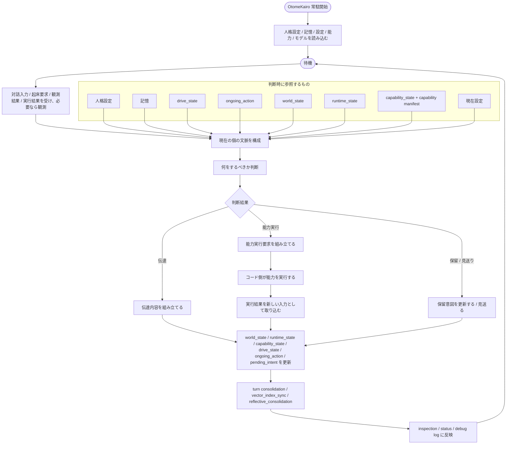
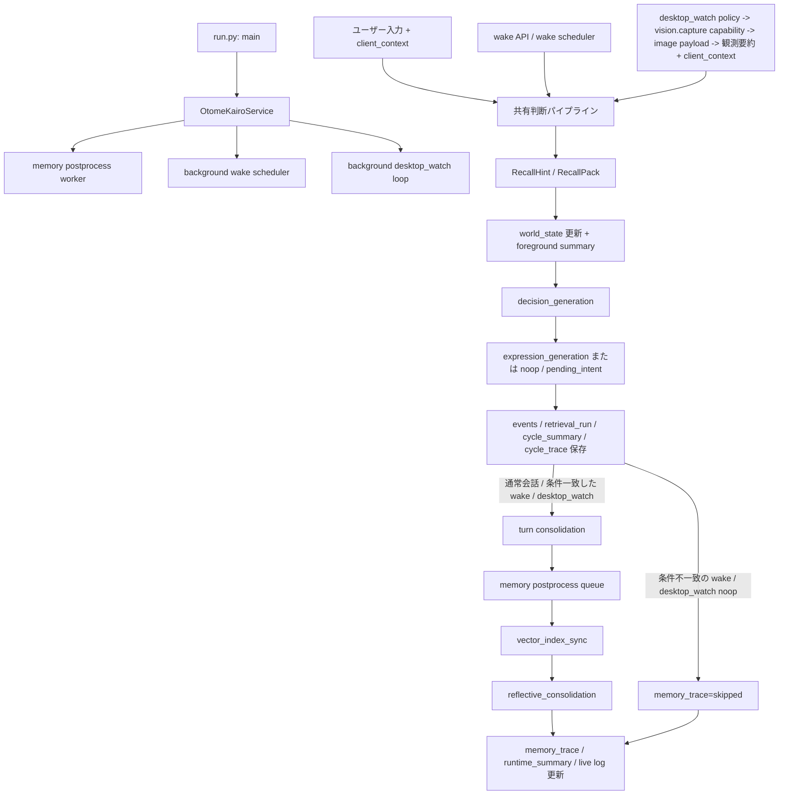
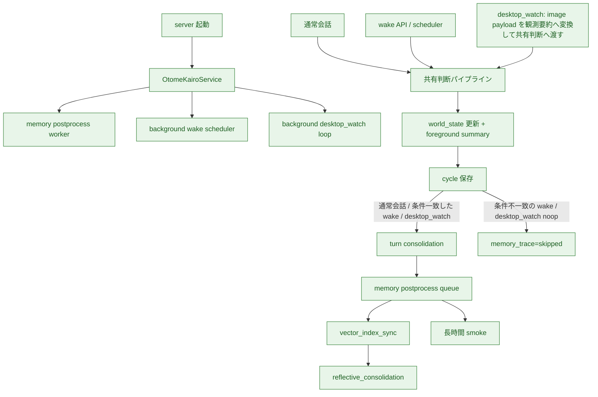
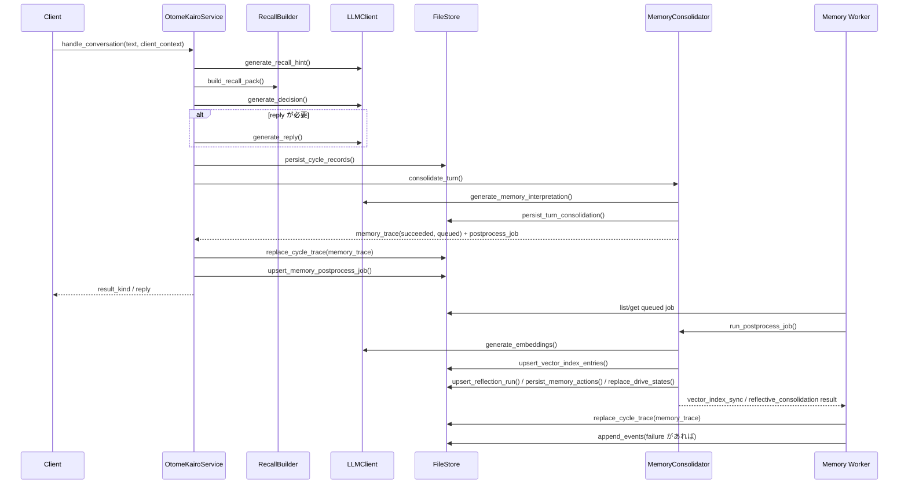

# 現行処理フロー

## この文書の役割

この文書は、**現在の実装が実際にどう流れているか** を素早く確認するための補助資料である。

- 責務境界や長く残る意味は `docs/design/` を正とする
- この文書は、現行コードの主要な流れを Mermaid で俯瞰するための要約である
- 関数分割や厳密な順序の最終正本は `src/` のコードとする

## 計画文書との分担

現在地、到達点、既知の制約、後続拡張は [01_現行計画.md](01_現行計画.md) を正とする。
この文書では、それらを重複管理せず、現行コードの流れと主要な処理経路だけを図で示す。

## 設計上の完成形

現行設計ファミリーにおける完成形は、「会話するアプリ」ではなく、人格、記憶、状態、能力を持った本体が、
対話入力、起床要求、観測結果、実行結果を受け、必要なら人、身体、外界、ネットワークを観測し、必要なら伝達や行動を行い、その結果をまた次の判断へ戻す循環である。

上位設計から読むと、設計上の完成形は次を含む。

- 対話入力、起床要求、観測結果、実行結果を受け、必要なら人、身体、外界、ネットワークを継続的に観測する
- 人格設定、記憶、`drive_state`、`ongoing_action`、`world_state`、`runtime_state`、`capability_state`、能力マニフェストを合わせて判断文脈を組む
- 判断結果として、伝達、能力実行、保留意図、見送りを同じ枠組みで選ぶ
- 実行結果や外界変化を取り込み、必要なら追加観測して状態と記憶へ戻す
- 自律判断でも同じ中心ループを回す
- 監査、inspection、運用 API を通じて、判断経路と状態変化を追える

## 現行実装との関係

設計上の完成形に対する実装状態は [01_現行計画.md](01_現行計画.md) を正とする。
この文書の図は、現在の処理経路を理解するための補助表示であり、到達点表の正本にはしない。

## 直近マイルストーンの到達点

直近マイルストーンの内容と後続拡張は [01_現行計画.md](01_現行計画.md) を正とする。
この文書では、直近マイルストーンが現在の処理フローのどこに現れるかだけを示す。

## 直近マイルストーンの処理フロー

直近マイルストーンで扱う処理フローは次である。

## 現行処理経路の補助図

現在の主要処理経路を図で示す。
色分けはこの図の視認補助であり、到達点の正本にはしない。

## 到達点一覧との境界

直近マイルストーンに対する到達点一覧は [01_現行計画.md](01_現行計画.md) に集約する。
この文書には同じ表を置かない。

## 実装済みの詳細フロー

現時点で実装済みの通常会話フローは次である。

## `wake` と `desktop_watch` の現状

`wake` と `desktop_watch` は、判断自体は通常会話と同じ `_run_input_pipeline` を使う。
その中で `world_state` 第一段の更新と foreground summary までは共通で通す。
そのうえで、`reply`、保留意図更新、capability failure、意味のある `world_state` 変化が起きたサイクルだけ `turn consolidation` を走らせる。条件に当てはまらない `noop` は `memory_trace=skipped` のまま残す。

- `wake`
  - `pending_intent` の due 判定
  - cooldown 判定
  - 条件を満たしたときだけ共有判断パイプラインへ入る
  - `reply` / `pending_intent` / 意味のある `world_state` 変化が起きたサイクルだけ episode 化する
- `desktop_watch`
  - `vision.capture` capability の binding を持つ client を自動選択する
  - `vision.capture_request` を送り、`capture-response` を待つ
  - `capture-response` が取れない場合や image が 0 件のときは、共有判断パイプラインへ入らずそのまま skip する
  - image payload は raw のまま保持せず、短い観測要約へ変換して入力文と inspection に反映する
  - `client_context` と `vision.capture` の観測要約から `world_state` を更新し、foreground summary を判断入力へ入れる
  - `observation_summary.error` があるサイクルと、`reply` / `pending_intent` / 意味のある `world_state` 変化が起きたサイクルだけ episode 化する
  - inspection には `observation_summary` と `capability_request_summary` を残す
  - `reply` のときだけ `desktop_watch` event を返し、`noop / pending_intent` のときは返さない
  - raw image payload の保存、OCR 全文抽出、UI 構造化はまだ入っていない

## 対応する主なコード

- 起動
  - `src/otomekairo/run.py`
- 通常会話
  - `src/otomekairo/service.py`
  - `src/otomekairo/service_input.py`
  - `src/otomekairo/recall.py`
  - `src/otomekairo/recall_association.py`
  - `src/otomekairo/recall_selection.py`
  - `src/otomekairo/llm.py`
- `wake` / `desktop_watch`
  - `src/otomekairo/service.py`
  - `src/otomekairo/service_spontaneous.py`
  - `src/otomekairo/llm.py`
- `turn consolidation` と postprocess job
  - `src/otomekairo/memory.py`
  - `src/otomekairo/service_memory.py`
- inspection / 永続化
  - `src/otomekairo/store.py`
  - `src/otomekairo/store_vector.py`
  - `src/otomekairo/store_clone.py`
