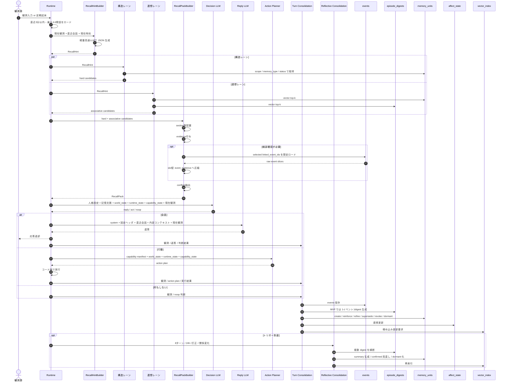
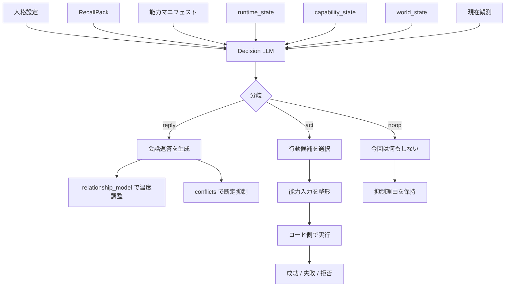
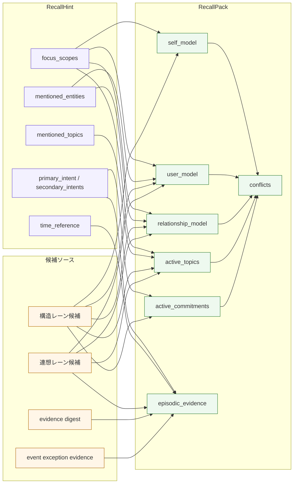
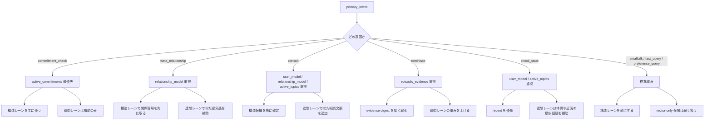
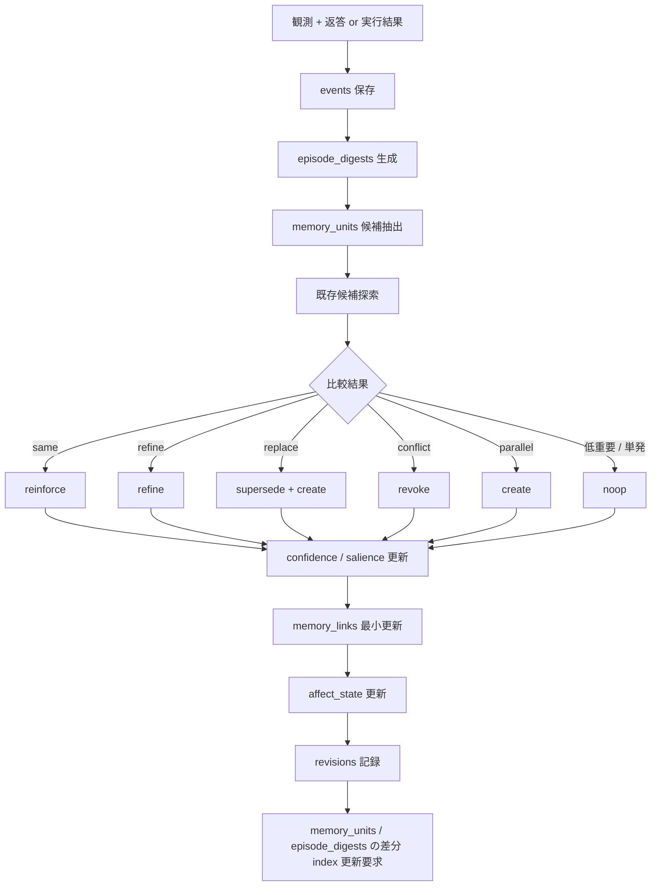
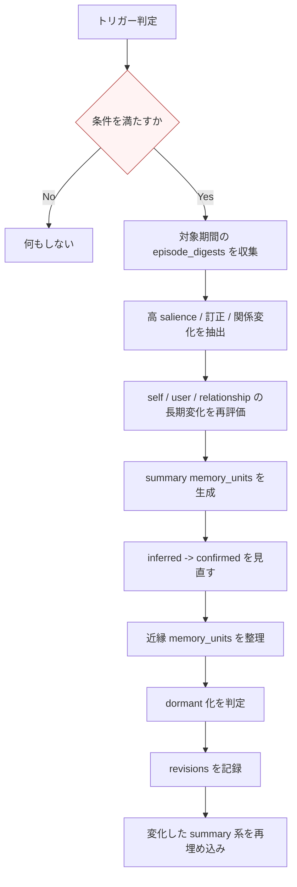
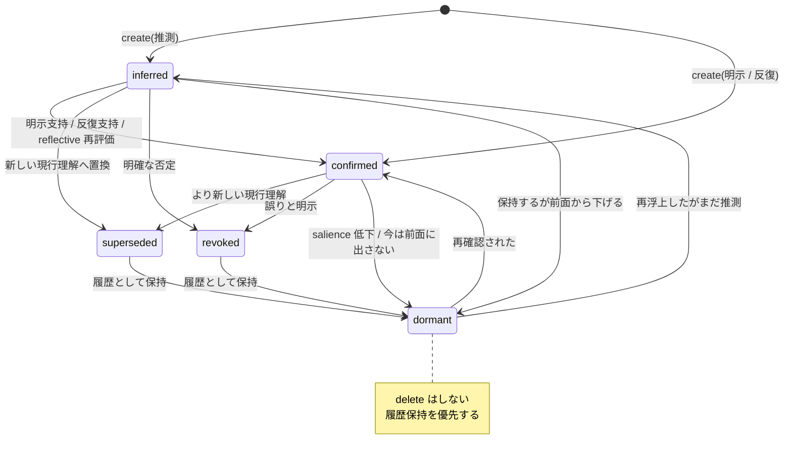
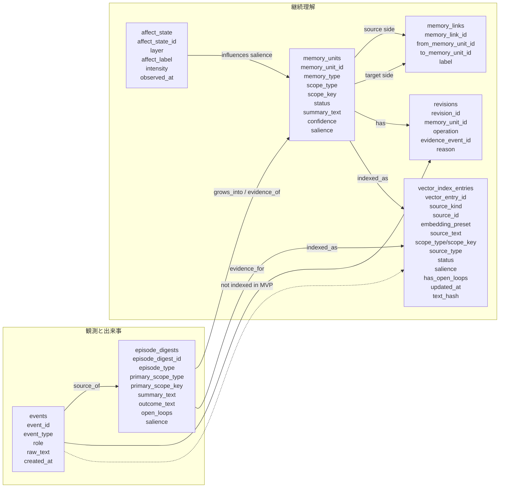
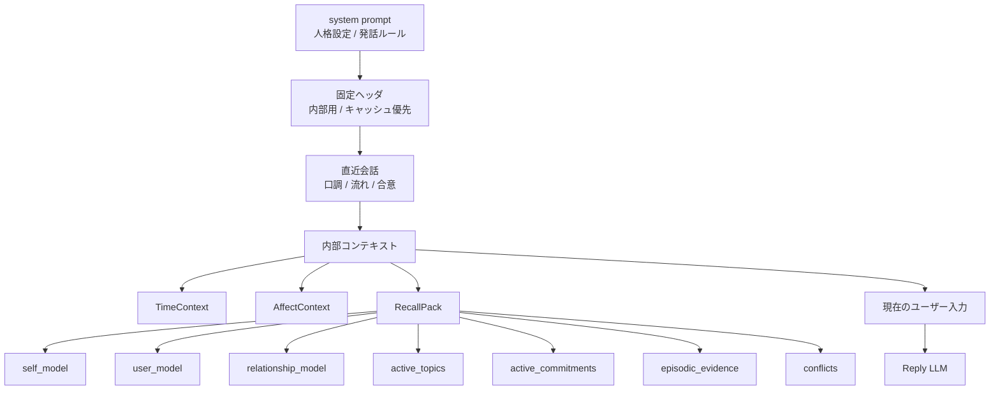

# 想起と判断フロー図

<!-- Block: Role -->
## この文書の役割

この文書は、`docs/design/memory/` 配下の正本を Mermaid 図で俯瞰できるようにするための参考資料である。

ここでは次を図にする。

- 共通の同期想起
- 共通判断から会話 / 行動 / 何もしない への分岐
- 返答後の記憶更新
- 永続データ同士の関係
- `memory_units` の状態遷移

図はできるだけ細かく書くが、DB カラムや API の確定仕様ではない。
現時点では、設計理解とレビューのための概念図として扱う。

<!-- Block: ReadGuide -->
## 読み方

この文書は、次の順で読むと分かりやすい。

1. 全体ライフサイクル
2. 同期想起の詳細
3. 判断分岐の詳細
4. `RecallPack` への振り分け
5. 返答後 / 実行後の更新
6. 状態遷移
7. 永続データの関係

特に重要なのは、OtomeKairo の判断が 1 本線ではなく、次の 4 層に分かれていることである。

- 同期想起:
  - 判断直前に必要分だけ読む
- 判断分岐:
  - `reply / act / noop` を決める
- ターン更新:
  - 返答後または実行後に 1 ターン単位で記憶を育てる
- 反省整理:
  - 数ターンまたは一定時間ごとに長期変化を再評価する

<!-- Block: Lifecycle -->
## 全体ライフサイクル

<!-- Block: SyncRecall -->
## 同期想起の詳細

```mermaid
flowchart TD
    A[現在観測] --> B[直近3分以内・最大4-6発話]
    A --> C[軽量高速LLMで RecallHint 生成]
    B --> C
    C --> D[primary_intent / secondary_intents / time_reference / focus_scopes]

    D --> E1
    D --> E2

    subgraph SL[構造レーン]
        direction TB
        E1[hard requirement 抽出]
        F1[active_commitments<br/>memory_type=commitment]
        F2[relationship_model<br/>scope=relationship:self&#124;user]
        F3[user_model<br/>scope=user]
        F4[self_model<br/>scope=self]
        F5[active_topics<br/>scope=topic / open_loops]
        G1[厳密候補集合]
        E1 --> F1
        E1 --> F2
        E1 --> F3
        E1 --> F4
        E1 --> F5
        F1 --> G1
        F2 --> G1
        F3 --> G1
        F4 --> G1
        F5 --> G1
    end

    subgraph VL[連想レーン]
        direction TB
        E2[問い合わせ方向の決定]
        H1[現在観測を主クエリ化]
        H2[mentioned_entities / topics で補強]
        H3[primary_intent / time_reference で重み調整]
        H4[memory_units vector top-k]
        H5[episode_digests vector top-k]
        H6[連想候補集合]
        E2 --> H1
        E2 --> H2
        E2 --> H3
        H1 --> H4
        H1 --> H5
        H2 --> H4
        H2 --> H5
        H3 --> H4
        H3 --> H5
        H4 --> H6
        H5 --> H6
    end

    G1 --> I[section ごとに再配置]
    H6 --> I
    I --> J[構造候補を優先]
    J --> K[vector-only 候補は弱く扱う]
    K --> L[選ばれた memory_units に evidence 付与]
    L --> X{細部確認}
    X -- no --> M[conflicts 抽出]
    X -- yes --> Y[selected linked_event_ids を限定ロード]
    Y --> Z[event_evidence を slot型で短文化]
    Z --> M
    M --> N[全体上限 8-14 件]
    N --> O[RecallPack 確定]

    classDef strong fill:#eef6ff,stroke:#336699,stroke-width:1px;
    classDef assoc fill:#fff6e8,stroke:#b36b00,stroke-width:1px;
    classDef out fill:#eef9ef,stroke:#2f7d32,stroke-width:1px;
    class F1,F2,F3,F4,F5,G1 strong;
    class H4,H5,H6 assoc;
    class O out;
```

<!-- Block: DecisionBranch -->
## 判断分岐の詳細

<!-- Block: RecallPackAssembly -->
## `RecallPack` への振り分け

<!-- Block: IntentWeight -->
## `primary_intent` ごとの重み付け

<!-- Block: UpdateFlow -->
## 返答後 / 実行後のターン更新

<!-- Block: ReflectiveFlow -->
## `reflective consolidation` の詳細

<!-- Block: StatusTransition -->
## `memory_units.status` の状態遷移

<!-- Block: DataRelation -->
## 永続データの関係

<!-- Block: PromptShape -->
## 会話返答への注入位置

<!-- Block: Notes -->
## 補足

この図群で特に確認したい設計判断は次である。

- `active_commitments` と `relationship_model` を、類似検索より先に取ること
- ベクトル検索は入れるが、主導権は持たせないこと
- `events` は監査正本であり、通常の想起注入では直接使わないこと
- `episode_digests` は証拠層、`memory_units` は継続理解層として分けること
- `reflective consolidation` は人格形成に効くが、同期経路へは入れないこと
- 会話と行動は想起まで共通にし、分岐は判断以降へ寄せること
